# AI System - Integration and Architecture

このドキュメントでは、Pyxis CodeCanvasのAI統合システムの設計、データフロー、機能について詳細に説明します。

---

## 1. AI System Overview

AI SystemはGemini AIを統合し、コード支援、レビュー、チャット機能を提供します。

### 1.1 AI Features

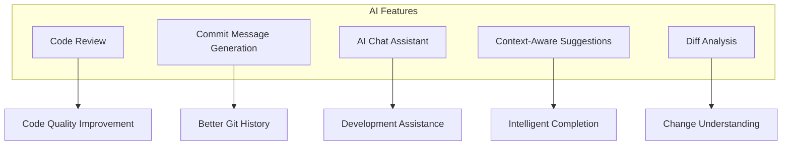
```mermaid
graph TB
    subgraph AI Features
        A[Code Review]
        B[Commit Message Generation]
        C[AI Chat Assistant]
        D[Context-Aware Suggestions]
        E[Diff Analysis]
    end
    
    A --> F[Code Quality Improvement]
    B --> G[Better Git History]
    C --> H[Development Assistance]
    D --> I[Intelligent Completion]
    E --> J[Change Understanding]
```

### 1.2 AI Module Structure

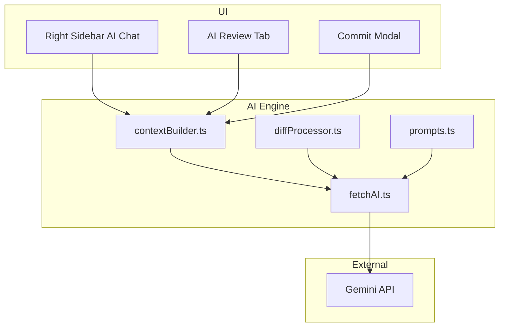
```mermaid
graph TB
    subgraph AI Engine
        A[fetchAI.ts]
        B[contextBuilder.ts]
        C[diffProcessor.ts]
        D[prompts.ts]
    end
    
    subgraph External
        E[Gemini API]
    end
    
    subgraph UI
        F[Right Sidebar AI Chat]
        G[AI Review Tab]
        H[Commit Modal]
    end
    
    F --> B
    G --> B
    H --> B
    
    B --> A
    C --> A
    D --> A
    
    A --> E
```

---

## 2. Core AI Modules

### 2.1 fetchAI.ts: API Client

**Responsibilities:**
- Gemini API communication
- Request/response handling
- Error handling and retry logic
- Token management

**API Methods:**

| Method | Purpose | Temperature | Max Tokens |
|--------|---------|-------------|------------|
| `generateCodeEdit` | Code review/suggestions | 0.1 | 4096 |
| `generateChatResponse` | Chat conversation | 0.7 | 2048 |
| `generateCommitMessage` | Commit message | 0.3 | 256 |

**Request Flow:**

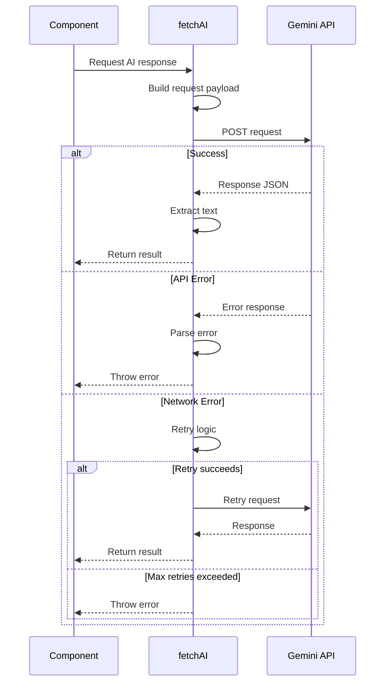
```mermaid
sequenceDiagram
    participant COMP as Component
    participant AI as fetchAI
    participant API as Gemini API

    COMP->>AI: Request AI response
    AI->>AI: Build request payload
    AI->>API: POST request
    
    alt Success
        API-->>AI: Response JSON
        AI->>AI: Extract text
        AI-->>COMP: Return result
    else API Error
        API-->>AI: Error response
        AI->>AI: Parse error
        AI-->>COMP: Throw error
    else Network Error
        AI->>AI: Retry logic
        alt Retry succeeds
            AI->>API: Retry request
            API-->>AI: Response
            AI-->>COMP: Return result
        else Max retries exceeded
            AI-->>COMP: Throw error
        end
    end
```

**Error Handling Strategy:**

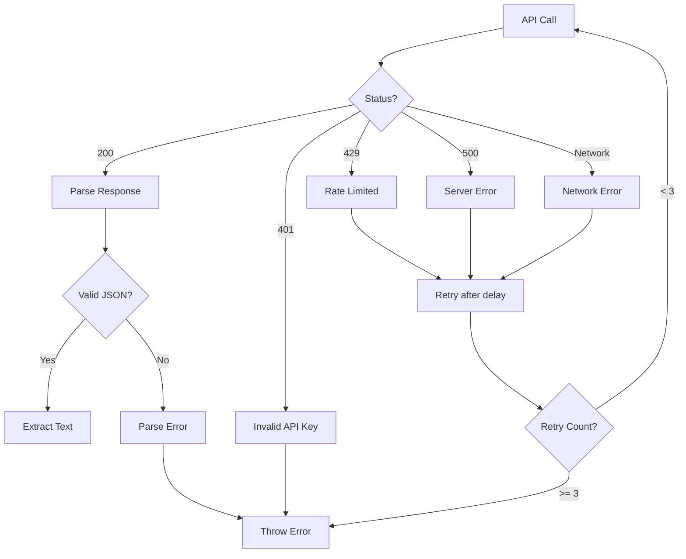
```mermaid
graph TB
    A[API Call] --> B{Status?}
    B -->|200| C[Parse Response]
    B -->|401| D[Invalid API Key]
    B -->|429| E[Rate Limited]
    B -->|500| F[Server Error]
    B -->|Network| G[Network Error]
    
    C --> H{Valid JSON?}
    H -->|Yes| I[Extract Text]
    H -->|No| J[Parse Error]
    
    E --> K[Retry after delay]
    F --> K
    G --> K
    
    K --> L{Retry Count?}
    L -->|< 3| A
    L -->|>= 3| M[Throw Error]
    
    D --> M
    J --> M
```

### 2.2 contextBuilder.ts: Context Management

**Purpose:**
- Collect relevant context for AI requests
- Build contextual prompts
- Manage context size limits

**Context Sources:**

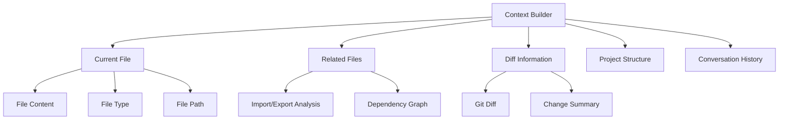
```mermaid
graph TB
    A[Context Builder] --> B[Current File]
    A --> C[Related Files]
    A --> D[Diff Information]
    A --> E[Project Structure]
    A --> F[Conversation History]
    
    B --> G[File Content]
    B --> H[File Type]
    B --> I[File Path]
    
    C --> J[Import/Export Analysis]
    C --> K[Dependency Graph]
    
    D --> L[Git Diff]
    D --> M[Change Summary]
```

**Context Building Flow:**

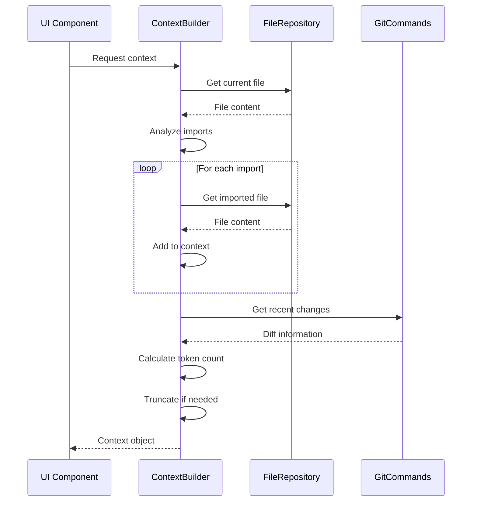
```mermaid
sequenceDiagram
    participant UI as UI Component
    participant CTX as ContextBuilder
    participant REPO as FileRepository
    participant GIT as GitCommands

    UI->>CTX: Request context
    CTX->>REPO: Get current file
    REPO-->>CTX: File content
    
    CTX->>CTX: Analyze imports
    
    loop For each import
        CTX->>REPO: Get imported file
        REPO-->>CTX: File content
        CTX->>CTX: Add to context
    end
    
    CTX->>GIT: Get recent changes
    GIT-->>CTX: Diff information
    
    CTX->>CTX: Calculate token count
    CTX->>CTX: Truncate if needed
    CTX-->>UI: Context object
```

**Context Prioritization:**

| Priority | Source | Max Size |
|----------|--------|----------|
| 1 | Current file content | 2000 tokens |
| 2 | Active diff | 1500 tokens |
| 3 | Direct dependencies | 1000 tokens |
| 4 | Recent conversation | 500 tokens |
| 5 | Project structure | 300 tokens |

### 2.3 diffProcessor.ts: Diff Analysis

**Responsibilities:**
- Parse Git diffs
- Identify change types
- Calculate diff statistics
- Format diff for AI consumption

**Diff Types:**

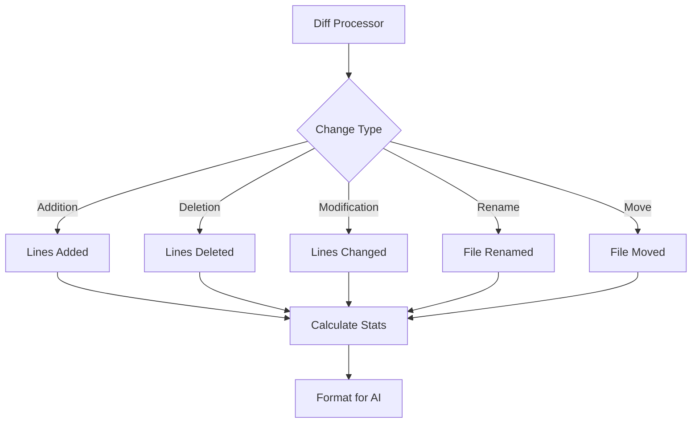
```mermaid
graph TB
    A[Diff Processor] --> B{Change Type}
    
    B -->|Addition| C[Lines Added]
    B -->|Deletion| D[Lines Deleted]
    B -->|Modification| E[Lines Changed]
    B -->|Rename| F[File Renamed]
    B -->|Move| G[File Moved]
    
    C --> H[Calculate Stats]
    D --> H
    E --> H
    F --> H
    G --> H
    
    H --> I[Format for AI]
```

**Diff Processing Flow:**

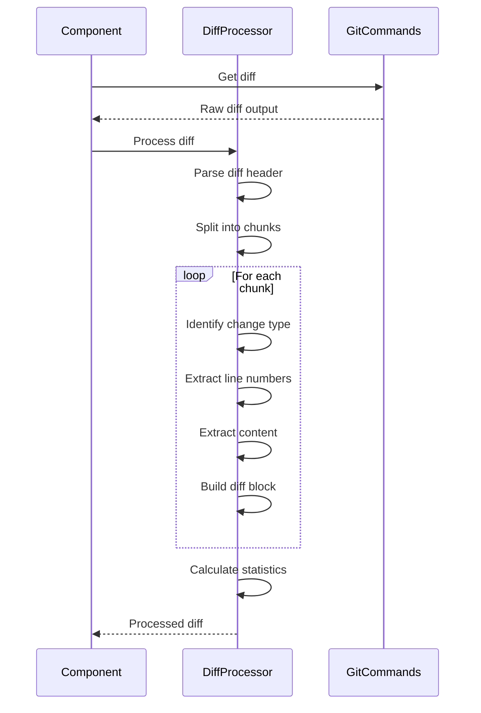
```mermaid
sequenceDiagram
    participant COMP as Component
    participant PROC as DiffProcessor
    participant GIT as GitCommands

    COMP->>GIT: Get diff
    GIT-->>COMP: Raw diff output
    
    COMP->>PROC: Process diff
    PROC->>PROC: Parse diff header
    PROC->>PROC: Split into chunks
    
    loop For each chunk
        PROC->>PROC: Identify change type
        PROC->>PROC: Extract line numbers
        PROC->>PROC: Extract content
        PROC->>PROC: Build diff block
    end
    
    PROC->>PROC: Calculate statistics
    PROC-->>COMP: Processed diff
```

**Diff Statistics:**

| Metric | Calculation | Usage |
|--------|-------------|-------|
| Lines Added | Count of '+' lines | Commit summary |
| Lines Deleted | Count of '-' lines | Commit summary |
| Files Changed | Unique file count | Commit context |
| Change Density | Changes per file | Complexity indicator |

### 2.4 prompts.ts: Prompt Templates

**Prompt Categories:**

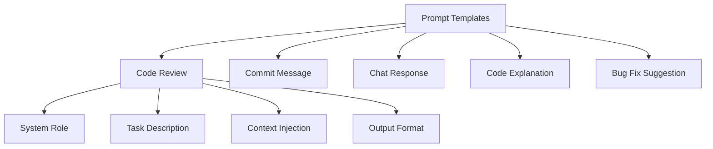
```mermaid
graph TB
    A[Prompt Templates] --> B[Code Review]
    A --> C[Commit Message]
    A --> D[Chat Response]
    A --> E[Code Explanation]
    A --> F[Bug Fix Suggestion]
    
    B --> G[System Role]
    B --> H[Task Description]
    B --> I[Context Injection]
    B --> J[Output Format]
```

**Prompt Structure:**

| Section | Purpose | Example |
|---------|---------|---------|
| System Role | Define AI persona | "You are an expert code reviewer" |
| Task Description | Specify objective | "Review the following code for issues" |
| Context | Provide relevant info | File content, dependencies, diffs |
| Format Instructions | Output structure | "Provide suggestions in JSON format" |
| Constraints | Limitations | "Keep response under 500 tokens" |

**Example: Code Review Prompt**

```
System: You are an expert code reviewer specializing in [LANGUAGE]

Task: Review the following code changes and provide actionable feedback

Context:
- File: [FILE_PATH]
- Language: [LANGUAGE]
- Changes: [DIFF_SUMMARY]

Current Code:
[CODE_CONTENT]

Instructions:
1. Identify potential bugs or issues
2. Suggest performance improvements
3. Check for best practices
4. Recommend refactoring opportunities

Output Format:
Provide feedback in a structured format with:
- Issue severity (high/medium/low)
- Line numbers affected
- Specific suggestions
- Example improvements
```

---

## 3. AI Features Implementation

### 3.1 Code Review System

**Review Flow:**

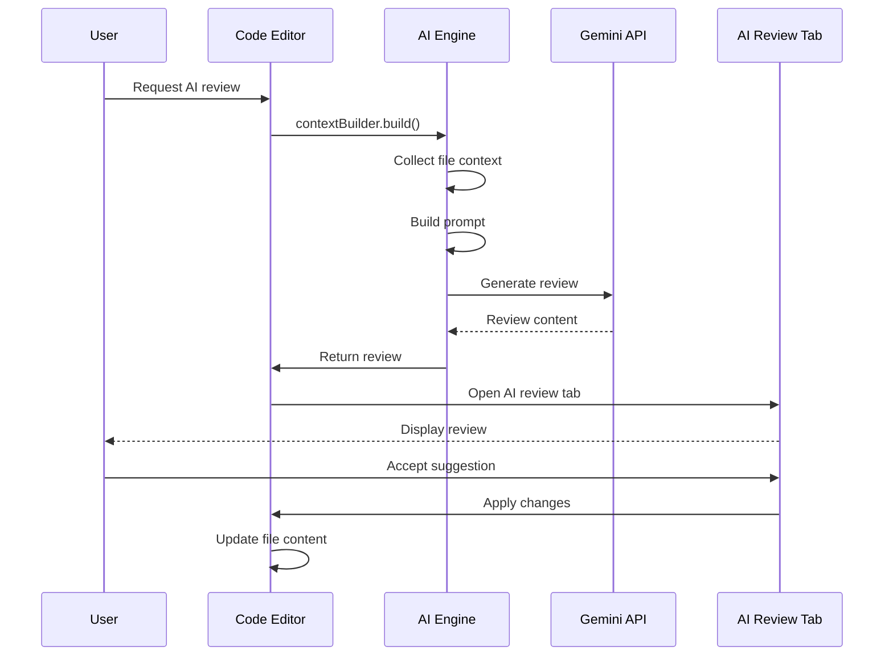
```mermaid
sequenceDiagram
    participant USER as User
    participant UI as Code Editor
    participant AI as AI Engine
    participant API as Gemini API
    participant TAB as AI Review Tab

    USER->>UI: Request AI review
    UI->>AI: contextBuilder.build()
    AI->>AI: Collect file context
    AI->>AI: Build prompt
    
    AI->>API: Generate review
    API-->>AI: Review content
    
    AI->>UI: Return review
    UI->>TAB: Open AI review tab
    TAB-->>USER: Display review
    
    USER->>TAB: Accept suggestion
    TAB->>UI: Apply changes
    UI->>UI: Update file content
```

**Review Tab Structure:**

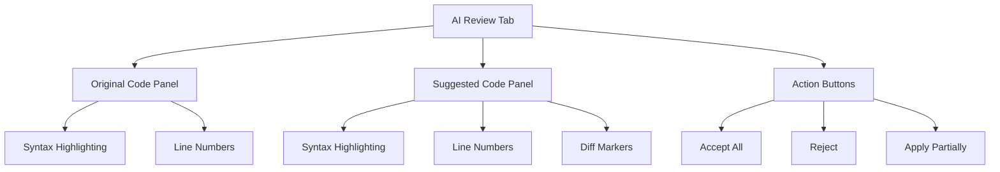
```mermaid
graph TB
    A[AI Review Tab] --> B[Original Code Panel]
    A --> C[Suggested Code Panel]
    A --> D[Action Buttons]
    
    B --> B1[Syntax Highlighting]
    B --> B2[Line Numbers]
    
    C --> C1[Syntax Highlighting]
    C --> C2[Line Numbers]
    C --> C3[Diff Markers]
    
    D --> D1[Accept All]
    D --> D2[Reject]
    D --> D3[Apply Partially]
```

**Review Actions:**

| Action | Operation | Result |
|--------|-----------|--------|
| Accept All | Replace file content | File updated, tab closes |
| Reject | Discard suggestions | Tab closes, no changes |
| Apply Partially | User selects changes | Mixed content, tab remains |
| Edit in Review | Modify suggestion | Custom changes applied |

### 3.2 Commit Message Generation

**Generation Flow:**

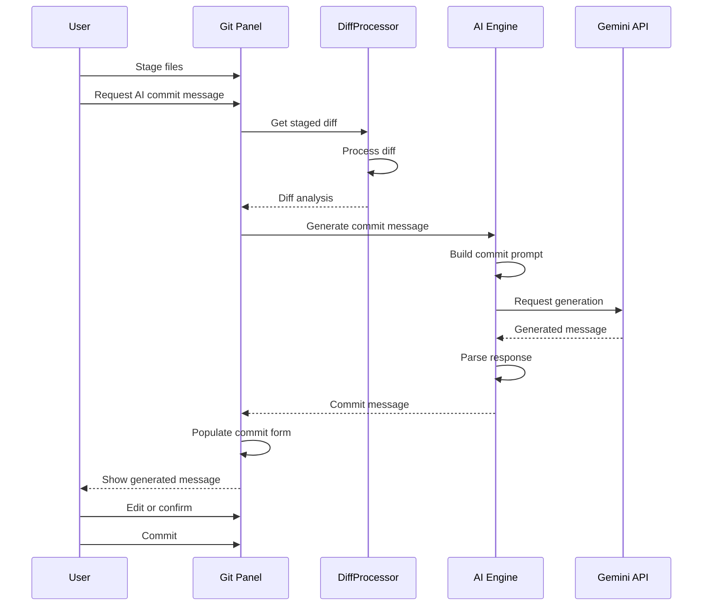
```mermaid
sequenceDiagram
    participant USER as User
    participant GIT as Git Panel
    participant DIFF as DiffProcessor
    participant AI as AI Engine
    participant API as Gemini API

    USER->>GIT: Stage files
    USER->>GIT: Request AI commit message
    
    GIT->>DIFF: Get staged diff
    DIFF->>DIFF: Process diff
    DIFF-->>GIT: Diff analysis
    
    GIT->>AI: Generate commit message
    AI->>AI: Build commit prompt
    AI->>API: Request generation
    API-->>AI: Generated message
    
    AI->>AI: Parse response
    AI-->>GIT: Commit message
    GIT->>GIT: Populate commit form
    GIT-->>USER: Show generated message
    
    USER->>GIT: Edit or confirm
    USER->>GIT: Commit
```

**Commit Message Format:**

```
<type>(<scope>): <subject>

<body>

<footer>
```

**Message Components:**

| Component | Source | Example |
|-----------|--------|---------|
| Type | Change analysis | feat, fix, refactor, docs |
| Scope | Files changed | auth, api, ui |
| Subject | Primary change | Add user authentication |
| Body | Detailed changes | Implemented JWT-based auth flow |
| Footer | Breaking changes | BREAKING CHANGE: API v1 deprecated |

### 3.3 AI Chat Assistant

**Chat Architecture:**

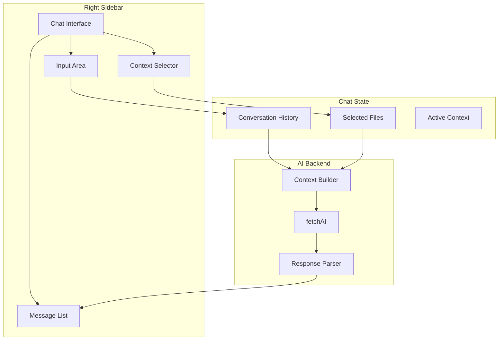
```mermaid
graph TB
    subgraph Right Sidebar
        A[Chat Interface]
        B[Message List]
        C[Input Area]
        D[Context Selector]
    end
    
    subgraph Chat State
        E[Conversation History]
        F[Selected Files]
        G[Active Context]
    end
    
    subgraph AI Backend
        H[Context Builder]
        I[fetchAI]
        J[Response Parser]
    end
    
    A --> B
    A --> C
    A --> D
    
    C --> E
    D --> F
    
    E --> H
    F --> H
    H --> I
    I --> J
    J --> B
```

**Chat Flow:**

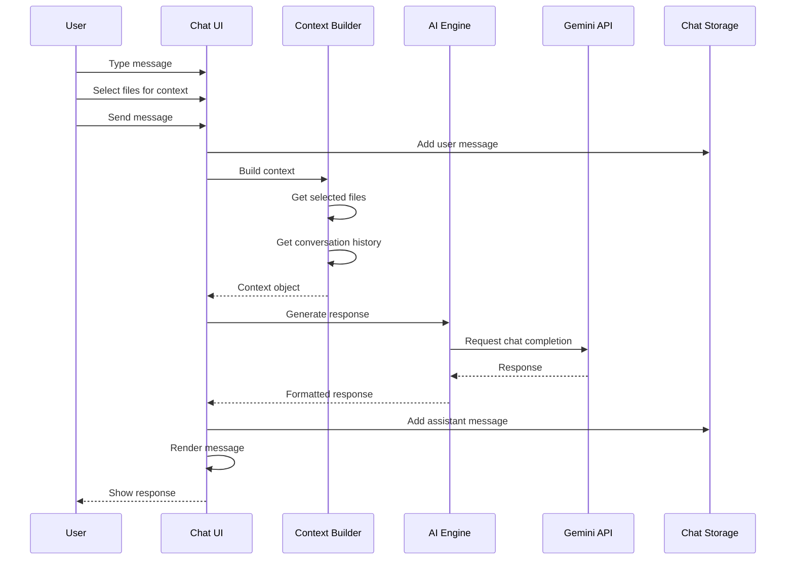
```mermaid
sequenceDiagram
    participant USER as User
    participant CHAT as Chat UI
    participant CTX as Context Builder
    participant AI as AI Engine
    participant API as Gemini API
    participant STORE as Chat Storage

    USER->>CHAT: Type message
    USER->>CHAT: Select files for context
    USER->>CHAT: Send message
    
    CHAT->>STORE: Add user message
    
    CHAT->>CTX: Build context
    CTX->>CTX: Get selected files
    CTX->>CTX: Get conversation history
    CTX-->>CHAT: Context object
    
    CHAT->>AI: Generate response
    AI->>API: Request chat completion
    API-->>AI: Response
    AI-->>CHAT: Formatted response
    
    CHAT->>STORE: Add assistant message
    CHAT->>CHAT: Render message
    CHAT-->>USER: Show response
```

**Context Selection:**

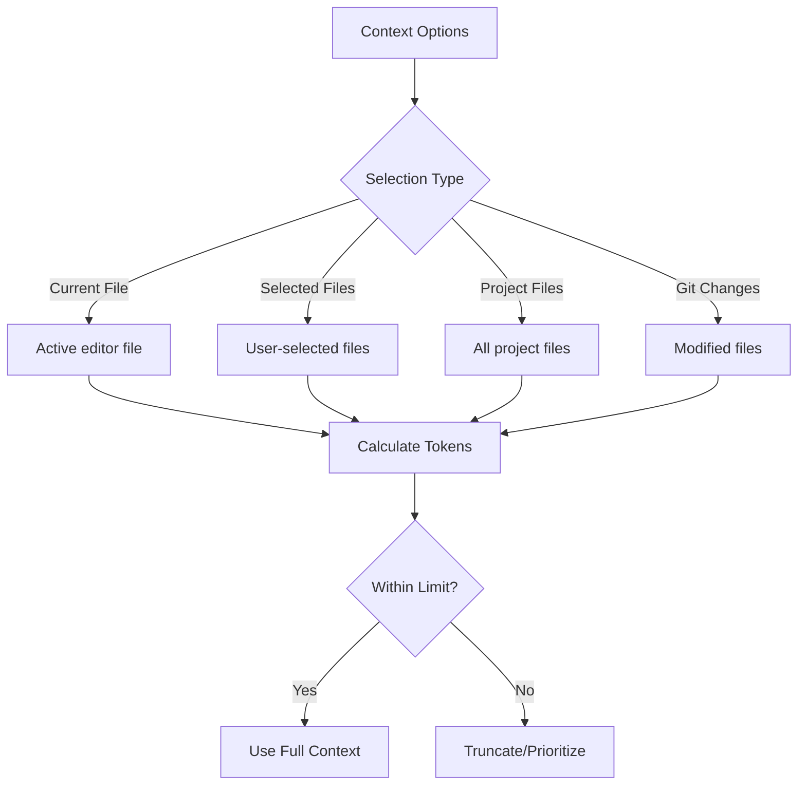
```mermaid
graph TB
    A[Context Options] --> B{Selection Type}
    
    B -->|Current File| C[Active editor file]
    B -->|Selected Files| D[User-selected files]
    B -->|Project Files| E[All project files]
    B -->|Git Changes| F[Modified files]
    
    C --> G[Calculate Tokens]
    D --> G
    E --> G
    F --> G
    
    G --> H{Within Limit?}
    H -->|Yes| I[Use Full Context]
    H -->|No| J[Truncate/Prioritize]
```

**Message Types:**

| Type | Rendering | Features |
|------|-----------|----------|
| User | Right-aligned, blue | Plain text |
| Assistant | Left-aligned, gray | Markdown, code blocks |
| System | Centered, muted | Status messages |
| Code | Full-width | Syntax highlighted |

### 3.4 Context-Aware Suggestions

**Suggestion Triggers:**

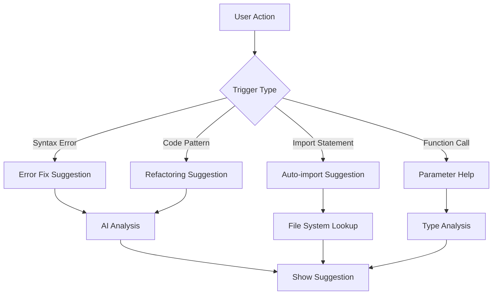
```mermaid
graph TB
    A[User Action] --> B{Trigger Type}
    
    B -->|Syntax Error| C[Error Fix Suggestion]
    B -->|Import Statement| D[Auto-import Suggestion]
    B -->|Function Call| E[Parameter Help]
    B -->|Code Pattern| F[Refactoring Suggestion]
    
    C --> G[AI Analysis]
    D --> H[File System Lookup]
    E --> I[Type Analysis]
    F --> G
    
    G --> J[Show Suggestion]
    H --> J
    I --> J
```

**Suggestion UI:**

- Inline suggestions (ghost text)
- Quick fix menu
- Hover tooltips
- Command palette integration

---

## 4. AI Data Flow

### 4.1 Complete Request Flow

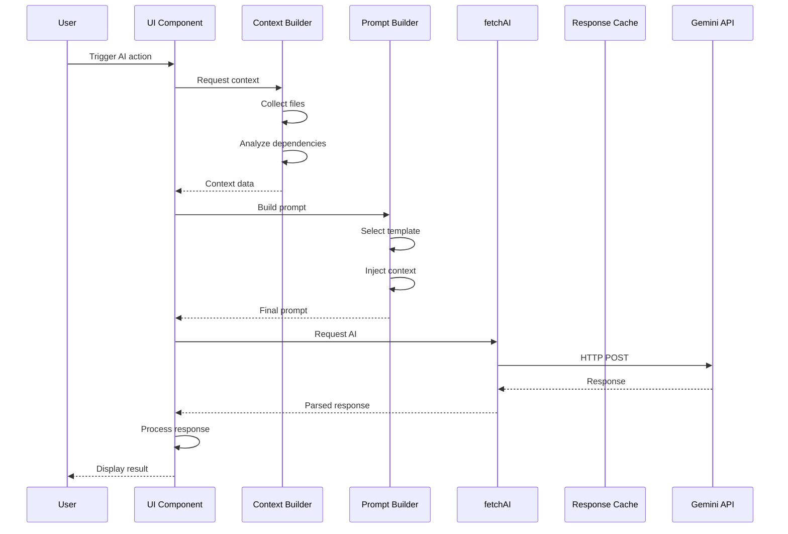
```mermaid
sequenceDiagram
    participant USER as User
    participant UI as UI Component
    participant CTX as Context Builder
    participant PROMPT as Prompt Builder
    participant API_CLIENT as fetchAI
    participant CACHE as Response Cache
    participant API as Gemini API

    USER->>UI: Trigger AI action
    UI->>CTX: Request context
    CTX->>CTX: Collect files
    CTX->>CTX: Analyze dependencies
    CTX-->>UI: Context data
    
    UI->>PROMPT: Build prompt
    PROMPT->>PROMPT: Select template
    PROMPT->>PROMPT: Inject context
    PROMPT-->>UI: Final prompt
    
    UI->>API_CLIENT: Request AI
    API_CLIENT->>API: HTTP POST
    API-->>API_CLIENT: Response
    API_CLIENT-->>UI: Parsed response
    
    UI->>UI: Process response
    UI-->>USER: Display result
```

### 4.2 Error Handling Flow

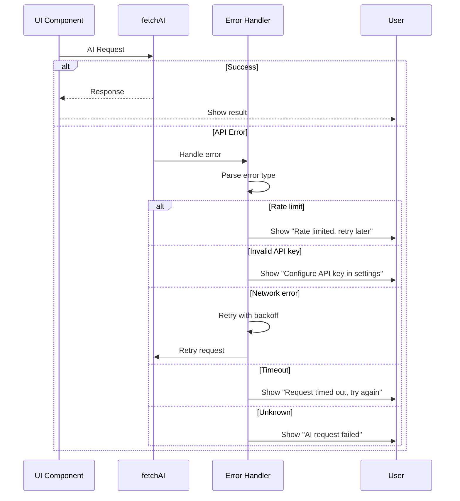
```mermaid
sequenceDiagram
    participant UI as UI Component
    participant API as fetchAI
    participant ERROR as Error Handler
    participant USER as User

    UI->>API: AI Request
    
    alt Success
        API-->>UI: Response
        UI-->>USER: Show result
    else API Error
        API->>ERROR: Handle error
        ERROR->>ERROR: Parse error type
        
        alt Rate limit
            ERROR->>USER: Show "Rate limited, retry later"
        else Invalid API key
            ERROR->>USER: Show "Configure API key in settings"
        else Network error
            ERROR->>ERROR: Retry with backoff
            ERROR->>API: Retry request
        else Timeout
            ERROR->>USER: Show "Request timed out, try again"
        else Unknown
            ERROR->>USER: Show "AI request failed"
        end
    end
```

---

## 5. AI Response Processing

### 5.1 Response Parsing

**Response Structure:**

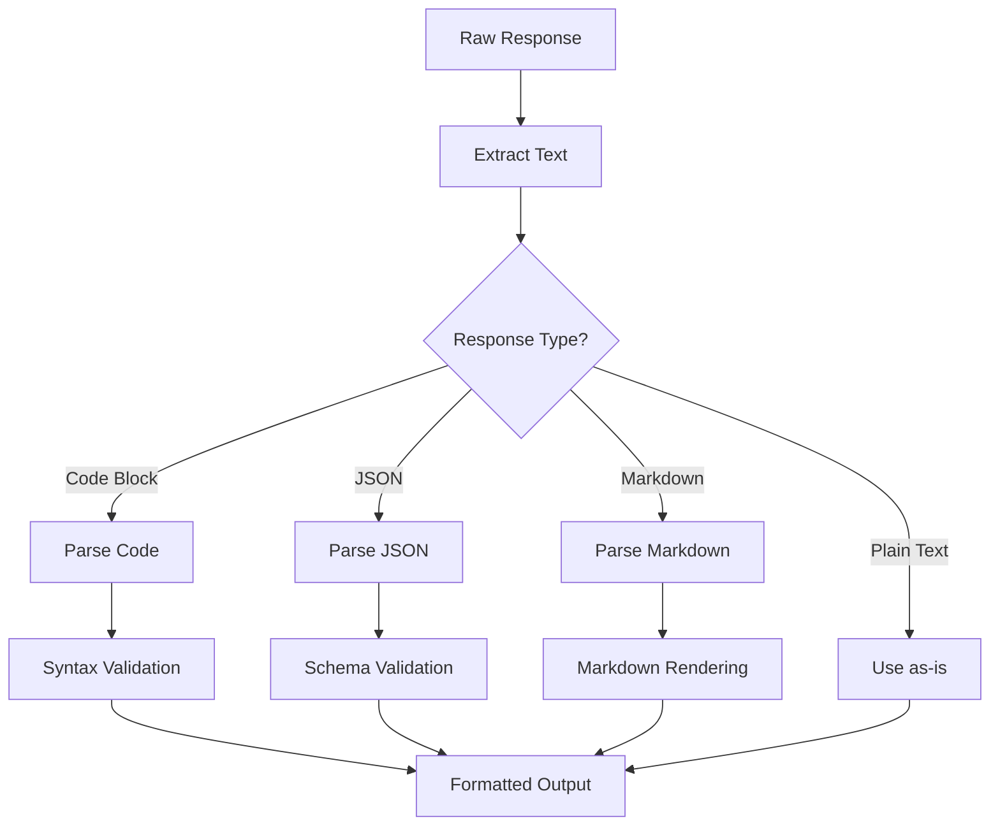
```mermaid
graph TB
    A[Raw Response] --> B[Extract Text]
    B --> C{Response Type?}
    
    C -->|Code Block| D[Parse Code]
    C -->|JSON| E[Parse JSON]
    C -->|Markdown| F[Parse Markdown]
    C -->|Plain Text| G[Use as-is]
    
    D --> H[Syntax Validation]
    E --> I[Schema Validation]
    F --> J[Markdown Rendering]
    
    H --> K[Formatted Output]
    I --> K
    J --> K
    G --> K
```

**Code Extraction:**

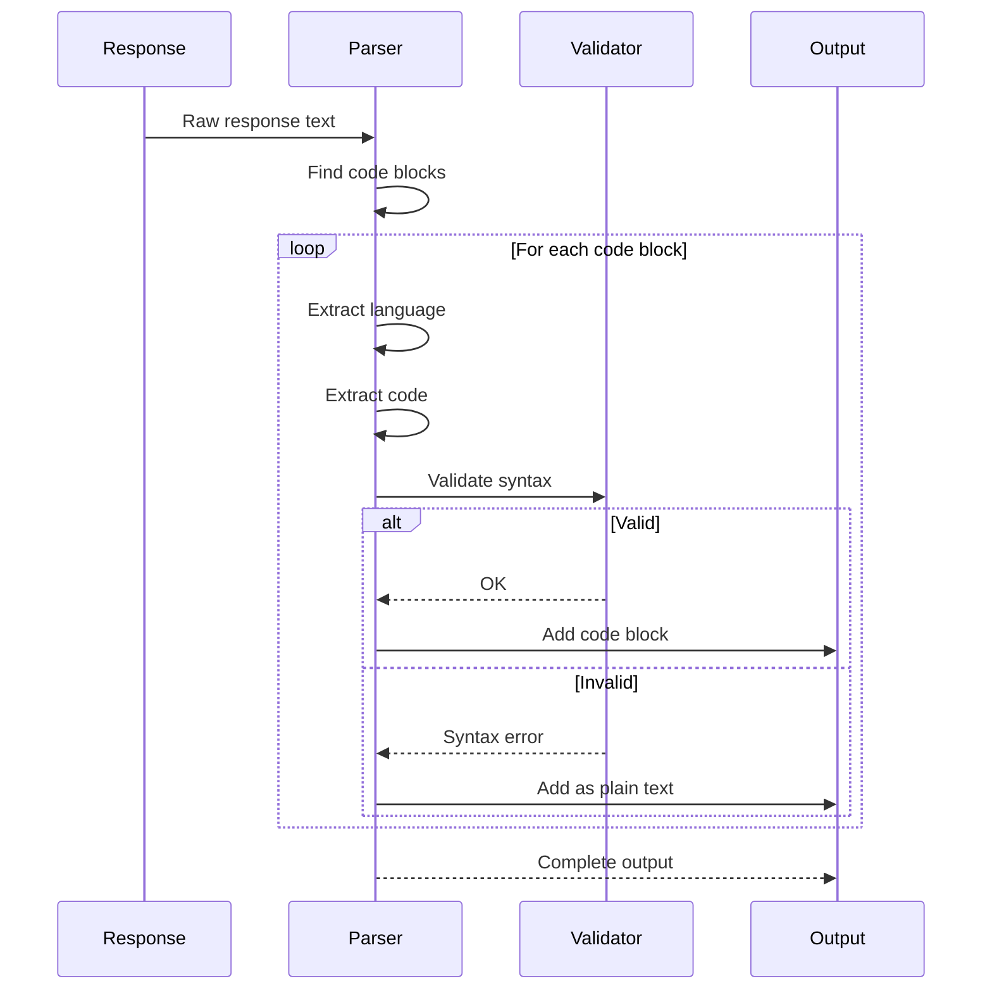
```mermaid
sequenceDiagram
    participant RESP as Response
    participant PARSER as Parser
    participant VALIDATOR as Validator
    participant OUTPUT as Output

    RESP->>PARSER: Raw response text
    PARSER->>PARSER: Find code blocks
    
    loop For each code block
        PARSER->>PARSER: Extract language
        PARSER->>PARSER: Extract code
        PARSER->>VALIDATOR: Validate syntax
        
        alt Valid
            VALIDATOR-->>PARSER: OK
            PARSER->>OUTPUT: Add code block
        else Invalid
            VALIDATOR-->>PARSER: Syntax error
            PARSER->>OUTPUT: Add as plain text
        end
    end
    
    PARSER-->>OUTPUT: Complete output
```

### 5.2 Chat Space - Conversation History Persistence

**Chat Space Overview:**

Pyxis CodeCanvasでは、AIとの会話履歴を「チャットスペース」として管理・永続化します。これにより、過去の会話を参照しながら継続的な開発支援を受けられます。

**Chat Space Features:**

- 1プロジェクトあたり最大10個のチャットスペースを保持
- 各スペースは独立したメッセージ履歴と選択ファイルを保持
- IndexedDBに永続化され、ブラウザを閉じても保存される
- 古いスペースは自動的に削除（LRUベース）

**Storage Structure:**

```mermaid
graph TB
    A[Chat Space] --> B[Messages]
    A --> C[Selected Files]
    A --> D[Metadata]
    
    B --> B1[User Messages]
    B --> B2[Assistant Responses]
    B --> B3[Edit Responses]
    
    C --> C1[File Paths]
    
    D --> D1[Space Name]
    D --> D2[Created/Updated Time]
```

**Note:** 現在、APIレスポンス自体のキャッシュ機能は実装されていません。各リクエストは毎回Gemini APIに送信されます。

---

## 6. AI Performance Optimization

> **注意**: 現在、以下のパフォーマンス最適化機能は実装されていません:
> - リクエストのバッチ処理
> - コンテキストの自動最適化(トランケート、要約、重複排除)
> - トークン制限の自動管理
>
> ユーザーは選択ファイルを手動で管理し、各リクエストは個別に送信されます。

---

## 7. AI Security and Privacy

### 7.1 API Key Management

**Key Storage:**

```mermaid
sequenceDiagram
    participant USER as User
    participant UI as Settings UI
    participant LS as localStorage
    participant AI as AI Engine

    USER->>UI: Enter API key
    UI->>LS: Store key (plain text)
    LS-->>UI: Saved
    
    Note over AI: On AI request
    AI->>LS: Retrieve key
    LS-->>AI: API key
    AI->>AI: Use for request
```

**Key Security:**
- Stored in localStorage as plain text (ブラウザのセキュリティに依存)
- Gemini API以外には送信されない
- ユーザーはいつでも設定から削除可能

> **注意**: 現在、以下のセキュリティ機能は実装されていません:
> - APIキーの暗号化保存
> - センシティブデータのフィルタリング(パスワード、個人情報など)
> - コンテキストの自動サニタイズ
> - データの匿名化処理
>
> ユーザーは手動でセンシティブな情報を含むファイルを選択から除外する必要があります。

---

## 8. AI Error Scenarios

### 8.1 Common Errors

| Error | Cause | User Action |
|-------|-------|-------------|
| Invalid API Key | Wrong or expired key | Check API key in settings |
| Rate Limit | Too many requests | Wait and retry |
| Context Too Large | Input exceeds token limit | Reduce context size |
| Network Timeout | Slow connection | Retry request |
| Server Error | Gemini API issue | Try again later |
| No Response | Empty API response | Report issue |

### 8.2 Error Recovery

```mermaid
graph TB
    A[Error Detected] --> B{Error Type?}
    
    B -->|Transient| C[Auto Retry]
    B -->|User Error| D[Show Guidance]
    B -->|System Error| E[Log and Alert]
    
    C --> F{Retry Success?}
    F -->|Yes| G[Continue]
    F -->|No| H[Max Retries]
    
    H --> I[Show Error to User]
    D --> I
    E --> I
```

---

## Related Documents

- [SYSTEM-OVERVIEW.md](./SYSTEM-OVERVIEW.md) - System architecture
- [CORE-ENGINE.md](./CORE-ENGINE.md) - Core engine details
- [UI-COMPONENTS.md](./UI-COMPONENTS.md) - UI components

---

**Last Updated**: 2025-01-02  
**Version**: 0.7  
**Status**: Verified - 未実装機能の推測記述を削除
