# Core Engine - Detailed Architecture

このドキュメントでは、Pyxis CodeCanvasのコアエンジン（`src/engine/core/`）の詳細な設計と動作フローを説明します。

---

## 1. Core Engine Overview

Core Engineは、システムの心臓部として、データの永続化、同期、Git操作、プロジェクト管理を担当します。

### 1.1 Core Modules

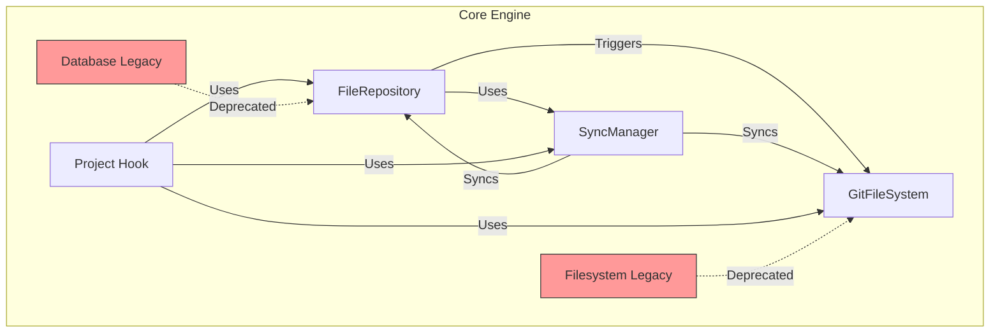
```mermaid
graph TB
    subgraph Core Engine
        A[FileRepository]
        B[GitFileSystem]
        C[SyncManager]
        D[Project Hook]
        E[Database Legacy]
        F[Filesystem Legacy]
    end
    
    A -->|Uses| C
    A -->|Triggers| B
    C -->|Syncs| A
    C -->|Syncs| B
    D -->|Uses| A
    D -->|Uses| B
    D -->|Uses| C
    
    E -.->|Deprecated| A
    F -.->|Deprecated| B
    
    style E fill:#f99,stroke:#333
    style F fill:#f99,stroke:#333
```

### 1.2 Module Responsibilities

| Module | Purpose | Direct Use | Internal Only |
|--------|---------|------------|---------------|
| **FileRepository** | IndexedDB management, file operations | ✅ Yes | - |
| **GitFileSystem** | lightning-fs management, Git operations | ✅ For read-only | ✅ For writes |
| **SyncManager** | Sync coordination between storages | ❌ No | ✅ Yes |
| **Project Hook** | React integration layer | ✅ In React components | - |
| **database.ts** | Backward compatibility wrapper | ⚠️ Still used (e.g., useChatSpace) | ✅ Delegates to FileRepository |
| **filesystem.ts** | Backward compatibility wrapper | ⚠️ Legacy only | ✅ Delegates to GitFileSystem |

---

## 2. FileRepository: IndexedDB Manager

FileRepositoryは、全てのファイル操作の中心となる統一APIです。

### 2.1 Architecture

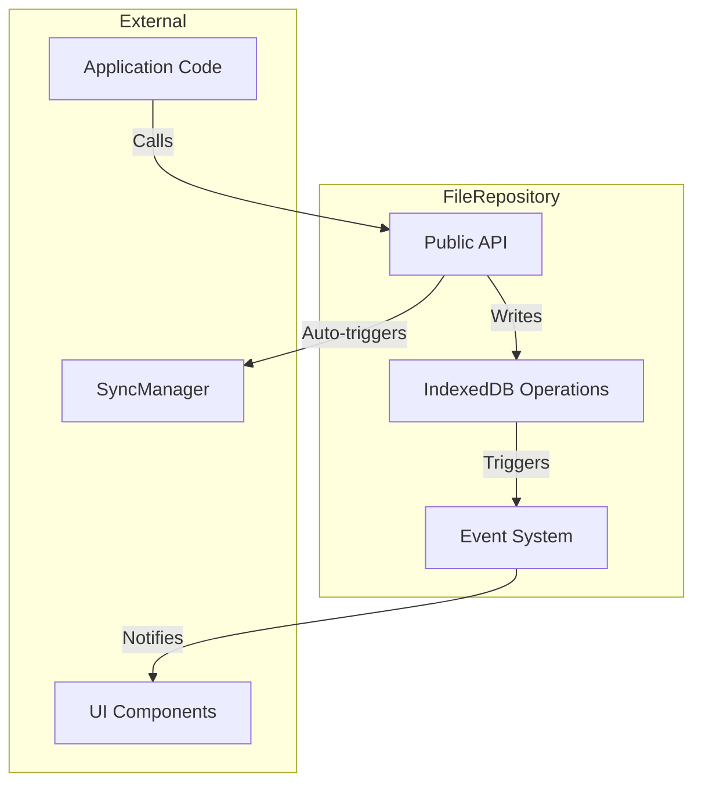
```mermaid
graph TB
    subgraph FileRepository
        A[Public API]
        B[Event System]
        C[IndexedDB Operations]
    end
    
    subgraph External
        E[Application Code]
        F[SyncManager]
        G[UI Components]
    end
    
    E -->|Calls| A
    A -->|Writes| C
    C -->|Triggers| B
    B -->|Notifies| G
    A -->|Auto-triggers| F
```

> **注意**: FileRepositoryは軽量なprojectNameCacheのみ実装。プロジェクト全体やファイルのキャッシュは行いません。

### 2.2 Database Schema

**Object Stores:**

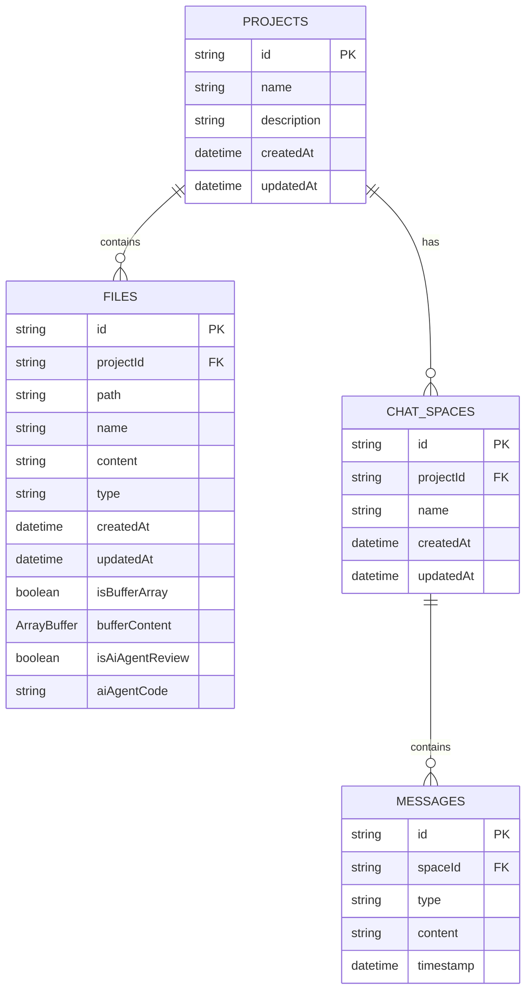
```mermaid
erDiagram
    PROJECTS ||--o{ FILES : contains
    PROJECTS ||--o{ CHAT_SPACES : has
    CHAT_SPACES ||--o{ MESSAGES : contains
    
    PROJECTS {
        string id PK
        string name
        string description
        datetime createdAt
        datetime updatedAt
    }
    
    FILES {
        string id PK
        string projectId FK
        string path
        string name
        string content
        string type
        datetime createdAt
        datetime updatedAt
        boolean isBufferArray
        ArrayBuffer bufferContent
        boolean isAiAgentReview
        string aiAgentCode
    }
    
    CHAT_SPACES {
        string id PK
        string projectId FK
        string name
        datetime createdAt
        datetime updatedAt
    }
    
    MESSAGES {
        string id PK
        string spaceId FK
        string type
        string content
        datetime timestamp
    }
```

**Indexes:**

- `files.projectId`: Query files by project
- `chatSpaces.projectId`: Query chat spaces by project
- `messages.spaceId`: Query messages by chat space

### 2.3 Key Operations

#### Project Operations

**Create Project:**
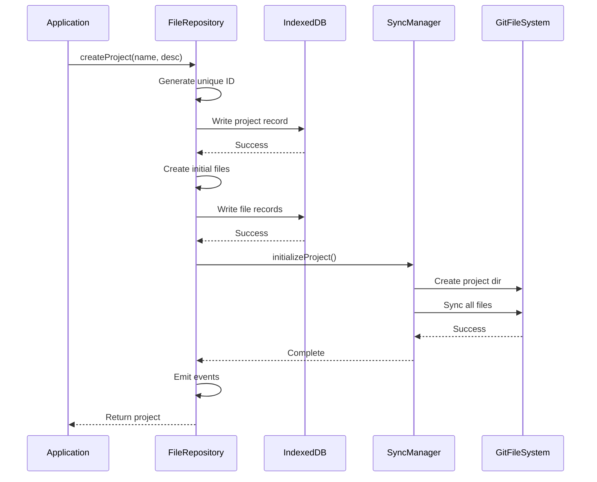
```mermaid
sequenceDiagram
    participant APP as Application
    participant REPO as FileRepository
    participant IDB as IndexedDB
    participant SYNC as SyncManager
    participant GFS as GitFileSystem

    APP->>REPO: createProject(name, desc)
    REPO->>REPO: Generate unique ID
    REPO->>IDB: Write project record
    IDB-->>REPO: Success
    REPO->>REPO: Create initial files
    REPO->>IDB: Write file records
    IDB-->>REPO: Success
    REPO->>SYNC: initializeProject()
    SYNC->>GFS: Create project dir
    SYNC->>GFS: Sync all files
    GFS-->>SYNC: Success
    SYNC-->>REPO: Complete
    REPO->>REPO: Emit events
    REPO-->>APP: Return project
```

**Load Projects:**
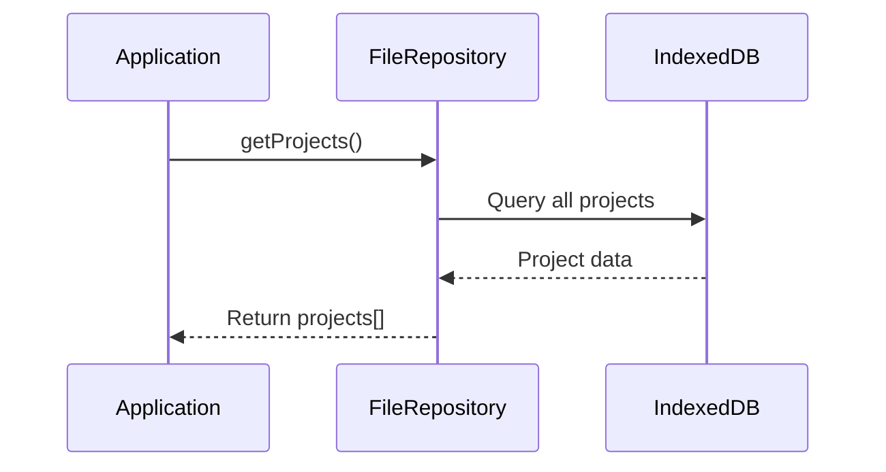
```mermaid
sequenceDiagram
    participant APP as Application
    participant REPO as FileRepository
    participant IDB as IndexedDB

    APP->>REPO: getProjects()
    REPO->>IDB: Query all projects
    IDB-->>REPO: Project data
    REPO-->>APP: Return projects[]
```

#### File Operations

**Create File:**
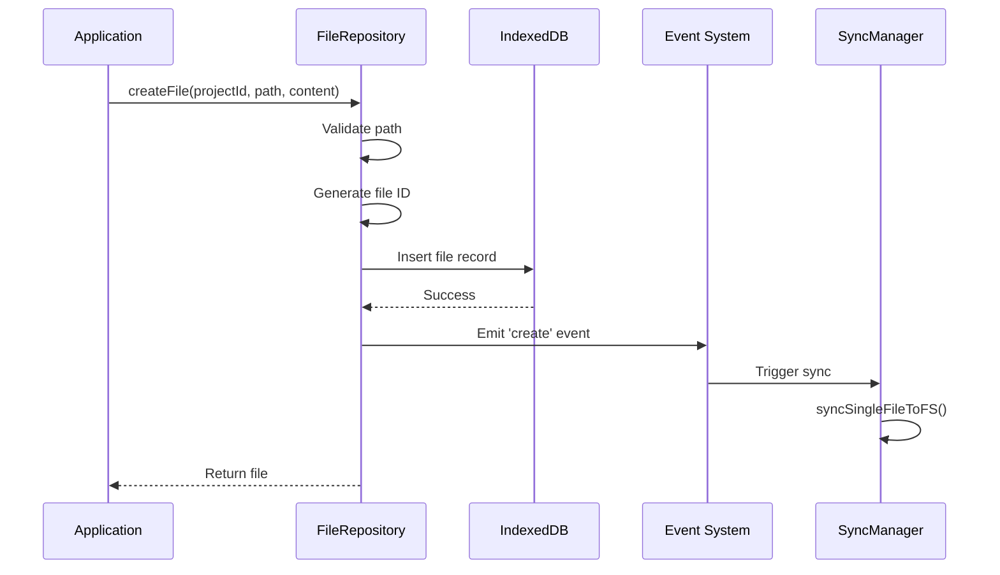
```mermaid
sequenceDiagram
    participant APP as Application
    participant REPO as FileRepository
    participant IDB as IndexedDB
    participant EVENT as Event System
    participant SYNC as SyncManager

    APP->>REPO: createFile(projectId, path, content)
    REPO->>REPO: Validate path
    REPO->>REPO: Generate file ID
    REPO->>IDB: Insert file record
    IDB-->>REPO: Success
    REPO->>EVENT: Emit 'create' event
    EVENT->>SYNC: Trigger sync
    SYNC->>SYNC: syncSingleFileToFS()
    REPO-->>APP: Return file
```

**Update File:**
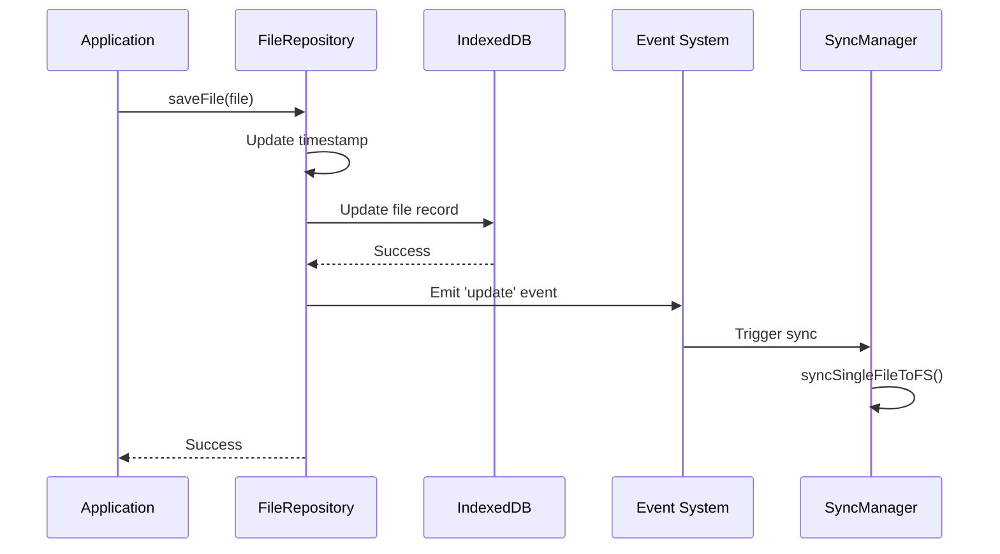
```mermaid
sequenceDiagram
    participant APP as Application
    participant REPO as FileRepository
    participant IDB as IndexedDB
    participant EVENT as Event System
    participant SYNC as SyncManager

    APP->>REPO: saveFile(file)
    REPO->>REPO: Update timestamp
    REPO->>IDB: Update file record
    IDB-->>REPO: Success
    REPO->>EVENT: Emit 'update' event
    EVENT->>SYNC: Trigger sync
    SYNC->>SYNC: syncSingleFileToFS()
    REPO-->>APP: Success
```

**Delete File:**
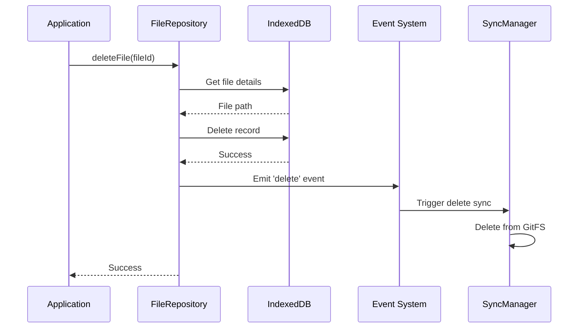
```mermaid
sequenceDiagram
    participant APP as Application
    participant REPO as FileRepository
    participant IDB as IndexedDB
    participant EVENT as Event System
    participant SYNC as SyncManager

    APP->>REPO: deleteFile(fileId)
    REPO->>IDB: Get file details
    IDB-->>REPO: File path
    REPO->>IDB: Delete record
    IDB-->>REPO: Success
    REPO->>EVENT: Emit 'delete' event
    EVENT->>SYNC: Trigger delete sync
    SYNC->>SYNC: Delete from GitFS
    REPO-->>APP: Success
```

### 2.4 Event System

FileRepositoryは変更通知のためのイベントシステムを実装しています。

**Event Flow:**
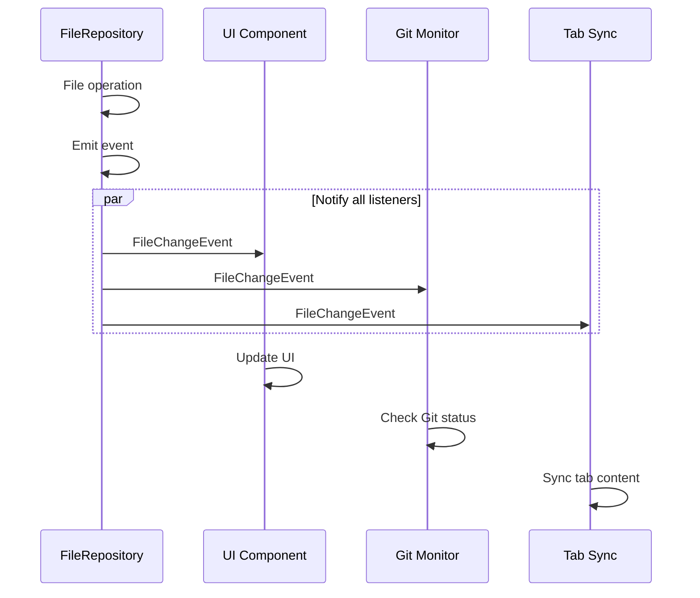
```mermaid
sequenceDiagram
    participant REPO as FileRepository
    participant LISTENER1 as UI Component
    participant LISTENER2 as Git Monitor
    participant LISTENER3 as Tab Sync

    REPO->>REPO: File operation
    REPO->>REPO: Emit event
    
    par Notify all listeners
        REPO->>LISTENER1: FileChangeEvent
        REPO->>LISTENER2: FileChangeEvent
        REPO->>LISTENER3: FileChangeEvent
    end
    
    LISTENER1->>LISTENER1: Update UI
    LISTENER2->>LISTENER2: Check Git status
    LISTENER3->>LISTENER3: Sync tab content
```

**Event Types:**

| Event Type | Payload | Triggered By |
|------------|---------|--------------|
| `create` | Full file object | createFile() |
| `update` | Full file object | saveFile() |
| `delete` | File ID and path | deleteFile() |

**Registering Listeners:**

Listeners are registered through the singleton instance and receive all file change events for processing.

### 2.5 Caching Strategy

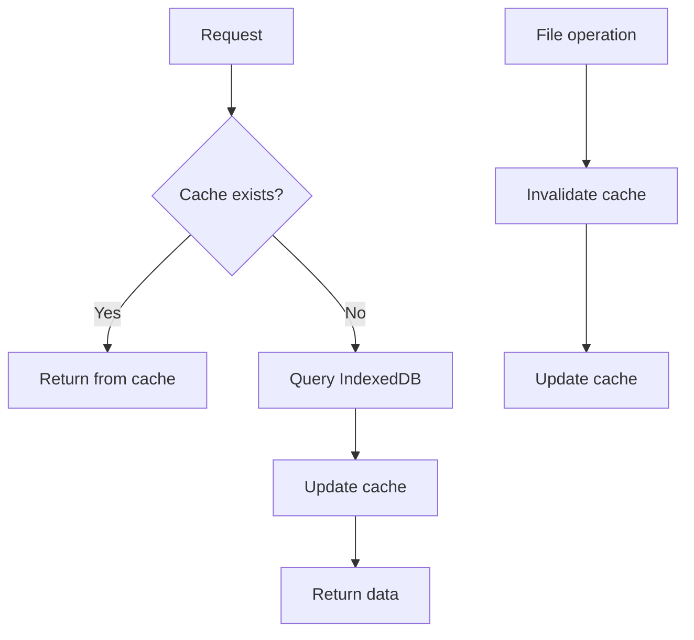
```mermaid
graph TB
    A[Request] --> B{Cache exists?}
    B -->|Yes| C[Return from cache]
    B -->|No| D[Query IndexedDB]
    D --> E[Update cache]
    E --> F[Return data]
    
    G[File operation] --> H[Invalidate cache]
    H --> I[Update cache]
```

**Cache Invalidation Rules:**
- Project name changed: Invalidate project name cache
- File created/updated/deleted: No cache currently (direct queries)
- Project deleted: Remove all related cache entries

---

## 3. GitFileSystem: lightning-fs Manager

GitFileSystemは、Git操作専用のファイルシステムを管理します。

### 3.1 Architecture

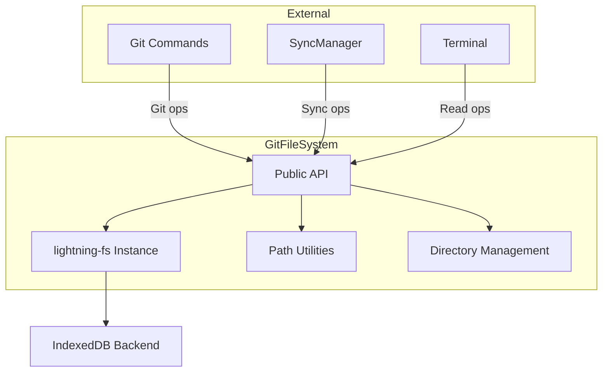
```mermaid
graph TB
    subgraph GitFileSystem
        A[Public API]
        B[lightning-fs Instance]
        C[Path Utilities]
        D[Directory Management]
    end
    
    subgraph External
        E[Git Commands]
        F[SyncManager]
        G[Terminal]
    end
    
    E -->|Git ops| A
    F -->|Sync ops| A
    G -->|Read ops| A
    
    A --> B
    A --> C
    A --> D
    B --> H[IndexedDB Backend]
```

### 3.2 File System Structure

```
/
└── projects/
    ├── project-1/
    │   ├── .git/
    │   │   ├── objects/
    │   │   ├── refs/
    │   │   └── HEAD
    │   ├── src/
    │   │   └── index.js
    │   └── package.json
    └── project-2/
        └── ...
```

### 3.3 Key Operations

#### Initialize FileSystem

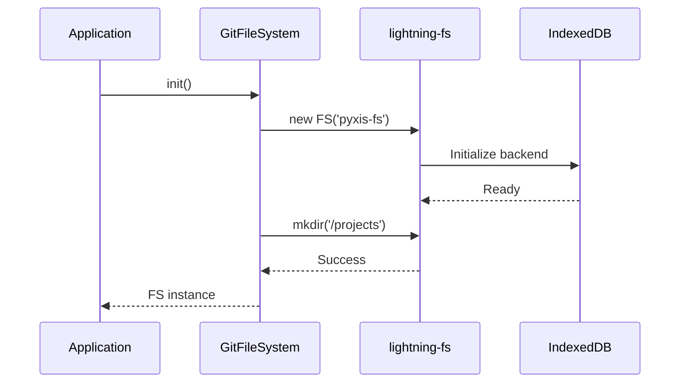
```mermaid
sequenceDiagram
    participant APP as Application
    participant GFS as GitFileSystem
    participant LFS as lightning-fs
    participant IDB as IndexedDB

    APP->>GFS: init()
    GFS->>LFS: new FS('pyxis-fs')
    LFS->>IDB: Initialize backend
    IDB-->>LFS: Ready
    GFS->>LFS: mkdir('/projects')
    LFS-->>GFS: Success
    GFS-->>APP: FS instance
```

#### Write File

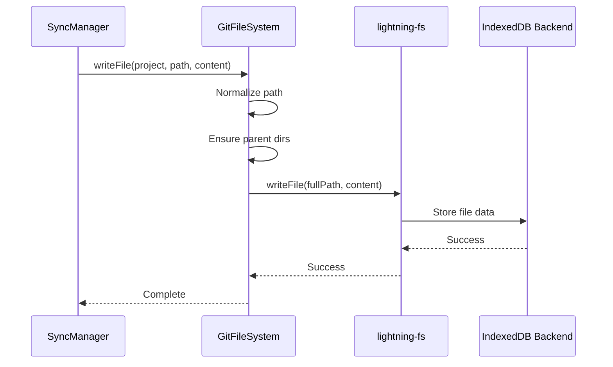
```mermaid
sequenceDiagram
    participant SYNC as SyncManager
    participant GFS as GitFileSystem
    participant LFS as lightning-fs
    participant IDB as IndexedDB Backend

    SYNC->>GFS: writeFile(project, path, content)
    GFS->>GFS: Normalize path
    GFS->>GFS: Ensure parent dirs
    GFS->>LFS: writeFile(fullPath, content)
    LFS->>IDB: Store file data
    IDB-->>LFS: Success
    LFS-->>GFS: Success
    GFS-->>SYNC: Complete
```

#### Read File

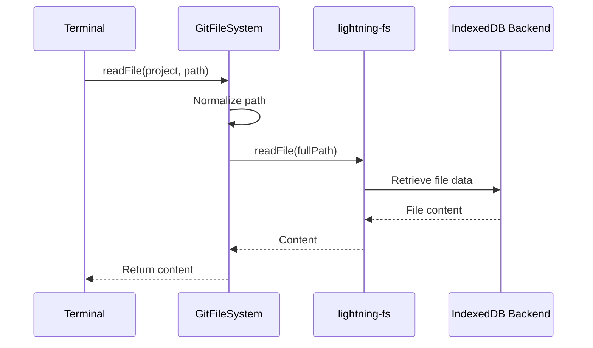
```mermaid
sequenceDiagram
    participant TERM as Terminal
    participant GFS as GitFileSystem
    participant LFS as lightning-fs
    participant IDB as IndexedDB Backend

    TERM->>GFS: readFile(project, path)
    GFS->>GFS: Normalize path
    GFS->>LFS: readFile(fullPath)
    LFS->>IDB: Retrieve file data
    IDB-->>LFS: File content
    LFS-->>GFS: Content
    GFS-->>TERM: Return content
```

### 3.4 Directory Management

**Ensure Directory:**
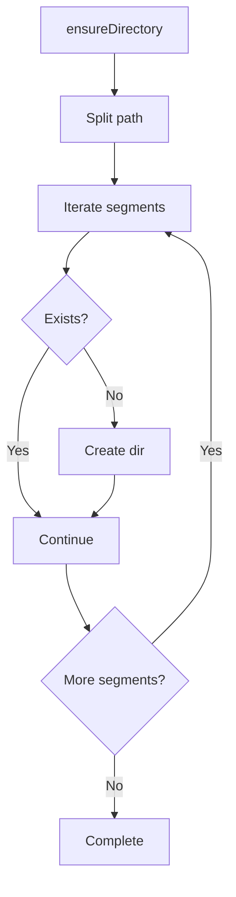
```mermaid
graph TB
    A[ensureDirectory] --> B[Split path]
    B --> C[Iterate segments]
    C --> D{Exists?}
    D -->|Yes| E[Continue]
    D -->|No| F[Create dir]
    F --> E
    E --> G{More segments?}
    G -->|Yes| C
    G -->|No| H[Complete]
```

**Clear Directory:**
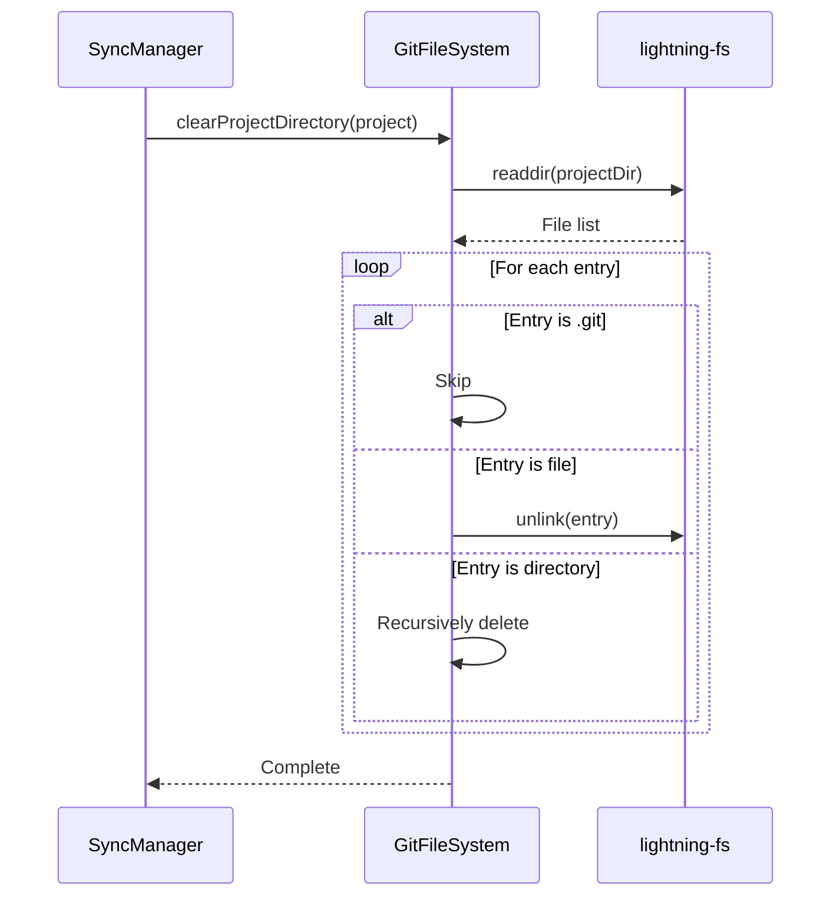
```mermaid
sequenceDiagram
    participant SYNC as SyncManager
    participant GFS as GitFileSystem
    participant LFS as lightning-fs

    SYNC->>GFS: clearProjectDirectory(project)
    GFS->>LFS: readdir(projectDir)
    LFS-->>GFS: File list
    
    loop For each entry
        alt Entry is .git
            GFS->>GFS: Skip
        else Entry is file
            GFS->>LFS: unlink(entry)
        else Entry is directory
            GFS->>GFS: Recursively delete
        end
    end
    
    GFS-->>SYNC: Complete
```

---

## 4. SyncManager: Synchronization Coordinator

SyncManagerは、IndexedDBとlightning-fsの同期を制御します。

### 4.1 Sync Responsibilities

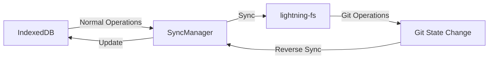
```mermaid
graph LR
    A[IndexedDB] -->|Normal Operations| B[SyncManager]
    B -->|Sync| C[lightning-fs]
    C -->|Git Operations| D[Git State Change]
    D -->|Reverse Sync| B
    B -->|Update| A
```

**Normal Flow (IndexedDB → lightning-fs):**
- User creates/edits/deletes files
- FileRepository writes to IndexedDB
- SyncManager syncs to lightning-fs (async)

**Reverse Flow (lightning-fs → IndexedDB):**
- Git operations modify lightning-fs directly
- Application calls reverse sync
- SyncManager reads lightning-fs and updates IndexedDB

### 4.2 Sync Strategies

#### Full Project Sync

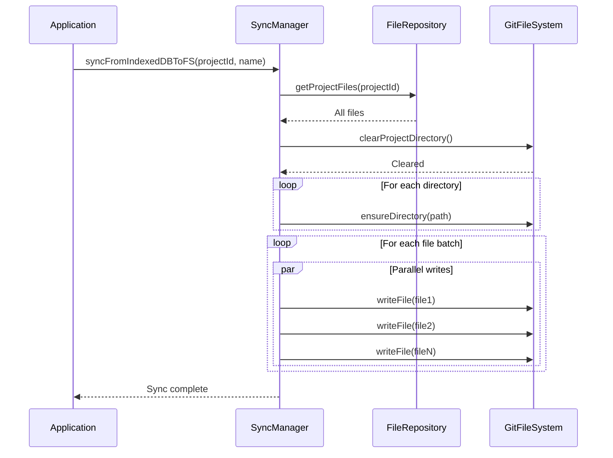
```mermaid
sequenceDiagram
    participant APP as Application
    participant SYNC as SyncManager
    participant REPO as FileRepository
    participant GFS as GitFileSystem

    APP->>SYNC: syncFromIndexedDBToFS(projectId, name)
    SYNC->>REPO: getProjectFiles(projectId)
    REPO-->>SYNC: All files
    SYNC->>GFS: clearProjectDirectory()
    GFS-->>SYNC: Cleared
    
    loop For each directory
        SYNC->>GFS: ensureDirectory(path)
    end
    
    loop For each file batch
        par Parallel writes
            SYNC->>GFS: writeFile(file1)
            SYNC->>GFS: writeFile(file2)
            SYNC->>GFS: writeFile(fileN)
        end
    end
    
    SYNC-->>APP: Sync complete
```

**Batch Processing:**
- Files are synced in batches of 10
- Small delay between batches to prevent blocking
- Timeout protection for long operations

#### Single File Sync

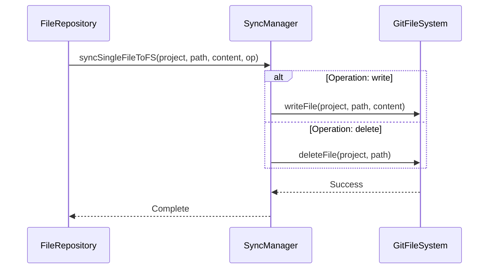
```mermaid
sequenceDiagram
    participant REPO as FileRepository
    participant SYNC as SyncManager
    participant GFS as GitFileSystem

    REPO->>SYNC: syncSingleFileToFS(project, path, content, op)
    
    alt Operation: write
        SYNC->>GFS: writeFile(project, path, content)
    else Operation: delete
        SYNC->>GFS: deleteFile(project, path)
    end
    
    GFS-->>SYNC: Success
    SYNC-->>REPO: Complete
```

**Operation Types:**
- `write`: Create or update file
- `delete`: Remove file

### 4.3 Reverse Sync (Git → IndexedDB)

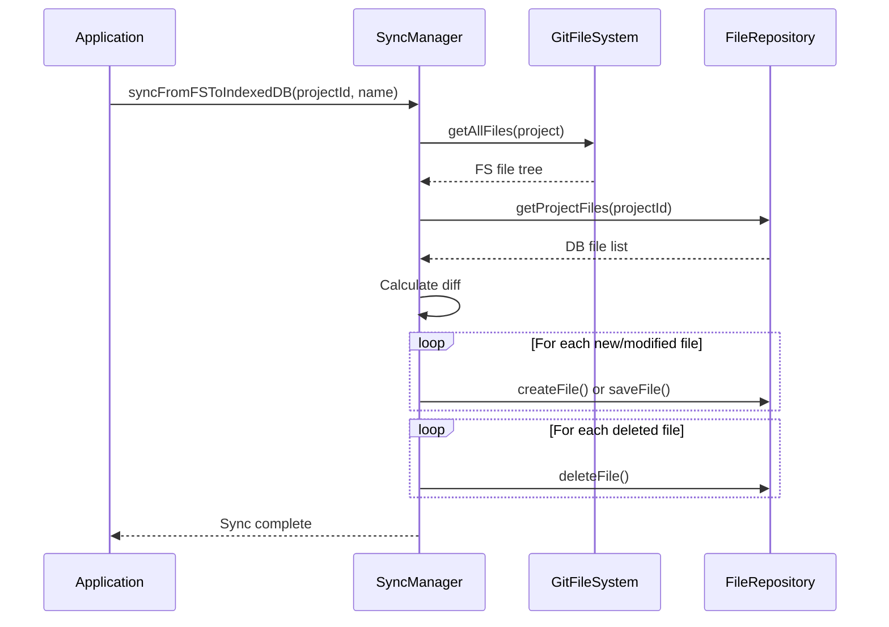
```mermaid
sequenceDiagram
    participant APP as Application
    participant SYNC as SyncManager
    participant GFS as GitFileSystem
    participant REPO as FileRepository

    APP->>SYNC: syncFromFSToIndexedDB(projectId, name)
    SYNC->>GFS: getAllFiles(project)
    GFS-->>SYNC: FS file tree
    
    SYNC->>REPO: getProjectFiles(projectId)
    REPO-->>SYNC: DB file list
    
    SYNC->>SYNC: Calculate diff
    
    loop For each new/modified file
        SYNC->>REPO: createFile() or saveFile()
    end
    
    loop For each deleted file
        SYNC->>REPO: deleteFile()
    end
    
    SYNC-->>APP: Sync complete
```

**Diff Calculation:**
- Compare file paths between FS and DB
- Check modification times
- Identify new, modified, and deleted files

---

## 5. Project Hook: React Integration

Project Hookは、ReactコンポーネントからCore Engineを使用するための統合レイヤーです。

### 5.1 Hook Architecture

```mermaid
graph TB
    subgraph useProject Hook
        A[State Management]
        B[Effect Handlers]
        C[API Methods]
        D[Event Listeners]
    end
    
    subgraph Core
        E[FileRepository]
        F[SyncManager]
        G[GitFileSystem]
    end
    
    subgraph UI
        H[React Components]
    end
    
    H -->|Call| C
    C -->|Use| E
    C -->|Use| F
    C -->|Use| G
    
    E -->|Events| D
    D -->|Update| A
    A -->|Trigger| B
    B -->|Re-render| H
```

### 5.2 State Management

**Hook State:**

| State | Type | Purpose |
|-------|------|---------|
| `currentProject` | Project or null | Currently loaded project |
| `projectFiles` | FileItem[] | Hierarchical file tree |
| `loading` | boolean | Operation in progress flag |
| `error` | Error or null | Last error state |

**State Update Flow:**
```mermaid
sequenceDiagram
    participant REPO as FileRepository
    participant HOOK as useProject
    participant COMP as Component

    REPO->>REPO: File operation
    REPO->>HOOK: Emit event
    HOOK->>HOOK: Update state
    HOOK->>COMP: Trigger re-render
    COMP->>COMP: Display updated data
```

### 5.3 Key Methods

#### Load Project

```mermaid
sequenceDiagram
    participant COMP as Component
    participant HOOK as useProject
    participant REPO as FileRepository
    participant SYNC as SyncManager

    COMP->>HOOK: loadProject(projectId)
    HOOK->>REPO: getProject(projectId)
    REPO-->>HOOK: Project data
    HOOK->>REPO: getProjectFiles(projectId)
    REPO-->>HOOK: File list
    HOOK->>HOOK: Convert to FileItem tree
    HOOK->>SYNC: syncFromIndexedDBToFS()
    SYNC-->>HOOK: Sync complete
    HOOK->>HOOK: Update state
    HOOK-->>COMP: Return success
```

#### Save File

```mermaid
sequenceDiagram
    participant COMP as Component
    participant HOOK as useProject
    participant REPO as FileRepository

    COMP->>HOOK: saveFile(content, path)
    HOOK->>REPO: getProjectFiles()
    REPO-->>HOOK: Find file
    HOOK->>REPO: saveFile(updatedFile)
    REPO-->>HOOK: Success
    Note over REPO: Auto-sync to GitFS
    Note over HOOK: Event listener updates state automatically
    HOOK-->>COMP: Return success
```

#### Create Project

```mermaid
sequenceDiagram
    participant COMP as Component
    participant HOOK as useProject
    participant REPO as FileRepository
    participant SYNC as SyncManager
    participant GIT as GitCommands

    COMP->>HOOK: createProject(name, desc)
    HOOK->>REPO: createProject(name, desc)
    REPO-->>HOOK: Project + initial files
    HOOK->>SYNC: initializeProject()
    SYNC-->>HOOK: Files synced
    HOOK->>GIT: init()
    GIT-->>HOOK: Git initialized
    HOOK->>GIT: add('.')
    HOOK->>GIT: commit('Initial commit')
    GIT-->>HOOK: Committed
    HOOK->>HOOK: Update state
    HOOK-->>COMP: Return project
```

### 5.4 Event Listener Integration

```mermaid
sequenceDiagram
    participant HOOK as useProject
    participant REPO as FileRepository

    Note over HOOK: On mount
    HOOK->>REPO: addEventListener(handler)
    REPO-->>HOOK: Registered

    loop During component lifetime
        REPO->>HOOK: File change event
        HOOK->>HOOK: refreshProjectFiles()
        HOOK->>HOOK: Update state
    end

    Note over HOOK: On unmount
    HOOK->>REPO: removeEventListener(handler)
    REPO-->>HOOK: Unregistered
```

---

## 6. Data Consistency

### 6.1 Consistency Guarantees

```mermaid
graph TB
    A[User Operation] --> B[IndexedDB Write]
    B -->|Immediate| C[IndexedDB Consistent]
    B -->|Async| D[Background Sync]
    D -->|Non-blocking| E[GitFS Write]
    E -->|Eventually| F[GitFS Consistent]
    
    style C fill:#9f9
    style F fill:#ff9
```

**Consistency Levels:**

1. **Strong Consistency**: IndexedDB (immediate writes)
2. **Eventual Consistency**: lightning-fs (async sync)
3. **No Consistency Guarantee**: localStorage (UI state only)

### 6.2 Conflict Resolution

**Scenario: Concurrent Operations**

```mermaid
sequenceDiagram
    participant USER as User
    participant REPO as FileRepository
    participant IDB as IndexedDB
    participant SYNC as SyncManager

    USER->>REPO: Save file v1
    REPO->>IDB: Write v1
    
    par Concurrent operations
        USER->>REPO: Save file v2
        SYNC->>SYNC: Sync v1 to GitFS
    end
    
    REPO->>IDB: Write v2 (overwrites v1)
    Note over REPO: v2 is now the truth
    
    SYNC->>SYNC: Sync v2 to GitFS
    Note over SYNC: GitFS eventually consistent with v2
```

**Resolution Strategy:**
- Last write wins in IndexedDB
- Sync queue ensures correct order
- No conflict: IndexedDB is always authoritative

---

## 7. Performance Characteristics

### 7.1 Operation Complexity

| Operation | IndexedDB | Sync to GitFS | Total Perceived |
|-----------|-----------|---------------|-----------------|
| Create File | O(1) | O(1) async | O(1) |
| Read File | O(1) | N/A | O(1) |
| Update File | O(1) | O(1) async | O(1) |
| Delete File | O(1) | O(1) async | O(1) |
| List Files | O(n) | N/A | O(n) |
| Full Sync | O(n) | O(n) batch | O(n) |

### 7.2 Optimization Techniques

**Batch Processing:**
```mermaid
graph LR
    A[File 1] --> D[Batch]
    B[File 2] --> D
    C[File 3] --> D
    D --> E[Parallel Sync]
    E --> F[GitFS Write]
```

**Benefits:**
- Reduced transaction overhead
- Better parallelization
- Smoother user experience

**Cache Strategy:**

現在実装されているキャッシュは、`projectNameCache` (projectId → projectName のマッピング) のみです。
プロジェクトやファイルの全体キャッシュは実装されておらず、毎回IndexedDBから読み取られます。

---

## 8. Error Handling in Core

### 8.1 Error Propagation

```mermaid
graph TB
    A[Operation] --> B{Error?}
    B -->|No| C[Success]
    B -->|Yes| D{Error Type?}
    
    D -->|IndexedDB Error| E[Throw to caller]
    D -->|Sync Error| F[Log + Continue]
    D -->|Git Error| G[Log + Throw]
    
    E --> H[UI Error Display]
    F --> I[Console Warning]
    G --> H
```

### 8.2 Error Recovery

**IndexedDB Errors:**
- Retry on transient errors
- Clear cache on corruption
- Fallback to re-initialization

**Sync Errors:**
- Log and continue (IndexedDB is still correct)
- User can manually trigger re-sync
- No data loss

**Git Errors:**
- Show error to user
- Allow retry
- Operations are idempotent where possible

---

## 9. Testing Strategies

### 9.1 Unit Testing

**Test Targets:**
- FileRepository CRUD operations
- GitFileSystem file operations
- SyncManager diff calculation
- Event system notification

**Mock Strategy:**
- Mock IndexedDB with fake-indexeddb
- Mock lightning-fs with in-memory implementation
- Spy on event listeners

### 9.2 Integration Testing

**Test Scenarios:**
- Full project lifecycle
- Concurrent operations
- Sync after Git operations
- Error recovery paths

---

## 10. Migration Guide

### 10.1 From Legacy to New Architecture

**Old Code (projectDB):**
```typescript
// DON'T USE
await projectDB.createFile(...)
```

**New Code (fileRepository):**
```typescript
// DO USE
await fileRepository.createFile(...)
```

**Old Code (filesystem):**
```typescript
// DON'T USE
const fs = getFileSystem()
await fs.promises.writeFile(...)
```

**New Code (fileRepository + auto-sync):**
```typescript
// DO USE
await fileRepository.saveFile(...)
// Automatically synced to GitFS
```

### 10.2 Gradual Migration

**Phase 1**: Use new APIs in new code
**Phase 2**: Update high-traffic paths
**Phase 3**: Refactor remaining legacy code
**Phase 4**: Remove legacy compatibility layer

---

## Related Documents

- [SYSTEM-OVERVIEW.md](./SYSTEM-OVERVIEW.md) - Overall system architecture
- [DATA-FLOW.md](./DATA-FLOW.md) - Data flow details
- [NEW-ARCHITECTURE.md](../Development/NEW-ARCHITECTURE.md) - Architecture guide

---

**Last Updated**: 2025-01-02  
**Version**: 0.7  
**Status**: Verified - Cache実装の実態を正確に記述
