# Data Flow - Complete System Flow Documentation

このドキュメントでは、Pyxis CodeCanvas全体のデータフロー、状態遷移、イベント伝播について詳細に説明します。

---

## 1. Data Flow Overview

### 1.1 System-Wide Data Flow

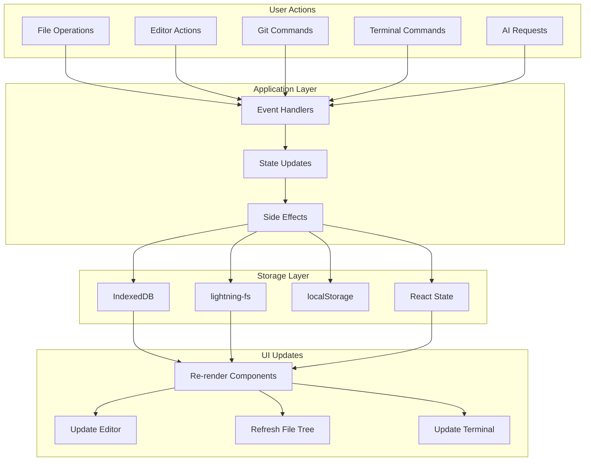
```mermaid
graph TB
    subgraph User Actions
        A1[File Operations]
        A2[Editor Actions]
        A3[Git Commands]
        A4[Terminal Commands]
        A5[AI Requests]
    end
    
    subgraph Application Layer
        B1[Event Handlers]
        B2[State Updates]
        B3[Side Effects]
    end
    
    subgraph Storage Layer
        C1[IndexedDB]
        C2[lightning-fs]
        C3[localStorage]
        C4[React State]
    end
    
    subgraph UI Updates
        D1[Re-render Components]
        D2[Update Editor]
        D3[Refresh File Tree]
        D4[Update Terminal]
    end
    
    A1 --> B1
    A2 --> B1
    A3 --> B1
    A4 --> B1
    A5 --> B1
    
    B1 --> B2
    B2 --> B3
    
    B3 --> C1
    B3 --> C2
    B3 --> C3
    B3 --> C4
    
    C1 --> D1
    C2 --> D1
    C4 --> D1
    
    D1 --> D2
    D1 --> D3
    D1 --> D4
```

---

## 2. File Operation Flows

### 2.1 Create File Flow

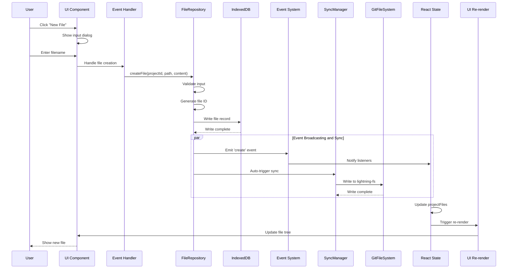
```mermaid
sequenceDiagram
    participant USER as User
    participant UI as UI Component
    participant HANDLER as Event Handler
    participant REPO as FileRepository
    participant IDB as IndexedDB
    participant EVENT as Event System
    participant SYNC as SyncManager
    participant GFS as GitFileSystem
    participant STATE as React State
    participant RENDER as UI Re-render

    USER->>UI: Click "New File"
    UI->>UI: Show input dialog
    USER->>UI: Enter filename
    UI->>HANDLER: Handle file creation
    
    HANDLER->>REPO: createFile(projectId, path, content)
    REPO->>REPO: Validate input
    REPO->>REPO: Generate file ID
    REPO->>IDB: Write file record
    IDB-->>REPO: Write complete
    
    par Event Broadcasting and Sync
        REPO->>EVENT: Emit 'create' event
        EVENT->>STATE: Notify listeners
        
        REPO->>SYNC: Auto-trigger sync
        SYNC->>GFS: Write to lightning-fs
        GFS-->>SYNC: Write complete
    end
    
    STATE->>STATE: Update projectFiles
    STATE->>RENDER: Trigger re-render
    RENDER->>UI: Update file tree
    UI-->>USER: Show new file
```

### 2.2 Edit File Flow

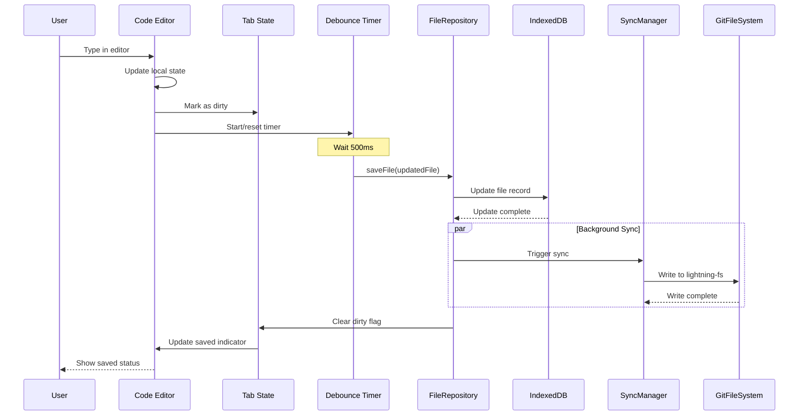
```mermaid
sequenceDiagram
    participant USER as User
    participant EDITOR as Code Editor
    participant TAB as Tab State
    participant DEBOUNCE as Debounce Timer
    participant REPO as FileRepository
    participant IDB as IndexedDB
    participant SYNC as SyncManager
    participant GFS as GitFileSystem

    USER->>EDITOR: Type in editor
    EDITOR->>EDITOR: Update local state
    EDITOR->>TAB: Mark as dirty
    
    EDITOR->>DEBOUNCE: Start/reset timer
    Note over DEBOUNCE: Wait 500ms
    
    DEBOUNCE->>REPO: saveFile(updatedFile)
    REPO->>IDB: Update file record
    IDB-->>REPO: Update complete
    
    par Background Sync
        REPO->>SYNC: Trigger sync
        SYNC->>GFS: Write to lightning-fs
        GFS-->>SYNC: Write complete
    end
    
    REPO->>TAB: Clear dirty flag
    TAB->>EDITOR: Update saved indicator
    EDITOR-->>USER: Show saved status
```

### 2.3 Delete File Flow

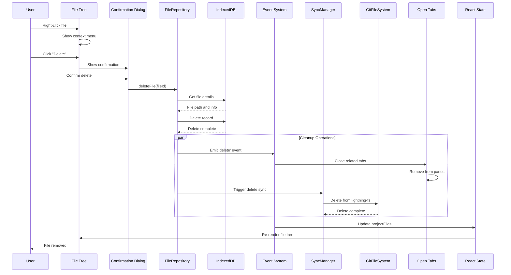
```mermaid
sequenceDiagram
    participant USER as User
    participant UI as File Tree
    participant CONFIRM as Confirmation Dialog
    participant REPO as FileRepository
    participant IDB as IndexedDB
    participant EVENT as Event System
    participant SYNC as SyncManager
    participant GFS as GitFileSystem
    participant TABS as Open Tabs
    participant STATE as React State

    USER->>UI: Right-click file
    UI->>UI: Show context menu
    USER->>UI: Click "Delete"
    UI->>CONFIRM: Show confirmation
    USER->>CONFIRM: Confirm delete
    
    CONFIRM->>REPO: deleteFile(fileId)
    REPO->>IDB: Get file details
    IDB-->>REPO: File path and info
    REPO->>IDB: Delete record
    IDB-->>REPO: Delete complete
    
    par Cleanup Operations
        REPO->>EVENT: Emit 'delete' event
        EVENT->>TABS: Close related tabs
        TABS->>TABS: Remove from panes
        
        REPO->>SYNC: Trigger delete sync
        SYNC->>GFS: Delete from lightning-fs
        GFS-->>SYNC: Delete complete
    end
    
    EVENT->>STATE: Update projectFiles
    STATE->>UI: Re-render file tree
    UI-->>USER: File removed
```

### 2.4 Move/Rename File Flow

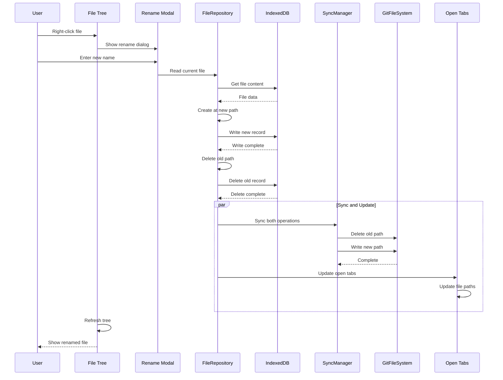
```mermaid
sequenceDiagram
    participant USER as User
    participant UI as File Tree
    participant MODAL as Rename Modal
    participant REPO as FileRepository
    participant IDB as IndexedDB
    participant SYNC as SyncManager
    participant GFS as GitFileSystem
    participant TABS as Open Tabs

    USER->>UI: Right-click file
    UI->>MODAL: Show rename dialog
    USER->>MODAL: Enter new name
    MODAL->>REPO: Read current file
    REPO->>IDB: Get file content
    IDB-->>REPO: File data
    
    REPO->>REPO: Create at new path
    REPO->>IDB: Write new record
    IDB-->>REPO: Write complete
    
    REPO->>REPO: Delete old path
    REPO->>IDB: Delete old record
    IDB-->>REPO: Delete complete
    
    par Sync and Update
        REPO->>SYNC: Sync both operations
        SYNC->>GFS: Delete old path
        SYNC->>GFS: Write new path
        GFS-->>SYNC: Complete
        
        REPO->>TABS: Update open tabs
        TABS->>TABS: Update file paths
    end
    
    UI->>UI: Refresh tree
    UI-->>USER: Show renamed file
```

---

## 3. Project Lifecycle Flows

### 3.1 Create Project Flow

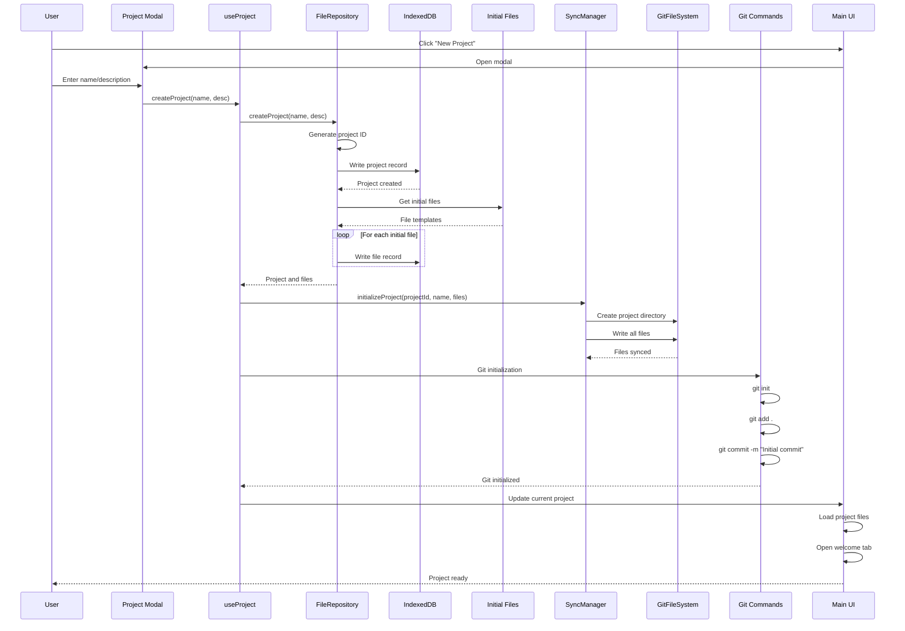
```mermaid
sequenceDiagram
    participant USER as User
    participant MODAL as Project Modal
    participant HOOK as useProject
    participant REPO as FileRepository
    participant IDB as IndexedDB
    participant INIT as Initial Files
    participant SYNC as SyncManager
    participant GFS as GitFileSystem
    participant GIT as Git Commands
    participant UI as Main UI

    USER->>UI: Click "New Project"
    UI->>MODAL: Open modal
    USER->>MODAL: Enter name/description
    MODAL->>HOOK: createProject(name, desc)
    
    HOOK->>REPO: createProject(name, desc)
    REPO->>REPO: Generate project ID
    REPO->>IDB: Write project record
    IDB-->>REPO: Project created
    
    REPO->>INIT: Get initial files
    INIT-->>REPO: File templates
    
    loop For each initial file
        REPO->>IDB: Write file record
    end
    
    REPO-->>HOOK: Project and files
    
    HOOK->>SYNC: initializeProject(projectId, name, files)
    SYNC->>GFS: Create project directory
    SYNC->>GFS: Write all files
    GFS-->>SYNC: Files synced
    
    HOOK->>GIT: Git initialization
    GIT->>GIT: git init
    GIT->>GIT: git add .
    GIT->>GIT: git commit -m "Initial commit"
    GIT-->>HOOK: Git initialized
    
    HOOK->>UI: Update current project
    UI->>UI: Load project files
    UI->>UI: Open welcome tab
    UI-->>USER: Project ready
```

### 3.2 Load Project Flow

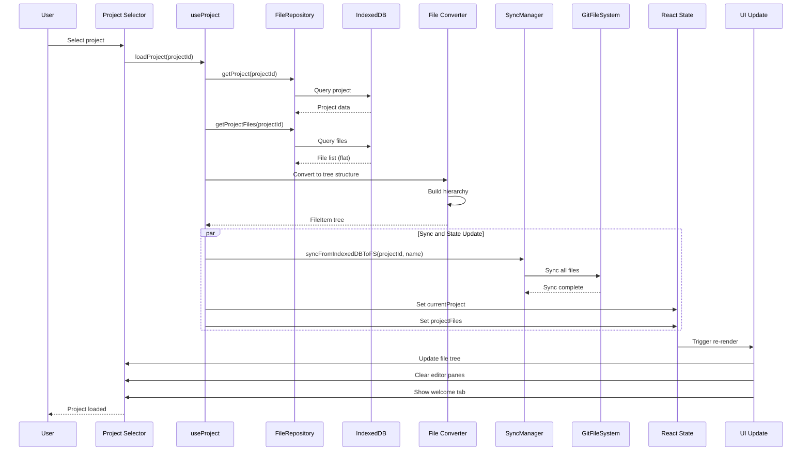
```mermaid
sequenceDiagram
    participant USER as User
    participant UI as Project Selector
    participant HOOK as useProject
    participant REPO as FileRepository
    participant IDB as IndexedDB
    participant CONVERT as File Converter
    participant SYNC as SyncManager
    participant GFS as GitFileSystem
    participant STATE as React State
    participant RENDER as UI Update

    USER->>UI: Select project
    UI->>HOOK: loadProject(projectId)
    
    HOOK->>REPO: getProject(projectId)
    REPO->>IDB: Query project
    IDB-->>REPO: Project data
    
    HOOK->>REPO: getProjectFiles(projectId)
    REPO->>IDB: Query files
    IDB-->>REPO: File list (flat)
    
    HOOK->>CONVERT: Convert to tree structure
    CONVERT->>CONVERT: Build hierarchy
    CONVERT-->>HOOK: FileItem tree
    
    par Sync and State Update
        HOOK->>SYNC: syncFromIndexedDBToFS(projectId, name)
        SYNC->>GFS: Sync all files
        GFS-->>SYNC: Sync complete
        
        HOOK->>STATE: Set currentProject
        HOOK->>STATE: Set projectFiles
    end
    
    STATE->>RENDER: Trigger re-render
    RENDER->>UI: Update file tree
    RENDER->>UI: Clear editor panes
    RENDER->>UI: Show welcome tab
    UI-->>USER: Project loaded
```

### 3.3 Switch Project Flow

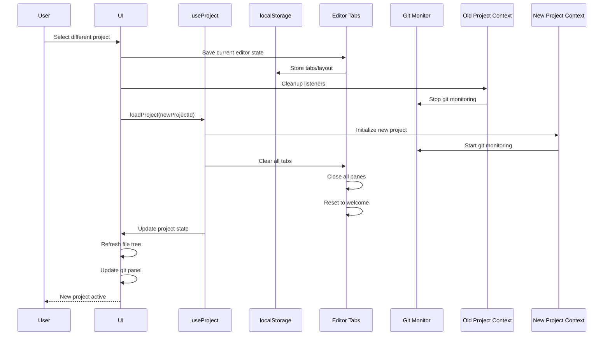
```mermaid
sequenceDiagram
    participant USER as User
    participant UI as UI
    participant HOOK as useProject
    participant LS as localStorage
    participant TABS as Editor Tabs
    participant GIT as Git Monitor
    participant OLD_PROJ as Old Project Context
    participant NEW_PROJ as New Project Context

    USER->>UI: Select different project
    
    UI->>TABS: Save current editor state
    TABS->>LS: Store tabs/layout
    
    UI->>OLD_PROJ: Cleanup listeners
    OLD_PROJ->>GIT: Stop git monitoring
    
    UI->>HOOK: loadProject(newProjectId)
    HOOK->>NEW_PROJ: Initialize new project
    NEW_PROJ->>GIT: Start git monitoring
    
    HOOK->>TABS: Clear all tabs
    TABS->>TABS: Close all panes
    TABS->>TABS: Reset to welcome
    
    HOOK->>UI: Update project state
    UI->>UI: Refresh file tree
    UI->>UI: Update git panel
    UI-->>USER: New project active
```

### 3.4 Delete Project Flow

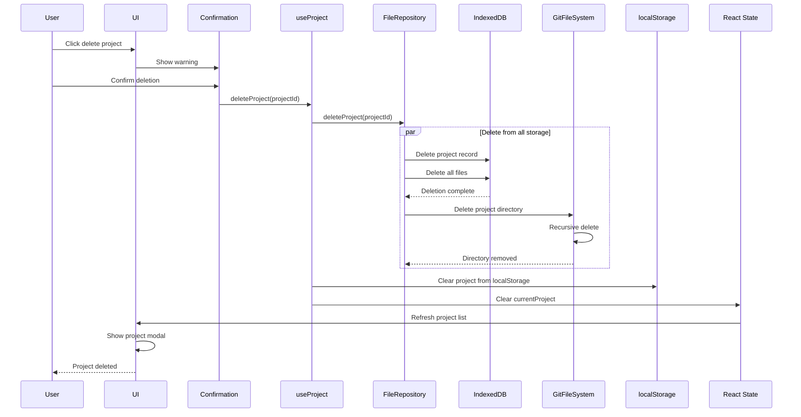
```mermaid
sequenceDiagram
    participant USER as User
    participant UI as UI
    participant CONFIRM as Confirmation
    participant HOOK as useProject
    participant REPO as FileRepository
    participant IDB as IndexedDB
    participant GFS as GitFileSystem
    participant LS as localStorage
    participant STATE as React State

    USER->>UI: Click delete project
    UI->>CONFIRM: Show warning
    USER->>CONFIRM: Confirm deletion
    
    CONFIRM->>HOOK: deleteProject(projectId)
    HOOK->>REPO: deleteProject(projectId)
    
    par Delete from all storage
        REPO->>IDB: Delete project record
        REPO->>IDB: Delete all files
        IDB-->>REPO: Deletion complete
        
        REPO->>GFS: Delete project directory
        GFS->>GFS: Recursive delete
        GFS-->>REPO: Directory removed
    end
    
    HOOK->>LS: Clear project from localStorage
    HOOK->>STATE: Clear currentProject
    STATE->>UI: Refresh project list
    UI->>UI: Show project modal
    UI-->>USER: Project deleted
```

---

## 4. Git Operation Flows

### 4.1 Git Commit Flow

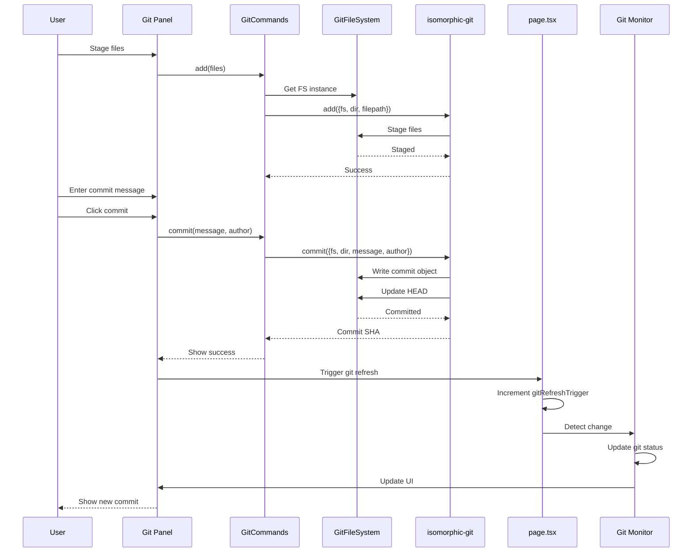
```mermaid
sequenceDiagram
    participant USER as User
    participant GIT_UI as Git Panel
    participant GIT as GitCommands
    participant GFS as GitFileSystem
    participant ISOGIT as isomorphic-git
    participant PAGE as page.tsx
    participant MONITOR as Git Monitor

    USER->>GIT_UI: Stage files
    GIT_UI->>GIT: add(files)
    GIT->>GFS: Get FS instance
    GIT->>ISOGIT: add({fs, dir, filepath})
    ISOGIT->>GFS: Stage files
    GFS-->>ISOGIT: Staged
    ISOGIT-->>GIT: Success
    
    USER->>GIT_UI: Enter commit message
    USER->>GIT_UI: Click commit
    GIT_UI->>GIT: commit(message, author)
    GIT->>ISOGIT: commit({fs, dir, message, author})
    ISOGIT->>GFS: Write commit object
    ISOGIT->>GFS: Update HEAD
    GFS-->>ISOGIT: Committed
    ISOGIT-->>GIT: Commit SHA
    
    GIT-->>GIT_UI: Show success
    GIT_UI->>PAGE: Trigger git refresh
    PAGE->>PAGE: Increment gitRefreshTrigger
    PAGE->>MONITOR: Detect change
    MONITOR->>MONITOR: Update git status
    MONITOR->>GIT_UI: Update UI
    GIT_UI-->>USER: Show new commit
```

### 4.2 Git Branch Flow

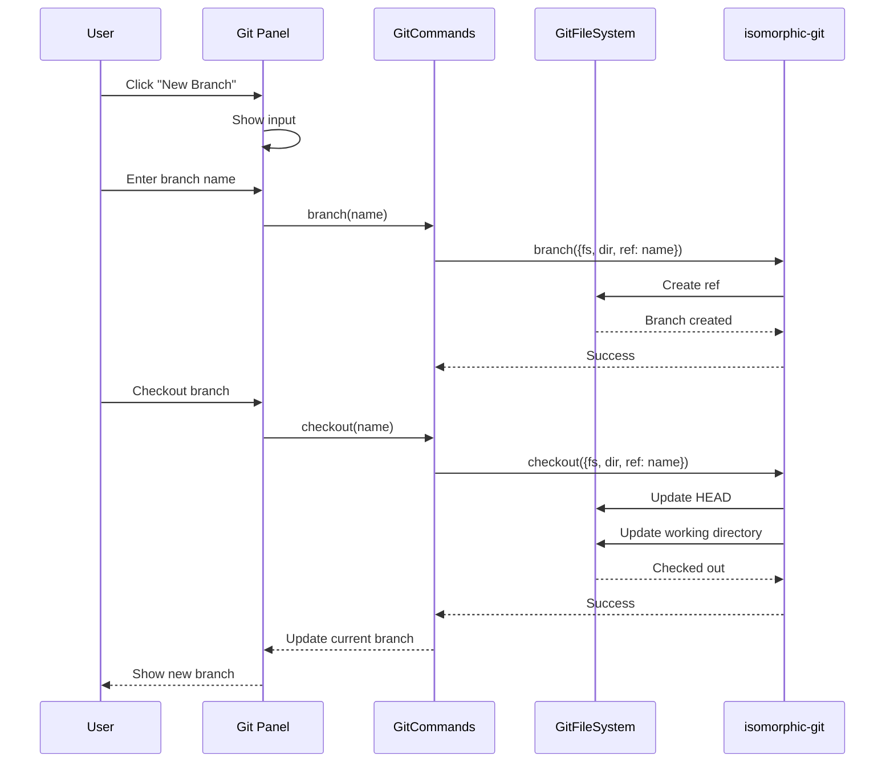
```mermaid
sequenceDiagram
    participant USER as User
    participant GIT_UI as Git Panel
    participant GIT as GitCommands
    participant GFS as GitFileSystem
    participant ISOGIT as isomorphic-git

    USER->>GIT_UI: Click "New Branch"
    GIT_UI->>GIT_UI: Show input
    USER->>GIT_UI: Enter branch name
    
    GIT_UI->>GIT: branch(name)
    GIT->>ISOGIT: branch({fs, dir, ref: name})
    ISOGIT->>GFS: Create ref
    GFS-->>ISOGIT: Branch created
    ISOGIT-->>GIT: Success
    
    USER->>GIT_UI: Checkout branch
    GIT_UI->>GIT: checkout(name)
    GIT->>ISOGIT: checkout({fs, dir, ref: name})
    ISOGIT->>GFS: Update HEAD
    ISOGIT->>GFS: Update working directory
    GFS-->>ISOGIT: Checked out
    ISOGIT-->>GIT: Success
    
    GIT-->>GIT_UI: Update current branch
    GIT_UI-->>USER: Show new branch
```

### 4.3 Git Diff Flow

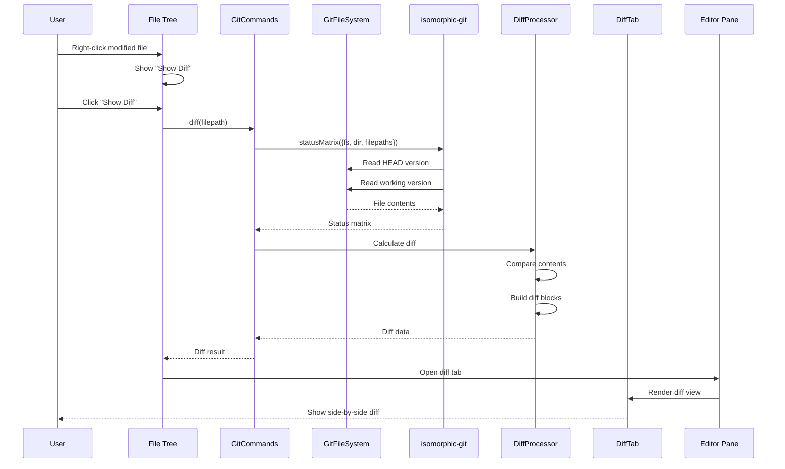
```mermaid
sequenceDiagram
    participant USER as User
    participant FILE_TREE as File Tree
    participant GIT as GitCommands
    participant GFS as GitFileSystem
    participant ISOGIT as isomorphic-git
    participant DIFF_PROC as DiffProcessor
    participant DIFF_TAB as DiffTab
    participant EDITOR as Editor Pane

    USER->>FILE_TREE: Right-click modified file
    FILE_TREE->>FILE_TREE: Show "Show Diff"
    USER->>FILE_TREE: Click "Show Diff"
    
    FILE_TREE->>GIT: diff(filepath)
    GIT->>ISOGIT: statusMatrix({fs, dir, filepaths})
    ISOGIT->>GFS: Read HEAD version
    ISOGIT->>GFS: Read working version
    GFS-->>ISOGIT: File contents
    ISOGIT-->>GIT: Status matrix
    
    GIT->>DIFF_PROC: Calculate diff
    DIFF_PROC->>DIFF_PROC: Compare contents
    DIFF_PROC->>DIFF_PROC: Build diff blocks
    DIFF_PROC-->>GIT: Diff data
    
    GIT-->>FILE_TREE: Diff result
    FILE_TREE->>EDITOR: Open diff tab
    EDITOR->>DIFF_TAB: Render diff view
    DIFF_TAB-->>USER: Show side-by-side diff
```

### 4.4 Git Merge Flow

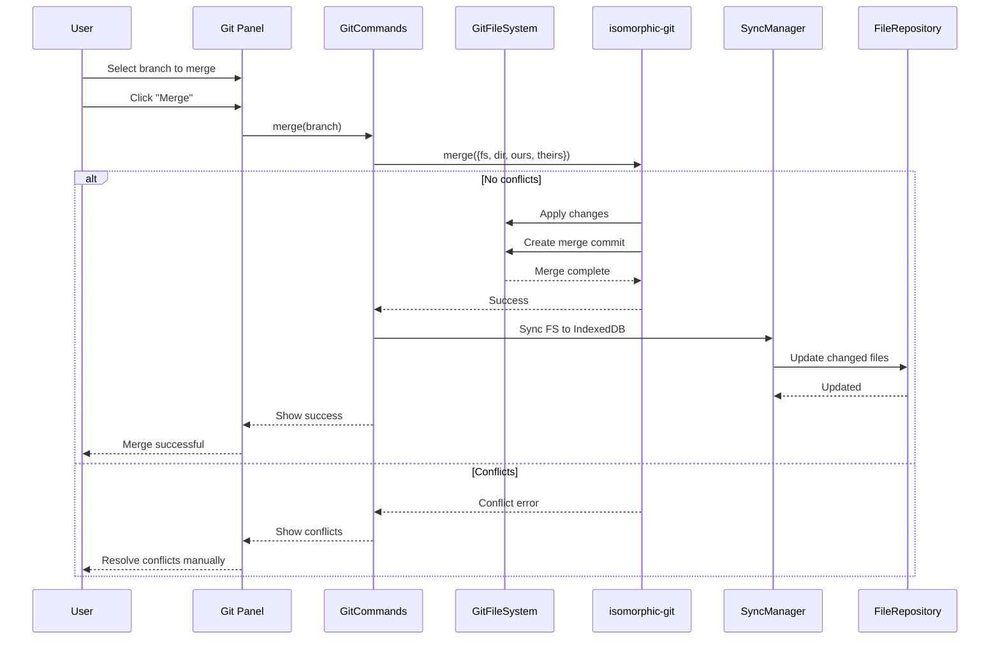
```mermaid
sequenceDiagram
    participant USER as User
    participant GIT_UI as Git Panel
    participant GIT as GitCommands
    participant GFS as GitFileSystem
    participant ISOGIT as isomorphic-git
    participant SYNC as SyncManager
    participant REPO as FileRepository

    USER->>GIT_UI: Select branch to merge
    USER->>GIT_UI: Click "Merge"
    
    GIT_UI->>GIT: merge(branch)
    GIT->>ISOGIT: merge({fs, dir, ours, theirs})
    
    alt No conflicts
        ISOGIT->>GFS: Apply changes
        ISOGIT->>GFS: Create merge commit
        GFS-->>ISOGIT: Merge complete
        ISOGIT-->>GIT: Success
        
        GIT->>SYNC: Sync FS to IndexedDB
        SYNC->>REPO: Update changed files
        REPO-->>SYNC: Updated
        
        GIT-->>GIT_UI: Show success
        GIT_UI-->>USER: Merge successful
        
    else Conflicts
        ISOGIT-->>GIT: Conflict error
        GIT-->>GIT_UI: Show conflicts
        GIT_UI-->>USER: Resolve conflicts manually
    end
```

---

## 5. Terminal Operation Flows

### 5.1 Unix Command Flow

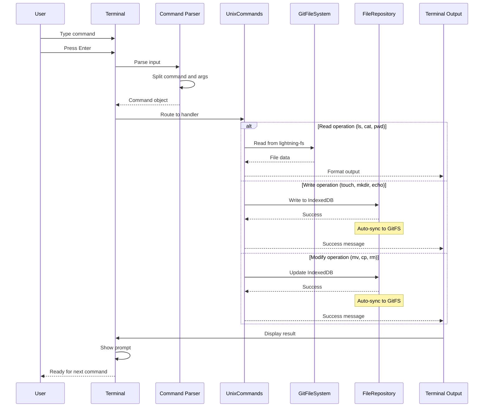
```mermaid
sequenceDiagram
    participant USER as User
    participant TERM as Terminal
    participant PARSER as Command Parser
    participant UNIX as UnixCommands
    participant GFS as GitFileSystem
    participant REPO as FileRepository
    participant OUTPUT as Terminal Output

    USER->>TERM: Type command
    USER->>TERM: Press Enter
    TERM->>PARSER: Parse input
    PARSER->>PARSER: Split command and args
    PARSER-->>TERM: Command object
    
    TERM->>UNIX: Route to handler
    
    alt Read operation (ls, cat, pwd)
        UNIX->>GFS: Read from lightning-fs
        GFS-->>UNIX: File data
        UNIX-->>OUTPUT: Format output
        
    else Write operation (touch, mkdir, echo)
        UNIX->>REPO: Write to IndexedDB
        REPO-->>UNIX: Success
        Note over REPO: Auto-sync to GitFS
        UNIX-->>OUTPUT: Success message
        
    else Modify operation (mv, cp, rm)
        UNIX->>REPO: Update IndexedDB
        REPO-->>UNIX: Success
        Note over REPO: Auto-sync to GitFS
        UNIX-->>OUTPUT: Success message
    end
    
    OUTPUT->>TERM: Display result
    TERM->>TERM: Show prompt
    TERM-->>USER: Ready for next command
```

### 5.2 NPM Command Flow

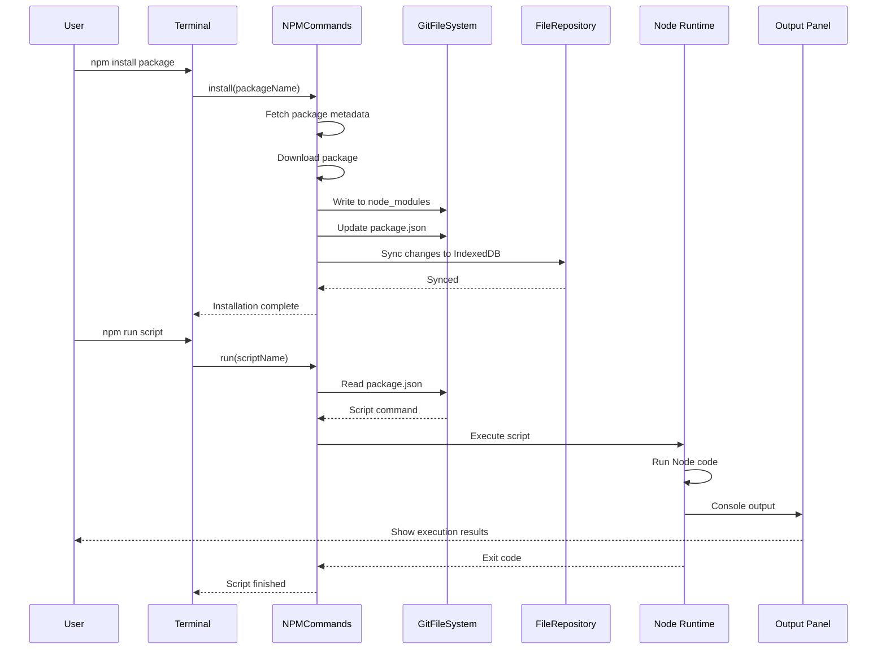
```mermaid
sequenceDiagram
    participant USER as User
    participant TERM as Terminal
    participant NPM as NPMCommands
    participant GFS as GitFileSystem
    participant REPO as FileRepository
    participant RUNTIME as Node Runtime
    participant OUTPUT as Output Panel

    USER->>TERM: npm install package
    TERM->>NPM: install(packageName)
    
    NPM->>NPM: Fetch package metadata
    NPM->>NPM: Download package
    NPM->>GFS: Write to node_modules
    NPM->>GFS: Update package.json
    
    NPM->>REPO: Sync changes to IndexedDB
    REPO-->>NPM: Synced
    
    NPM-->>TERM: Installation complete
    
    USER->>TERM: npm run script
    TERM->>NPM: run(scriptName)
    NPM->>GFS: Read package.json
    GFS-->>NPM: Script command
    
    NPM->>RUNTIME: Execute script
    RUNTIME->>RUNTIME: Run Node code
    RUNTIME->>OUTPUT: Console output
    OUTPUT-->>USER: Show execution results
    
    RUNTIME-->>NPM: Exit code
    NPM-->>TERM: Script finished
```

---

## 6. AI Operation Flows

### 6.1 Code Review Flow

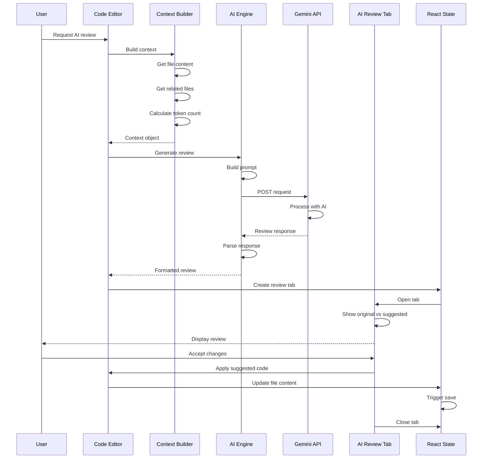
```mermaid
sequenceDiagram
    participant USER as User
    participant EDITOR as Code Editor
    participant CTX as Context Builder
    participant AI as AI Engine
    participant API as Gemini API
    participant REVIEW_TAB as AI Review Tab
    participant STATE as React State

    USER->>EDITOR: Request AI review
    EDITOR->>CTX: Build context
    CTX->>CTX: Get file content
    CTX->>CTX: Get related files
    CTX->>CTX: Calculate token count
    CTX-->>EDITOR: Context object
    
    EDITOR->>AI: Generate review
    AI->>AI: Build prompt
    AI->>API: POST request
    API->>API: Process with AI
    API-->>AI: Review response
    AI->>AI: Parse response
    AI-->>EDITOR: Formatted review
    
    EDITOR->>STATE: Create review tab
    STATE->>REVIEW_TAB: Open tab
    REVIEW_TAB->>REVIEW_TAB: Show original vs suggested
    REVIEW_TAB-->>USER: Display review
    
    USER->>REVIEW_TAB: Accept changes
    REVIEW_TAB->>EDITOR: Apply suggested code
    EDITOR->>STATE: Update file content
    STATE->>STATE: Trigger save
    REVIEW_TAB->>STATE: Close tab
```

### 6.2 AI Chat Flow

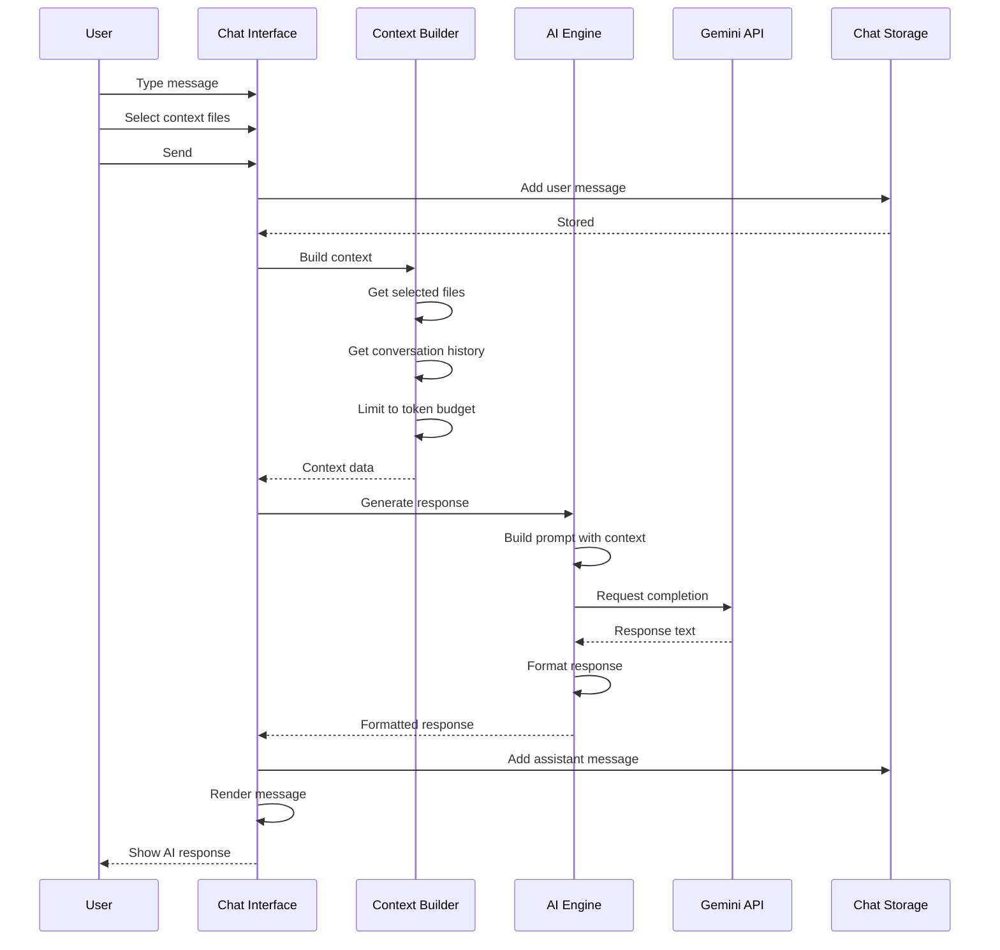
```mermaid
sequenceDiagram
    participant USER as User
    participant CHAT_UI as Chat Interface
    participant CTX as Context Builder
    participant AI as AI Engine
    participant API as Gemini API
    participant STORE as Chat Storage

    USER->>CHAT_UI: Type message
    USER->>CHAT_UI: Select context files
    USER->>CHAT_UI: Send
    
    CHAT_UI->>STORE: Add user message
    STORE-->>CHAT_UI: Stored
    
    CHAT_UI->>CTX: Build context
    CTX->>CTX: Get selected files
    CTX->>CTX: Get conversation history
    CTX->>CTX: Limit to token budget
    CTX-->>CHAT_UI: Context data
    
    CHAT_UI->>AI: Generate response
    AI->>AI: Build prompt with context
    AI->>API: Request completion
    API-->>AI: Response text
    AI->>AI: Format response
    AI-->>CHAT_UI: Formatted response
    
    CHAT_UI->>STORE: Add assistant message
    CHAT_UI->>CHAT_UI: Render message
    CHAT_UI-->>USER: Show AI response
```

---

## 7. UI Update Flows

### 7.1 File Tree Update Flow

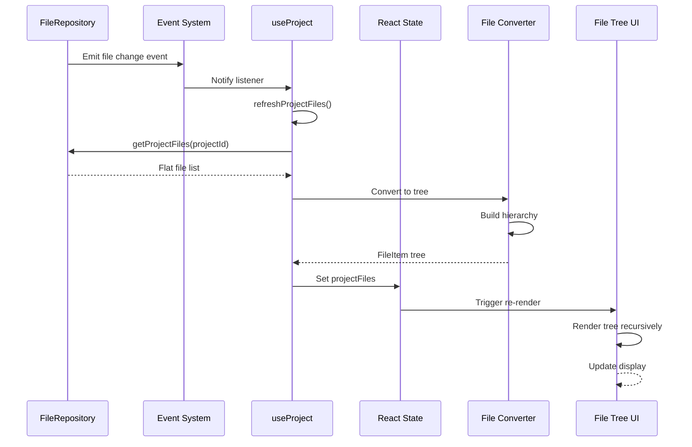
```mermaid
sequenceDiagram
    participant REPO as FileRepository
    participant EVENT as Event System
    participant HOOK as useProject
    participant STATE as React State
    participant CONVERT as File Converter
    participant TREE_UI as File Tree UI

    REPO->>EVENT: Emit file change event
    EVENT->>HOOK: Notify listener
    HOOK->>HOOK: refreshProjectFiles()
    HOOK->>REPO: getProjectFiles(projectId)
    REPO-->>HOOK: Flat file list
    
    HOOK->>CONVERT: Convert to tree
    CONVERT->>CONVERT: Build hierarchy
    CONVERT-->>HOOK: FileItem tree
    
    HOOK->>STATE: Set projectFiles
    STATE->>TREE_UI: Trigger re-render
    TREE_UI->>TREE_UI: Render tree recursively
    TREE_UI-->>TREE_UI: Update display
```

### 7.2 Tab Content Update Flow

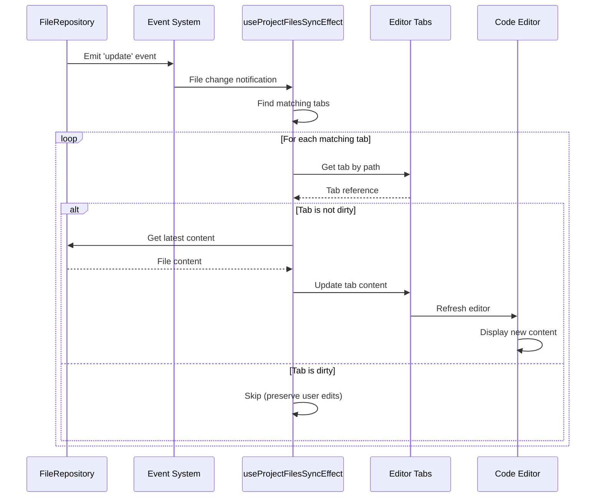
```mermaid
sequenceDiagram
    participant REPO as FileRepository
    participant EVENT as Event System
    participant EFFECT as useProjectFilesSyncEffect
    participant TABS as Editor Tabs
    participant EDITOR as Code Editor

    REPO->>EVENT: Emit 'update' event
    EVENT->>EFFECT: File change notification
    EFFECT->>EFFECT: Find matching tabs
    
    loop For each matching tab
        EFFECT->>TABS: Get tab by path
        TABS-->>EFFECT: Tab reference
        
        alt Tab is not dirty
            EFFECT->>REPO: Get latest content
            REPO-->>EFFECT: File content
            EFFECT->>TABS: Update tab content
            TABS->>EDITOR: Refresh editor
            EDITOR->>EDITOR: Display new content
        else Tab is dirty
            EFFECT->>EFFECT: Skip (preserve user edits)
        end
    end
```

### 7.3 Git Status Update Flow

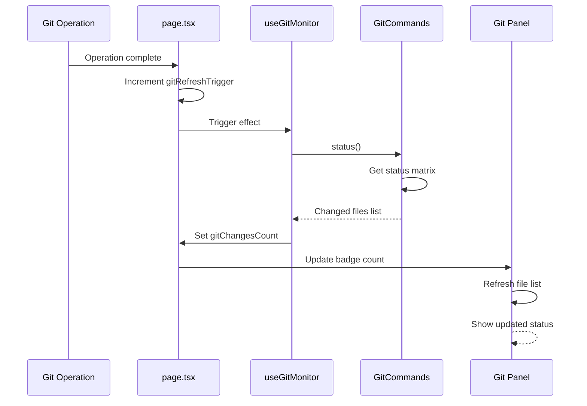
```mermaid
sequenceDiagram
    participant GIT_OP as Git Operation
    participant PAGE as page.tsx
    participant MONITOR as useGitMonitor
    participant GIT as GitCommands
    participant GIT_UI as Git Panel

    GIT_OP->>PAGE: Operation complete
    PAGE->>PAGE: Increment gitRefreshTrigger
    PAGE->>MONITOR: Trigger effect
    
    MONITOR->>GIT: status()
    GIT->>GIT: Get status matrix
    GIT-->>MONITOR: Changed files list
    
    MONITOR->>PAGE: Set gitChangesCount
    PAGE->>GIT_UI: Update badge count
    GIT_UI->>GIT_UI: Refresh file list
    GIT_UI-->>GIT_UI: Show updated status
```

---

## 8. State Persistence Flows

### 8.1 Editor Layout Persistence

```mermaid
sequenceDiagram
    participant USER as User
    participant EDITOR as Editor Panes
    participant STATE as React State
    participant EFFECT as useEffect
    participant LS as localStorage

    USER->>EDITOR: Modify layout (split, resize, etc.)
    EDITOR->>STATE: Update editors state
    STATE->>EFFECT: Trigger effect
    
    Note over EFFECT: Debounce 500ms
    
    EFFECT->>EFFECT: Serialize editor state
    EFFECT->>LS: Save to localStorage
    LS-->>EFFECT: Saved
    
    Note over LS: On next page load
    
    LS->>EFFECT: Read saved layout
    EFFECT->>STATE: Restore editors state
    STATE->>EDITOR: Render restored layout
    EDITOR-->>USER: Previous layout restored
```

### 8.2 Tab Restoration Flow

```mermaid
sequenceDiagram
    participant BROWSER as Browser
    participant PAGE as page.tsx
    participant LS as localStorage
    participant REPO as FileRepository
    participant TABS as Editor Tabs
    participant EDITOR as Code Editor

    BROWSER->>PAGE: Mount component
    PAGE->>LS: Load saved tabs
    LS-->>PAGE: Tab metadata (paths, flags)
    
    PAGE->>PAGE: Set isRestoredFromLocalStorage = false
    PAGE->>TABS: Create tabs with metadata
    TABS->>TABS: Mark needsContentRestore = true
    
    PAGE->>REPO: Load project
    REPO-->>PAGE: Project loaded
    PAGE->>PAGE: Set isRestoredFromLocalStorage = true
    
    PAGE->>TABS: Trigger content restore
    
    loop For each tab needing restore
        TABS->>REPO: Get file content
        REPO-->>TABS: File content
        TABS->>EDITOR: Set content
        TABS->>TABS: Clear needsContentRestore
    end
    
    TABS-->>BROWSER: Tabs fully restored
```

---

## 9. Error Propagation Flows

### 9.1 File Operation Error Flow

```mermaid
sequenceDiagram
    participant USER as User
    participant UI as UI Component
    participant REPO as FileRepository
    participant IDB as IndexedDB
    participant ERROR as Error Handler
    participant TOAST as Toast Notification

    USER->>UI: Attempt operation
    UI->>REPO: File operation
    REPO->>IDB: Database operation
    
    alt Database error
        IDB-->>REPO: Error
        REPO->>ERROR: Catch error
        ERROR->>ERROR: Log to console
        ERROR->>TOAST: Show error message
        TOAST-->>USER: Error notification
        ERROR-->>UI: Throw error
        UI->>UI: Revert UI state
        
    else Success
        IDB-->>REPO: Success
        REPO-->>UI: Success
        UI-->>USER: Operation complete
    end
```

### 9.2 AI Error Handling

**エラー処理:**
- APIエラー(429, 500等) → エラーメッセージ表示
- ネットワークエラー → ユーザーに通知
- 無効なAPIキー → 設定画面へ誘導

> **注意**: 現在、自動リトライやExponential Backoffは実装されていません。

---

## 10. Performance Optimization Flows

### 10.1 Debounced Save Flow

```mermaid
sequenceDiagram
    participant USER as User
    participant EDITOR as Code Editor
    participant DEBOUNCE as Debounce Timer
    participant REPO as FileRepository

    USER->>EDITOR: Type character 1
    EDITOR->>DEBOUNCE: Start timer (500ms)
    
    USER->>EDITOR: Type character 2
    EDITOR->>DEBOUNCE: Reset timer
    
    USER->>EDITOR: Type character 3
    EDITOR->>DEBOUNCE: Reset timer
    
    Note over USER: User stops typing
    Note over DEBOUNCE: Wait 500ms
    
    DEBOUNCE->>REPO: Save file
    REPO->>REPO: Write to IndexedDB
    REPO-->>EDITOR: Save complete
    EDITOR-->>USER: Show saved indicator
```

---

## Related Documents

- [SYSTEM-OVERVIEW.md](./SYSTEM-OVERVIEW.md) - System architecture overview
- [CORE-ENGINE.md](./CORE-ENGINE.md) - Core engine detailed design
- [UI-COMPONENTS.md](./UI-COMPONENTS.md) - UI component architecture
- [AI-SYSTEM.md](./AI-SYSTEM.md) - AI integration system
- [NODE-RUNTIME.md](./NODE-RUNTIME.md) - Browser Node.js runtime

---

**Last Updated**: 2025-01-02  
**Version**: 0.7  
**Status**: Verified - 未実装機能削除(Batch Queue, Retry Logic, User Scenarios)
