# Extension System

Pyxisの拡張機能システムは、動的なモジュール読み込み、型安全なAPI、IndexedDBによる永続化を組み合わせ、ブラウザ環境で完全に独立した拡張機能エコシステムを実現しています。

## 目次

1. [基盤となる仕組み](#基盤となる仕組み)
2. [TypeScriptトランスパイル拡張機能](#typescriptトランスパイル拡張機能)
3. [サイドバーパネル拡張機能](#サイドバーパネル拡張機能)
4. [カスタムタブ拡張機能](#カスタムタブ拡張機能)
5. [ターミナルコマンド拡張機能](#ターミナルコマンド拡張機能)
6. [API提供の仕組み](#api提供の仕組み)
7. [拡張機能の配信とビルド](#拡張機能の配信とビルド)

---

## 基盤となる仕組み

### アーキテクチャ概要

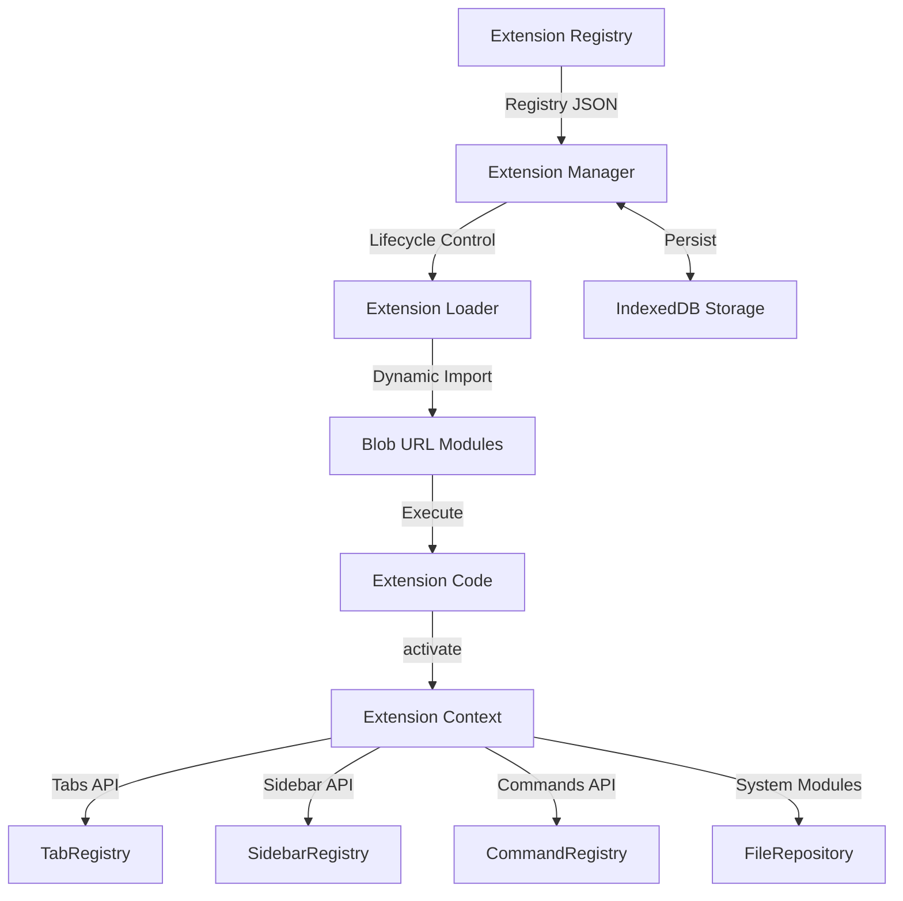

### Extension Manager

Extension Managerは拡張機能のライフサイクルを統一的に管理します。

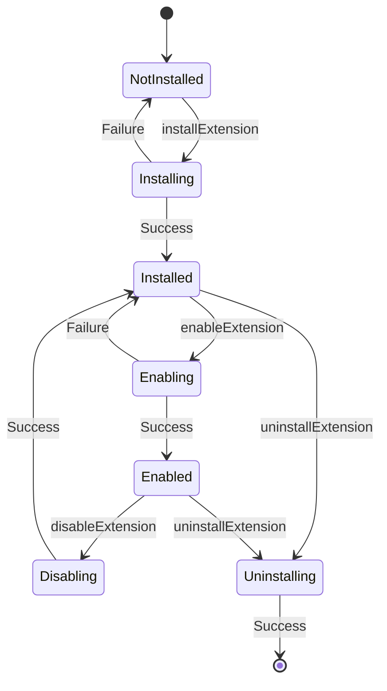

**主要な処理フロー**

| フェーズ | 処理内容 | 関連コンポーネント |
|---------|---------|-------------------|
| Install | マニフェストとコードをfetchし、IndexedDBに保存 | `extensionLoader.ts`, `storage-adapter.ts` |
| Enable | モジュールを動的ロード、activateを実行 | `extensionLoader.ts`, `TabAPI`, `SidebarAPI`, `CommandRegistry` |
| Disable | deactivateを実行、API登録を削除 | `extensionManager.ts` |
| Uninstall | IndexedDBからデータ削除 | `storage-adapter.ts` |

**onlyOneグループの制御**

マニフェストの`onlyOne`フィールドにより、同一グループ内では1つの拡張機能のみが有効化できます。言語パック（`pyxis.lang.*`）はすべて`onlyOne: "language-pack"`を持ち、言語切り替え時に自動的に排他制御されます。

```typescript
// enableExtension内での処理
if (installed.manifest.onlyOne) {
  const group = installed.manifest.onlyOne;
  const conflictingExtensions = allInstalled.filter(
    ext => ext.manifest?.onlyOne === group && 
           ext.enabled && 
           ext.manifest?.id !== extensionId
  );
  
  for (const conflict of conflictingExtensions) {
    await this.disableExtension(conflict.manifest.id);
  }
}
```

### IndexedDB Storage

拡張機能データはIndexedDBの`extensions`ストアに保存されます。

**保存データ構造**

```typescript
interface InstalledExtension {
  manifest: ExtensionManifest;
  status: ExtensionStatus;
  installedAt: number;
  updatedAt: number;
  enabled: boolean;
  cache: {
    entryCode: string;           // エントリーポイントのコード
    files: Record<string, string>; // 追加ファイル群
    cachedAt: number;
  };
}
```

**キャッシュ戦略**

拡張機能のコードは初回インストール時にIndexedDBにキャッシュされます。これにより、2回目以降の起動時はネットワークリクエストなしで拡張機能を有効化できます。

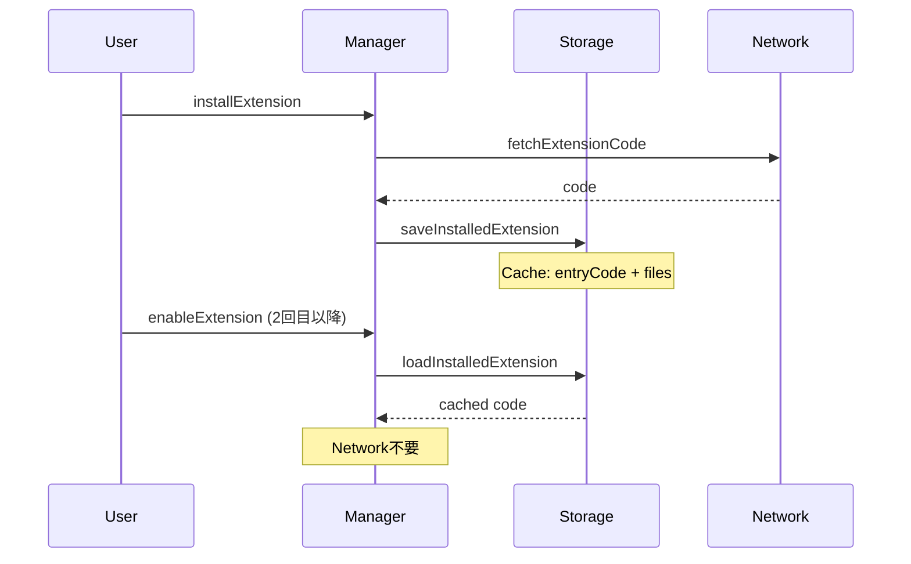

### Extension Loader

Extension Loaderは動的なモジュールローディングを実現します。

**Blob URLによるモジュール解決**

拡張機能のコードはfetchされた後、Blob URLとして一時的にブラウザメモリ上に展開されます。これにより`import()`でJavaScriptモジュールとしてロードできます。


**複数ファイル対応**

マニフェストの`files`配列に追加ファイルを指定できます。

```json
{
  "id": "pyxis.test-multi-file",
  "entry": "index.js",
  "files": ["helper.js", "utils.js"]
}
```

各ファイルはBlobURLとして登録され、Import Mapで相対パスから解決されます。

```typescript
// 追加ファイルをBlobURLとして登録
for (const [filePath, code] of Object.entries(additionalFiles)) {
  const transformedCode = transformImports(code);
  const blob = new Blob([transformedCode], { type: 'application/javascript' });
  const url = URL.createObjectURL(blob);
  
  const normalizedPath = filePath.startsWith('./') ? filePath : `./${filePath}`;
  const pathWithoutExt = normalizedPath.replace(/\.(js|ts|tsx)$/, '');
  
  importMap[normalizedPath] = url;
  importMap[pathWithoutExt] = url;
}
```

**React/ReactDOMのグローバル提供**

PyxisはReactをバンドルしており、拡張機能はそれを共有します。Extension Managerの初期化時に`window.__PYXIS_REACT__`として提供されます。

```typescript
// ExtensionManager.init()内
const React = await import('react');
const ReactDOM = await import('react-dom');
(window as any).__PYXIS_REACT__ = React;
(window as any).__PYXIS_REACT_DOM__ = ReactDOM;
```

拡張機能コード内の`import React from 'react'`は`transformImports`により以下に変換されます。

```typescript
// 変換前
import React from 'react';

// 変換後
const React = window.__PYXIS_REACT__;
```

### Extension Context

各拡張機能には専用の`ExtensionContext`が提供されます。

**ExtensionContextの構成**

| プロパティ | 型 | 説明 |
|-----------|---|------|
| `extensionId` | `string` | 拡張機能の一意なID |
| `extensionPath` | `string` | 拡張機能のパス |
| `version` | `string` | 拡張機能のバージョン |
| `logger` | `Logger` | ロガーAPI |
| `getSystemModule` | `Function` | システムモジュールへのアクセス |
| `tabs` | `TabAPI` | タブ管理API |
| `sidebar` | `SidebarAPI` | サイドバーAPI |
| `commands` | `CommandsAPI` | コマンドAPI |

**型安全なgetSystemModule**

`getSystemModule`は型推論により、要求したモジュール名に応じた正確な型を返します。

```typescript
// systemModuleTypes.ts
export interface SystemModuleMap {
  fileRepository: FileRepository;
  normalizeCjsEsm: NormalizeCjsEsmModule;
  commandRegistry: CommandRegistry;
}

// 使用例（拡張機能内）
const fileRepo = await context.getSystemModule('fileRepository');
// fileRepoはFileRepository型として推論される
```

### 変更イベント

Extension Managerは拡張機能の状態変化を通知します。

```typescript
export type ExtensionChangeEvent = {
  type: 'enabled' | 'disabled' | 'installed' | 'uninstalled';
  extensionId: string;
  manifest?: ExtensionManifest;
};

extensionManager.addChangeListener((event) => {
  if (event.type === 'enabled') {
    // 拡張機能が有効化された
  }
});
```

UIコンポーネントはこのイベントを購読し、リアルタイムで表示を更新します。

---

## TypeScriptトランスパイル拡張機能

TypeScriptトランスパイル機能は`pyxis.typescript-runtime`拡張機能として実装されています。

### 動作の仕組み

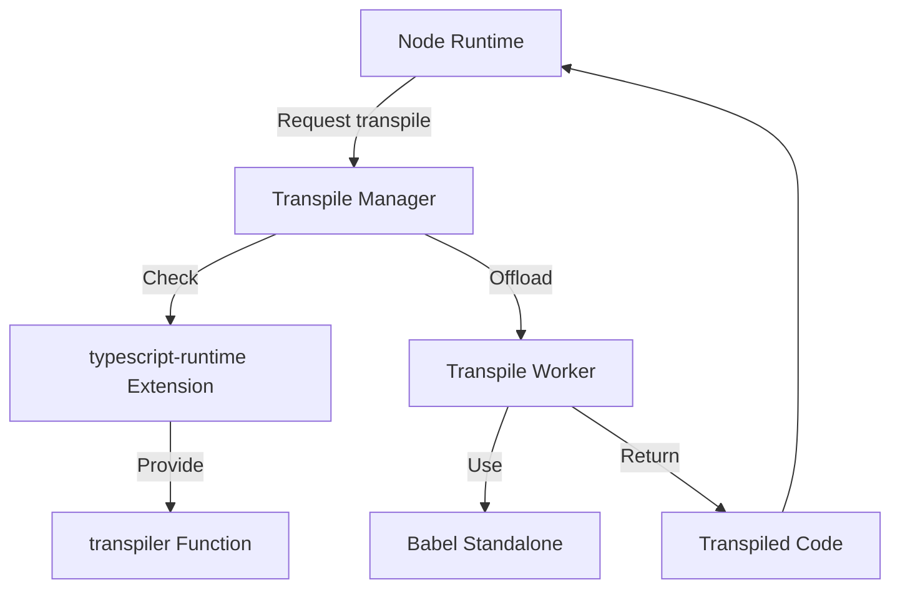

**transpiler拡張機能の登録**

拡張機能は`activate()`で`runtimeFeatures.transpiler`を返します。

```typescript
export async function activate(context: ExtensionContext): Promise<ExtensionActivation> {
  return {
    runtimeFeatures: {
      transpiler: async (code: string, options: any) => {
        // Babelを使用してTypeScript/JSXをトランスパイル
        const result = Babel.transform(code, {
          presets: ['typescript', 'react'],
          filename: options.filename || 'module.ts',
        });
        return { code: result.code || '' };
      },
    },
  };
}
```

**TranspileManagerによる統合**

TranspileManagerは有効化されたtranspiler拡張機能を検出し、Node Runtimeに提供します。

```typescript
// TranspileManager
export function getActiveTranspiler(): TranspilerFunction | null {
  const extensions = extensionManager.getActiveExtensions();
  
  for (const ext of extensions) {
    if (ext.activation.runtimeFeatures?.transpiler) {
      return ext.activation.runtimeFeatures.transpiler;
    }
  }
  
  return null;
}
```

**Web Workerでの並列処理**

実際のトランスパイル処理はWeb Workerに委譲され、UIスレッドをブロックしません。

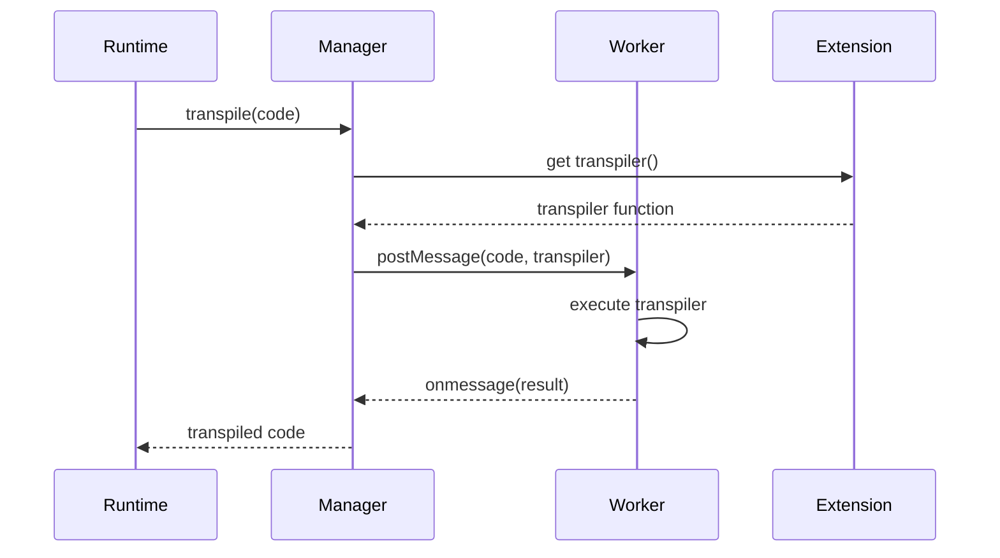

---

## サイドバーパネル拡張機能

拡張機能はSidebar APIを使用してカスタムパネルを追加できます。

### SidebarRegistryのアーキテクチャ

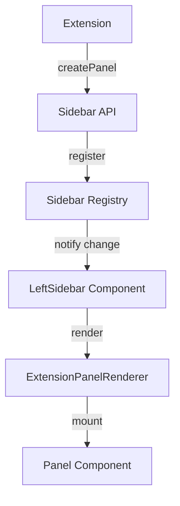

**パネル登録の流れ**

1. 拡張機能が`context.sidebar.createPanel()`を呼び出す
2. SidebarAPIがSidebarRegistryにパネルを登録
3. SidebarRegistryが変更イベントを発火
4. UIコンポーネントがパネル一覧を再取得
5. ExtensionPanelRendererがパネルコンポーネントを描画

**実装例（todo-panel拡張機能）**

```typescript
export async function activate(context: ExtensionContext): Promise<ExtensionActivation> {
  // サイドバーパネルを作成
  context.sidebar.createPanel({
    id: 'todo-scanner',
    title: 'TODO',
    icon: 'ListTodo',
    component: TodoSidebarPanel,
    order: 50,
  });
  
  return {};
}
```

**パネルコンポーネントのProps**

```typescript
export interface SidebarPanelProps {
  extensionId: string;  // 拡張機能ID
  panelId: string;      // パネルID
  isActive: boolean;    // パネルがアクティブか
  state?: any;          // パネルの状態
}
```

**状態管理**

パネルごとに独立した状態を持つことができます。

```typescript
// 拡張機能側で状態を更新
context.sidebar.updatePanel('todo-scanner', {
  todoCount: 42,
  lastScan: Date.now(),
});

// パネルコンポーネントで状態を受け取る
function TodoSidebarPanel({ state }: SidebarPanelProps) {
  return <div>TODOs: {state?.todoCount}</div>;
}
```

---

## カスタムタブ拡張機能

拡張機能はTab APIを使用して独自のタブを作成できます。

### TabRegistryとの統合

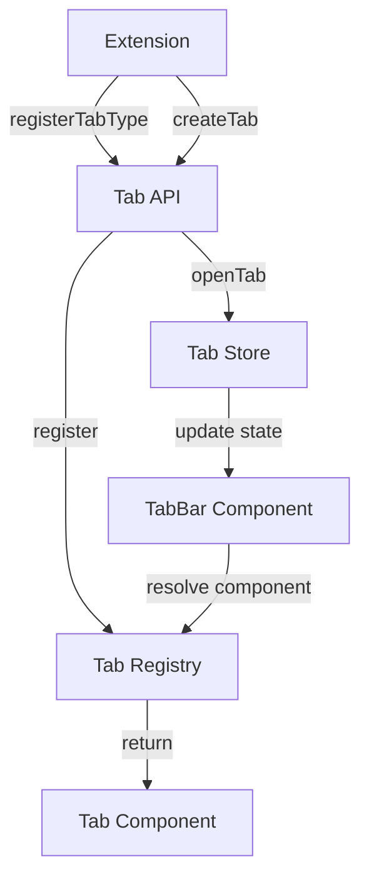

**タブタイプの登録**

拡張機能は`activate()`時にタブコンポーネントを登録します。

```typescript
export async function activate(context: ExtensionContext): Promise<ExtensionActivation> {
  // タブタイプを登録
  context.tabs.registerTabType(NoteTabComponent);
  
  return {};
}
```

タブタイプは`extension:${extensionId}`というKind文字列で識別されます。TabRegistryはこのKindとコンポーネントのマッピングを保持します。

**タブの作成**

```typescript
// 拡張機能内でタブを作成
const tabId = context.tabs.createTab({
  id: 'my-note-1',           // オプション: 指定すると同じIDのタブを再利用
  title: 'My Note',
  icon: 'FileText',
  closable: true,
  activateAfterCreate: true,
  data: { content: 'Hello' }, // 任意のデータ
});
```

**タブIDとセキュリティ**

タブIDは`extension:${extensionId}:${id}`の形式で生成されます。拡張機能は自分が作成したタブのみ操作できます。

```typescript
private isOwnedTab(tabId: string): boolean {
  const expectedPrefix = `extension:${this.extensionId}`;
  return tabId.startsWith(expectedPrefix);
}
```

**タブの更新とクローズ**

```typescript
// タブの内容を更新
context.tabs.updateTab(tabId, {
  title: 'New Title',
  data: { content: 'Updated content' },
});

// タブを閉じる
context.tabs.closeTab(tabId);

// クローズコールバックの登録
context.tabs.onTabClose(tabId, async (tabId) => {
  // クリーンアップ処理
  await saveData();
});
```

**システムタブの開く**

拡張機能は`openSystemTab`を使用してPyxisのエディタタブを開くことができます。

```typescript
context.tabs.openSystemTab(file, {
  kind: 'editor',
  jumpToLine: 42,
  activateAfterOpen: true,
});
```

---

## ターミナルコマンド拡張機能

拡張機能はCommands APIを使用してカスタムターミナルコマンドを追加できます。

### CommandRegistryのアーキテクチャ

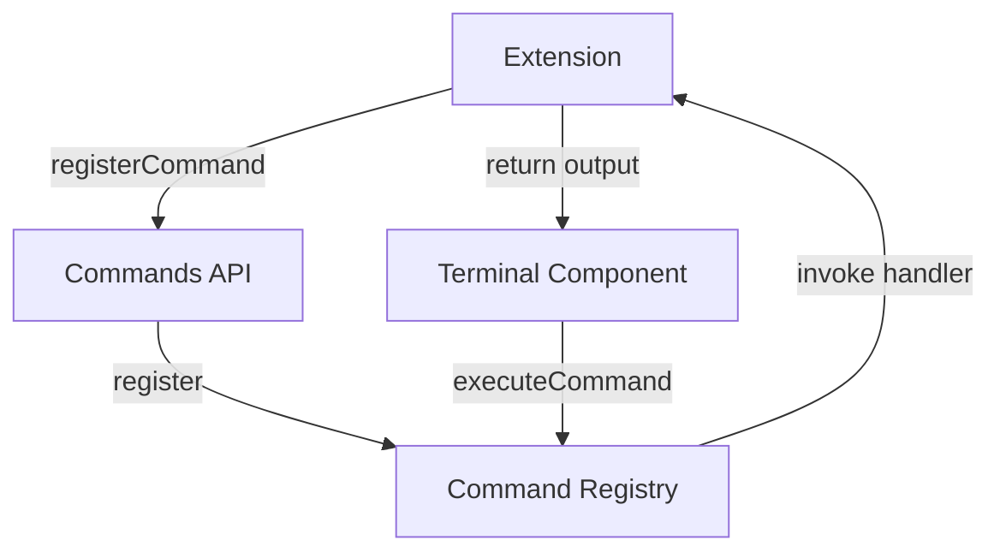

**コマンドの登録**

```typescript
export async function activate(context: ExtensionContext): Promise<ExtensionActivation> {
  context.commands.registerCommand('hello', async (args, cmdContext) => {
    const name = args.length > 0 ? args.join(' ') : 'World';
    return `Hello, ${name}!\nProject: ${cmdContext.projectName}`;
  });
  
  return {};
}
```

**CommandContextの構造**

コマンドハンドラーには`CommandContext`が渡されます。これは`ExtensionContext`を拡張したものです。

```typescript
export interface CommandContext extends ExtensionContext {
  projectName: string;        // プロジェクト名
  projectId: string;          // プロジェクトID
  currentDirectory: string;   // 現在のディレクトリ
}
```

**システムモジュールへのアクセス**

コマンドハンドラー内で`getSystemModule`を使用して、fileRepositoryなどにアクセスできます。

```typescript
async function fileinfoCommand(args: string[], context: CommandContext): Promise<string> {
  const filePath = args[0];
  
  // fileRepositoryを取得
  const fileRepository = await context.getSystemModule('fileRepository');
  
  // ファイル情報を取得
  const files = await fileRepository.getProjectFiles(context.projectId);
  const file = files.find(f => f.path === filePath);
  
  if (!file) {
    return `Error: File not found: ${filePath}`;
  }
  
  return `Path: ${file.path}\nSize: ${file.content.length} bytes`;
}
```

**コマンドの実行フロー**

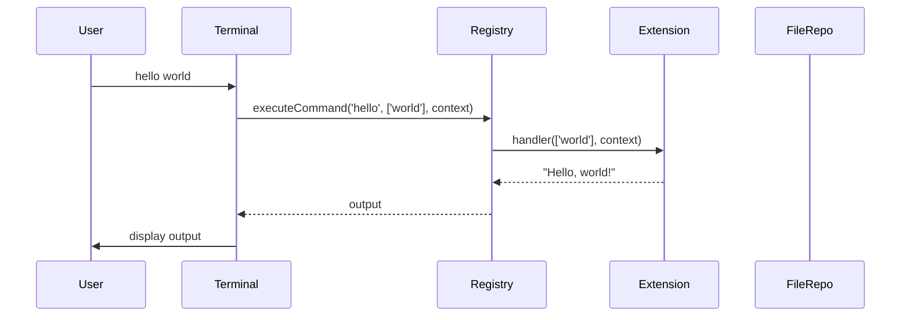

**コマンドの登録解除**

拡張機能が無効化されると、登録されたコマンドは自動的に削除されます。

```typescript
// extensionManager.disableExtension内
commandRegistry.unregisterExtensionCommands(extensionId);
```

---

## API提供の仕組み

Pyxisは拡張機能に対して、複数のレイヤーでAPIを提供します。

### API提供の全体像

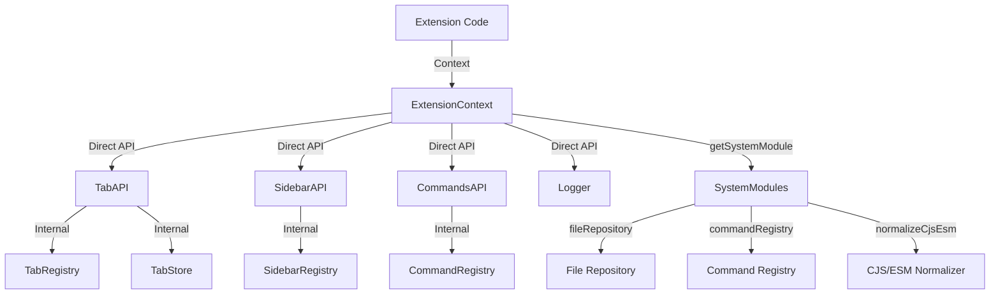

### レイヤー1: Direct API

Direct APIは`ExtensionContext`の直接のプロパティとして提供されます。

| API | 用途 | 特徴 |
|-----|------|------|
| `tabs` | タブ管理 | 拡張機能がUIタブを作成・制御 |
| `sidebar` | サイドバー管理 | 拡張機能がサイドバーパネルを追加 |
| `commands` | コマンド管理 | ターミナルコマンドの登録 |
| `logger` | ロギング | 拡張機能IDプレフィックス付きログ |

**APIインスタンスの作成**

ExtensionManagerは各拡張機能に対して専用のAPIインスタンスを作成します。

```typescript
private async createExtensionContext(extensionId: string): Promise<ExtensionContext> {
  const tabAPI = new TabAPI(context);
  const sidebarAPI = new SidebarAPI(context);
  
  const context: ExtensionContext = {
    extensionId,
    tabs: {
      registerTabType: (component) => tabAPI.registerTabType(component),
      createTab: (options) => tabAPI.createTab(options),
      updateTab: (tabId, options) => tabAPI.updateTab(tabId, options),
      closeTab: (tabId) => tabAPI.closeTab(tabId),
      onTabClose: (tabId, callback) => tabAPI.onTabClose(tabId, callback),
      getTabData: (tabId) => tabAPI.getTabData(tabId),
      openSystemTab: (file, options) => tabAPI.openSystemTab(file, options),
    },
    sidebar: {
      createPanel: (definition) => sidebarAPI.createPanel(definition),
      updatePanel: (panelId, state) => sidebarAPI.updatePanel(panelId, state),
      removePanel: (panelId) => sidebarAPI.removePanel(panelId),
      onPanelActivate: (panelId, callback) => sidebarAPI.onPanelActivate(panelId, callback),
    },
    commands: {
      registerCommand: (commandName, handler) => {
        return commandRegistry.registerCommand(extensionId, commandName, handler);
      },
    },
  };
  
  // APIインスタンスを保存（dispose用）
  (context as any)._tabAPI = tabAPI;
  (context as any)._sidebarAPI = sidebarAPI;
  
  return context;
}
```

**dispose処理**

拡張機能が無効化されるとき、APIインスタンスの`dispose()`が呼ばれ、登録されたすべてのリソースがクリーンアップされます。

```typescript
async disableExtension(extensionId: string): Promise<boolean> {
  const active = this.activeExtensions.get(extensionId);
  
  const context = (active as any)._context;
  if (context) {
    if ((context as any)._tabAPI) {
      (context as any)._tabAPI.dispose();
    }
    if ((context as any)._sidebarAPI) {
      (context as any)._sidebarAPI.dispose();
    }
  }
  
  commandRegistry.unregisterExtensionCommands(extensionId);
}
```

### レイヤー2: System Modules

System ModulesはPyxisの内部APIへの型安全なアクセスを提供します。

**型マップによる型推論**

```typescript
// systemModuleTypes.ts
export interface SystemModuleMap {
  fileRepository: FileRepository;
  normalizeCjsEsm: NormalizeCjsEsmModule;
  commandRegistry: CommandRegistry;
}

// ExtensionContext内のgetSystemModule
getSystemModule: async <T extends SystemModuleName>(
  moduleName: T
): Promise<SystemModuleMap[T]> => {
  switch (moduleName) {
    case 'fileRepository':
      return fileRepository as SystemModuleMap[T];
    case 'normalizeCjsEsm':
      return module as SystemModuleMap[T];
    case 'commandRegistry':
      return commandRegistry as SystemModuleMap[T];
    default:
      throw new Error(`System module not found: ${String(moduleName)}`);
  }
}
```

これにより、拡張機能側では型推論が効きます。

```typescript
// 拡張機能内
const fileRepo = await context.getSystemModule('fileRepository');
// fileRepoはFileRepository型

const normalizer = await context.getSystemModule('normalizeCjsEsm');
// normalizerはNormalizeCjsEsmModule型
```

**System Modulesの追加方法**

1. `systemModuleTypes.ts`の`SystemModuleMap`に型を追加
2. `ExtensionContext`の`getSystemModule`のswitch文に実装を追加
3. ドキュメントを更新

### レイヤー3: Built-in Modules

Built-in Modules（`fs`, `path`等）は`builtin-module`タイプの拡張機能として提供されます。

```typescript
export async function activate(context: ExtensionContext): Promise<ExtensionActivation> {
  return {
    builtInModules: {
      'node:fs': fsModule,
      'node:path': pathModule,
      'node:os': osModule,
      // ...
    },
  };
}
```

Node Runtimeは有効化されたbuilt-in module拡張機能を検出し、`require()`時に解決します。

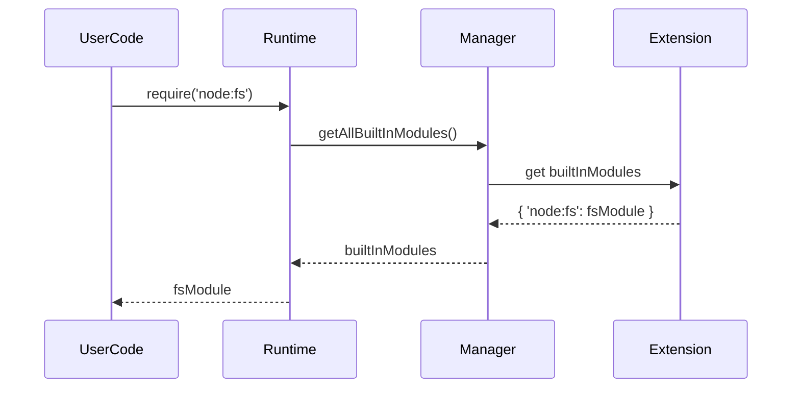

---

## 拡張機能の配信とビルド

### 配信形態

Pyxisの拡張機能は静的ファイルとして配信されます。

**ディレクトリ構造**

```
public/extensions/
├── registry.json                   # 拡張機能レジストリ
├── typescript-runtime/
│   ├── manifest.json
│   └── index.js                   # バンドル済みJS
├── lang-packs/
│   ├── ja/
│   │   ├── manifest.json
│   │   └── index.js
│   └── en/
│       ├── manifest.json
│       └── index.js
├── note-tab/
│   ├── manifest.json
│   └── index.js
└── sample-command/
    ├── manifest.json
    └── index.js
```

### Registry JSON

`registry.json`は利用可能な拡張機能の一覧を定義します。

```json
{
  "version": "1.0.0",
  "extensions": [
    {
      "id": "pyxis.typescript-runtime",
      "type": "transpiler",
      "manifestUrl": "/extensions/typescript-runtime/manifest.json",
      "defaultEnabled": true
    },
    {
      "id": "pyxis.lang.ja",
      "type": "service",
      "manifestUrl": "/extensions/lang-packs/ja/manifest.json",
      "defaultEnabled": false
    }
  ]
}
```

**Auto Installer**

アプリケーション起動時、Auto Installerが以下を実行します。

1. `registry.json`を取得
2. `defaultEnabled: true`の拡張機能をインストール
3. ブラウザ言語を検出し、対応する言語パックをインストール

```typescript
export async function initializeExtensions(): Promise<void> {
  await extensionManager.init();
  
  if (await isFirstRun()) {
    await autoInstallExtensions();
  }
}
```

### ビルドプロセス

拡張機能のビルドは`build-extensions.js`により自動化されています。

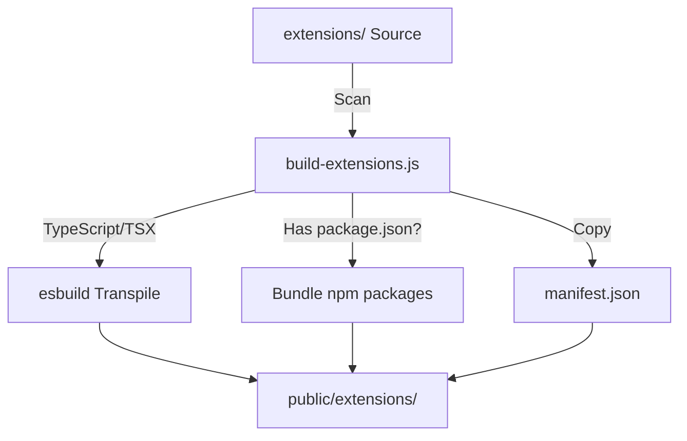

**主要な処理**

| ステップ | 処理内容 |
|---------|---------|
| ソーススキャン | `extensions/`以下の全ディレクトリを走査 |
| TypeScript/TSXトランスパイル | esbuildでJSに変換 |
| npm/pnpmライブラリのバンドル | `package.json`がある場合、依存関係を含めてバンドル |
| React外部化 | `react`と`react-dom`は外部化（Pyxis本体を使用） |
| manifest.jsonのコピー | そのまま出力ディレクトリにコピー |
| registry.jsonの生成 | 全拡張機能の一覧を生成 |

**esbuild設定**

```javascript
await esbuild.build({
  entryPoints: [entryPath],
  bundle: true,
  format: 'esm',
  target: 'es2020',
  outfile: outPath,
  external: ['react', 'react-dom'],  // React外部化
  loader: {
    '.ts': 'ts',
    '.tsx': 'tsx',
    '.js': 'js',
    '.jsx': 'jsx',
  },
});
```

**Reactの扱い**

拡張機能のビルド時、`react`と`react-dom`はバンドルから除外されます（`external`設定）。実行時には`transformImports`により、グローバル変数`window.__PYXIS_REACT__`への参照に変換されます。

これにより、以下のメリットがあります。

- 拡張機能のバンドルサイズが削減される
- Pyxis本体とReactのバージョンが統一される
- メモリ使用量が削減される

### マニフェスト仕様

**基本フィールド**

| フィールド | 型 | 必須 | 説明 |
|----------|---|------|------|
| `id` | `string` | ✓ | 拡張機能の一意なID |
| `name` | `string` | ✓ | 表示名 |
| `version` | `string` | ✓ | バージョン（semver） |
| `type` | `ExtensionType` | ✓ | 拡張機能の種類 |
| `description` | `string` | | 説明文 |
| `author` | `string` | | 作者名 |
| `entry` | `string` | | エントリーポイント（デフォルト: `index.js`） |
| `files` | `string[]` | | 追加ファイルのリスト |
| `dependencies` | `string[]` | | 依存拡張機能のID |
| `defaultEnabled` | `boolean` | | デフォルトで有効化するか |
| `onlyOne` | `string` | | 排他グループ名 |
| `metadata` | `object` | | メタデータ |

**ExtensionType**

```typescript
export enum ExtensionType {
  BUILTIN_MODULE = 'builtin-module',    // fs, path等
  SERVICE = 'service',                  // i18n, Git統合
  TRANSPILER = 'transpiler',            // TypeScript, JSX
  LANGUAGE_RUNTIME = 'language-runtime', // Python, Rust
  TOOL = 'tool',                        // linter, formatter
  UI = 'ui',                            // タブ、サイドバー
}
```

---

## まとめ

Pyxisの拡張機能システムは以下の特徴を持ちます。

| 特徴 | 説明 |
|------|------|
| **完全なブラウザ動作** | サーバー不要。IndexedDBとfetchのみで完結 |
| **動的モジュールローディング** | Blob URLとDynamic Importによる実行時ロード |
| **型安全なAPI** | TypeScript型推論によるコンパイル時検証 |
| **独立したライフサイクル** | 各拡張機能は独立してインストール・有効化・無効化可能 |
| **キャッシュ機構** | IndexedDBによる永続化で高速起動 |
| **柔軟な拡張ポイント** | タブ、サイドバー、コマンド、トランスパイラ等 |
| **React共有** | Pyxis本体のReactを共有してバンドルサイズ削減 |

この設計により、Pyxisはブラウザ上で動作しながら、VS Codeのような拡張可能なIDEとしての機能を実現しています。
