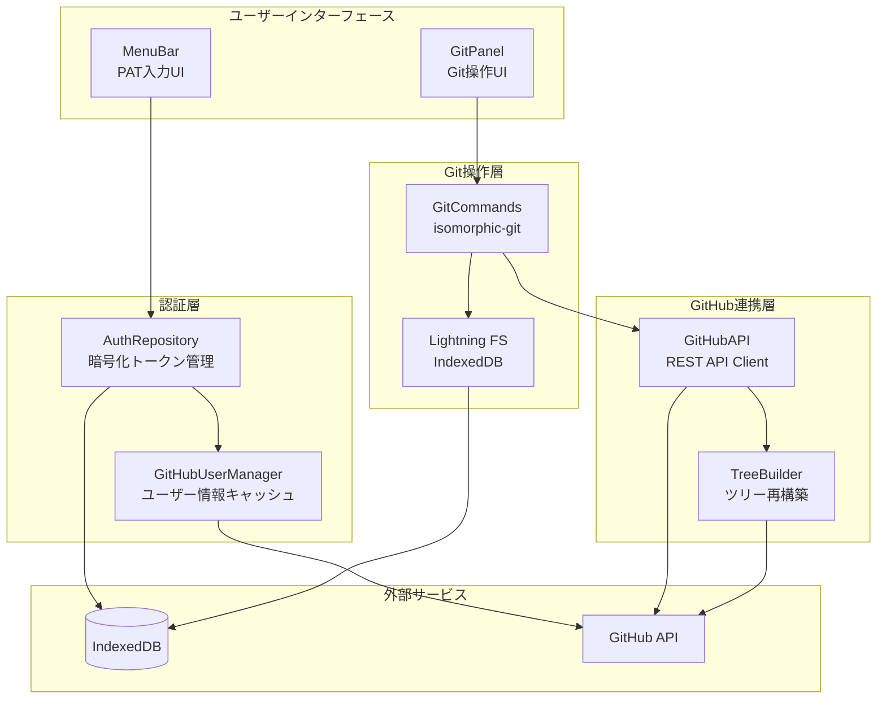
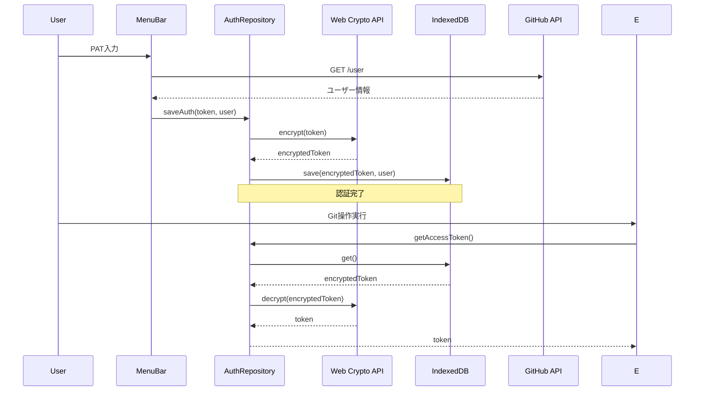
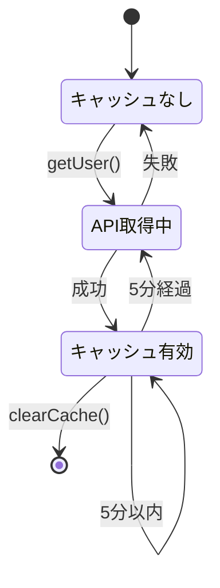
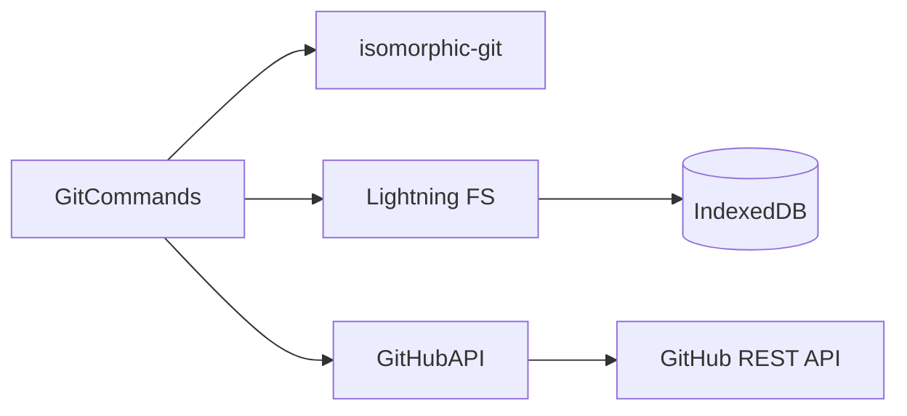
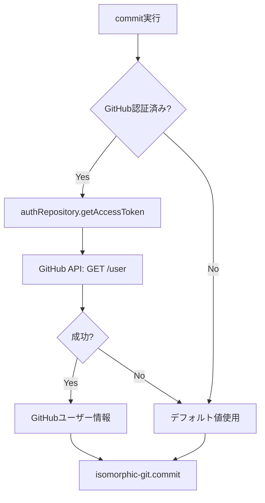
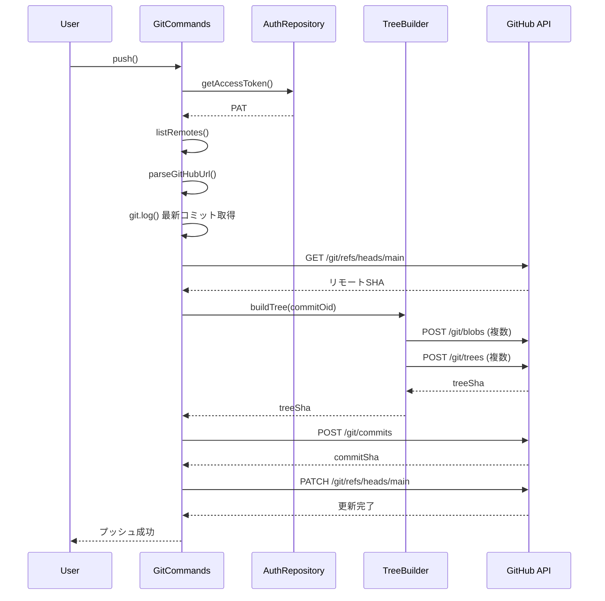
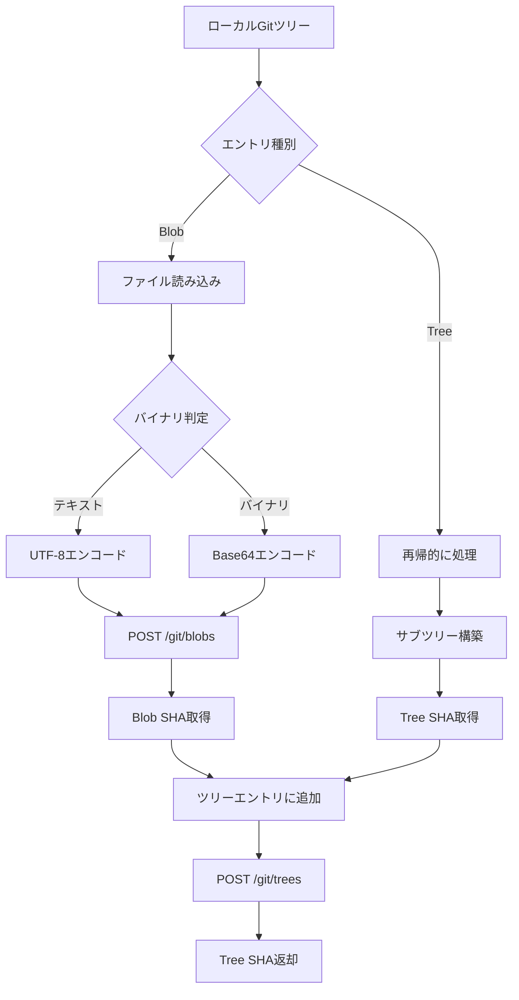
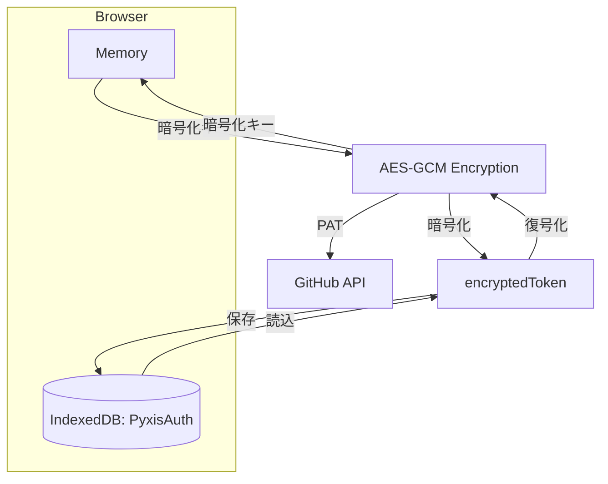
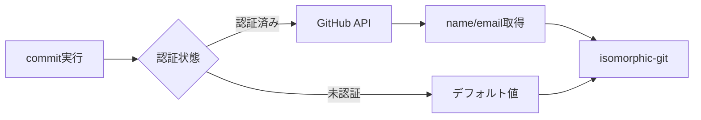

# GitHub連携アーキテクチャ

## 概要

Personal Access Token (PAT) を使用したGitHub認証と、GitHub Git Data APIを用いたプッシュ機能を実装しています。

## システム全体図

---

## 1. 認証システム

### AuthRepository

**ファイル**: `src/engine/core/authRepository.ts`

#### アーキテクチャ

#### データ構造

| フィールド | 型 | 説明 |
|-----------|-----|------|
| `id` | `string` | 固定値 `"github"` |
| `encryptedToken` | `string` | 暗号化されたPAT |
| `user.login` | `string` | GitHubユーザー名 |
| `user.name` | `string \| null` | 表示名 |
| `user.email` | `string \| null` | メールアドレス |
| `user.avatar_url` | `string` | アバターURL |
| `user.id` | `number` | GitHub ID |
| `createdAt` | `number` | 作成タイムスタンプ |
#### セキュリティ設計

| 項目 | 実装 |
|------|------|
| 暗号化アルゴリズム | AES-GCM |
| 鍵の保存場所 | メモリのみ（永続化しない） |
| トークン保存形式 | 暗号化された文字列 |
| 復号化失敗時 | 認証情報を自動削除 |
| サインアウト時 | 暗号化鍵を破棄 |

---

## 2. ユーザー情報管理

### GitHubUserManager

**ファイル**: `src/engine/core/githubUserManager.ts`

#### キャッシュ戦略

#### 機能一覧

| メソッド | 動作 | API呼び出し |
|----------|------|-------------|
| `getUser()` | ユーザー情報取得 | キャッシュ有効時は無し |
| `getCommitAuthor()` | Gitコミット用情報 | `getUser()`経由 |
| `refreshUser()` | 強制再取得 | 必ず実行 |
| `getCachedUser()` | キャッシュ取得 | 無し |
| `clearCache()` | キャッシュクリア | 無し |

---

## 3. Git操作

### GitCommands

**ファイル**: `src/engine/cmd/global/git.ts`

#### アーキテクチャ

#### コミット時のAuthor解決

#### リモート操作

| 操作 | メソッド | 用途 |
|------|----------|------|
| リモート追加 | `addRemote()` | GitHub URLを登録 |
| リモート一覧 | `listRemotes()` | 登録済みリモート確認 |
| リモート削除 | `deleteRemote()` | リモートを削除 |
---

## 4. GitHubプッシュアーキテクチャ

### 設計方針

ブラウザ環境ではSSH/HTTPSプロトコルが使用できないため、GitHub Git Data APIを使用してプッシュを実装しています。

### プッシュフロー

### TreeBuilder

**ファイル**: `src/engine/cmd/global/gitOperations/github/TreeBuilder.ts`

#### ツリー再構築プロセス

#### 最適化手法

| 手法 | 実装 | 効果 |
|------|------|------|
| Blobキャッシュ | `Map<content, sha>` | 同一ファイルの重複アップロード防止 |
| バイナリ判定 | NULL文字チェック | 適切なエンコーディング選択 |
| 再帰構築 | 深さ優先探索 | ディレクトリ構造の完全再現 |

### GitHubAPI

**ファイル**: `src/engine/cmd/global/gitOperations/github/GitHubAPI.ts`

#### API エンドポイント

| 操作 | エンドポイント | 用途 |
|------|---------------|------|
| 参照取得 | `GET /git/refs/heads/{branch}` | リモートブランチのHEAD確認 |
| 参照更新 | `PATCH /git/refs/heads/{branch}` | プッシュの最終ステップ |
| コミット作成 | `POST /git/commits` | GitHub上にコミットオブジェクト作成 |
| ツリー作成 | `POST /git/trees` | ディレクトリ構造の作成 |
| Blob作成 | `POST /git/blobs` | ファイル内容のアップロード |

#### 認証ヘッダー
全てのリクエストに以下を付与:
- `Authorization: Bearer {PAT}`
- `Accept: application/vnd.github.v3+json`
- `Content-Type: application/json`

#### エラーハンドリング
- 404エラー: ブランチ不在時は新規作成
- 401/403エラー: 認証エラーとして処理
- その他: エラーメッセージを含めて例外をスロー

---

## URL解析とリポジトリ特定

**ファイル**: `src/engine/cmd/global/gitOperations/github/utils.ts`

### サポートするURL形式

| 形式 | 例 | 抽出結果 |
|------|---|---------|
| HTTPS | `https://github.com/owner/repo.git` | `{ owner, repo }` |
| HTTPS (拡張子なし) | `https://github.com/owner/repo` | `{ owner, repo }` |
| SSH | `git@github.com:owner/repo.git` | `{ owner, repo }` |

### 制限事項
- **GitHubのみサポート**: GitLab, Bitbucket等は非対応
- 理由: 各サービスでGit Data APIの仕様が異なるため

---

## 5. 認証管理の実装

### ストレージ構造

### 認証フロー

| ステップ | 処理 | 関連コンポーネント |
|---------|------|-------------------|
| 1. PAT入力 | ユーザーがトークンを入力 | MenuBar |
| 2. 検証 | `GET /user` で有効性確認 | GitHub API |
| 3. 暗号化 | Web Crypto APIで暗号化 | AuthRepository |
| 4. 保存 | IndexedDBに格納 | AuthRepository |
| 5. 利用 | Git操作時に復号化して使用 | GitCommands |

### トークンの利用箇所

| 操作 | 必須 | 動作 |
|------|------|------|
| コミット | No | 認証済みならGitHubユーザー情報使用 |
| プッシュ | Yes | 認証なしはエラー |
| UI表示 | No | 認証済みならアバター表示 |

---

## 6. 設計上の制約

### GitHub専用設計

**理由:**

| 制約 | 背景 |
|------|------|
| GitHubのみサポート | Git Data APIは各サービスで仕様が異なる |
| ブラウザ環境 | SSH/HTTPSプロトコルが使用不可 |
| REST API依存 | 通常のGitプロトコルは使えない |
- CORSの制約により直接Git通信が困難

### プッシュ方式の選択理由

| 方式 | 採用 | 理由 |
|------|------|------|
| SSH/HTTPS | ❌ | ブラウザ環境で使用不可 |
| Git Data API | ✅ | REST APIで完全なGit操作が可能 |

### 認証方式の選択理由

| 方式 | 採用 | 理由 |
|------|------|------|
| OAuth Device Flow | ❌ | OAuth App登録が必要、実装が複雑 |
| OAuth Web Flow | ❌ | コールバックサーバーが必要 |
| PAT | ✅ | シンプル、即座に利用可能 |

### セキュリティ実装

| 項目 | 実装内容 |
|------|---------|
| トークン保護 | AES-GCM暗号化 |
| キー管理 | メモリのみ（永続化なし） |
| 通信 | HTTPS |
| 必要スコープ | `repo` |

---

## 補足情報

### コミットAuthorの自動設定

認証済みの場合、コミット時に自動的にGitHubユーザー情報が使用されます。

### パフォーマンス特性

プッシュは通常のGitよりも時間がかかります。

**理由:**
- 各Blobを個別にREST APIでアップロード
- ツリー構造を再帰的に構築
- HTTPリクエストのオーバーヘッド

**最適化:**
- Blobキャッシュで重複アップロード防止

### 制限事項

| 項目 | 制限内容 |
|------|----------|
| サポートサービス | GitHub のみ |
| PATスコープ | `repo` が必須 |
| PAT有効期限 | GitHubの設定に従う（期限切れ時は再認証が必要） |

---

## 参考リンク

- [GitHub REST API - Git Database](https://docs.github.com/en/rest/git)
- [isomorphic-git](https://isomorphic-git.org/)
- [Web Crypto API](https://developer.mozilla.org/en-US/docs/Web/API/Web_Crypto_API)
