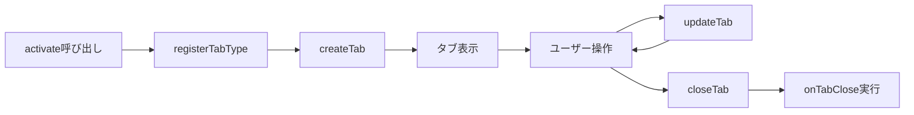
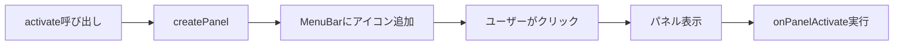

# Pyxis Extension Development Guide

Pyxisの拡張機能を作成するための完全ガイド。カスタムタブとサイドバーパネルを追加し、Pyxisの機能を拡張できます。

## 目次

1. [はじめに](#はじめに)
2. [拡張機能の基本構造](#拡張機能の基本構造)
3. [開発環境のセットアップ](#開発環境のセットアップ)
4. [提供されているAPI](#提供されているapi)
5. [タブAPIの使い方](#タブapiの使い方)
6. [サイドバーAPIの使い方](#サイドバーapiの使い方)
7. [実践例: Note Tab拡張機能](#実践例-note-tab拡張機能)
8. [ベストプラクティス](#ベストプラクティス)
9. [トラブルシューティング](#トラブルシューティング)

---

## はじめに

### Pyxis拡張機能とは

Pyxis拡張機能は、Pyxisエディタに新しい機能を追加するためのプラグインシステムです。以下のことができます:

- ✅ **カスタムタブの作成**: 独自のエディタタブを追加
- ✅ **サイドバーパネルの追加**: 左サイドバーに新しいパネルを表示
- ✅ **React コンポーネント**: Reactで自由にUIを構築
- ✅ **データの永続化**: localStorageでデータを保存
- ✅ **動的ロード**: ユーザーが必要に応じて拡張機能をインストール/有効化


### 技術的制約・最新仕様

Pyxis拡張機能は、完全なブラウザ動作・型安全なAPI・TSX構文推奨・IndexedDBキャッシュ・Reactグローバル提供など、最新の設計思想に基づいています。

1. **Static Site**: Pyxisは静的サイトとしてホスティングされるため、サーバーサイド処理は不可
2. **動的Import**: 拡張機能はランタイムにBlob URL経由でimportされます
3. **React提供**: Reactは`window.__PYXIS_REACT__`としてグローバル提供され、import文は自動変換されます
4. **TSX推奨**: JSX/TSX構文が利用可能。ビルド時に`React.createElement`へ変換されます
5. **型安全API**: ExtensionContext・TabAPI・SidebarAPI・CommandsAPIはTypeScript型で完全管理
6. **IndexedDBキャッシュ**: インストール済み拡張機能はIndexedDBに保存され、2回目以降は高速起動


### 設計原則

1. **最小権限の原則**: 拡張機能は自分が作成したタブ・パネル・コマンドのみ操作可能
2. **宣言的API**: manifest.jsonで機能宣言、実行時はExtensionContext経由でAPI操作
3. **型安全性**: TypeScript型で全API・データを管理
4. **自動クリーンアップ**: 無効化時にAPIインスタンスのdisposeでリソース解放
5. **React共有**: Pyxis本体のReactを全拡張機能で共有

---

## 拡張機能の基本構造

拡張機能は以下のファイルで構成されます:

```
extensions/
  my-extension/
  ├── manifest.json    # 拡張機能のメタデータ
  ├── index.ts         # エントリーポイント
  └── README.md        # ドキュメント(オプション)
```

### 1. manifest.json

拡張機能のメタデータを定義します:

```json
{
  "id": "pyxis.my-extension",
  "name": "My Extension",
  "version": "1.0.0",
  "type": "ui",
  "description": "Example extension for Pyxis",
  "author": "Your Name",
  "entry": "index.js",
  "metadata": {
    "publishedAt": "2025-01-01T00:00:00Z",
    "updatedAt": "2025-01-01T00:00:00Z",
    "tags": ["ui", "productivity"]
  }
}
```

**フィールド説明:**

| フィールド | 型 | 必須 | 説明 |
|----------|---|------|------|
| `id` | string | ✅ | 拡張機能の一意なID (通常は`pyxis.`で始まる) |
| `name` | string | ✅ | 表示名 |
| `version` | string | ✅ | セマンティックバージョン |
| `type` | string | ✅ | 拡張機能の種類 (`ui`, `transpiler`, `service`など) |
| `description` | string | ✅ | 説明 |
| `author` | string | ✅ | 作者名 |
| `entry` | string | ✅ | エントリーポイント (通常は`index.js`) |
| `metadata` | object | ❌ | その他のメタデータ |


### 2. index.tsx（TSX推奨）

拡張機能のエントリーポイントは`activate`/`deactivate`関数をエクスポートします。TSX構文でUIを記述できます。

```tsx
import type { ExtensionContext, ExtensionActivation } from '../_shared/types';
import React, { useState } from 'react';

function MyTabComponent({ tab, isActive }: { tab: any; isActive: boolean }) {
  const [count, setCount] = useState(0);
  return (
    <div style={{ padding: '16px', background: '#1e1e1e', color: '#d4d4d4' }}>
      <h2>My Custom Tab</h2>
      <p>Count: {count}</p>
      <button onClick={() => setCount(count + 1)}>Increment</button>
    </div>
  );
}

export async function activate(context: ExtensionContext): Promise<ExtensionActivation> {
  context.logger.info('Extension activated!');
  if (context.tabs) {
    context.tabs.registerTabType(MyTabComponent);
  }
  return {};
}

export async function deactivate(): Promise<void> {
  console.log('Extension deactivated');
}
```

---

## 開発環境のセットアップ

### ステップ 1: 拡張機能ディレクトリを作成

```bash
mkdir -p extensions/my-extension
cd extensions/my-extension
```

### ステップ 2: manifest.jsonを作成

```bash
cat > manifest.json << 'EOF'
{
  "id": "pyxis.my-extension",
  "name": "My Extension",
  "version": "1.0.0",
  "type": "ui",
  "description": "My first Pyxis extension",
  "author": "Your Name",
  "entry": "index.js"
}
EOF
```

### ステップ 3: index.tsを作成

```bash
cat > index.ts << 'EOF'
import type { ExtensionContext, ExtensionActivation } from '../_shared/types';

export async function activate(context: ExtensionContext): Promise<ExtensionActivation> {
  context.logger.info('My Extension activated!');
  return { services: {} };
}

export async function deactivate(): Promise<void> {
  console.log('My Extension deactivated');
}
EOF
```

### ステップ 4: レジストリに登録

`extensions/registry.json`に拡張機能を追加:

```json
{
  "id": "pyxis.my-extension",
  "type": "ui",
  "manifestUrl": "/extensions/my-extension/manifest.json",
  "defaultEnabled": false
}
```


### ステップ 5: ビルド

```bash
# プロジェクトルートで実行
pnpm run setup-build
```

これで`public/extensions/my-extension/`にバンドル済みJSファイルが生成されます。


### ステップ 6: 開発サーバーで確認

```bash
pnpm run dev
```

ブラウザで開き、拡張機能パネルから「My Extension」をインストール・有効化してください。

---


### TSX構文の使用（推奨）

TSX (TypeScript + JSX) を使うことで、HTMLライクな構文でUIを記述できます。ビルド時に自動的に`React.createElement`へ変換されます。

#### 1. ファイル名を`.tsx`にする

```bash
mv extensions/my-extension/index.ts extensions/my-extension/index.tsx
```

#### 2. TSX構文で記述

```tsx
import type { ExtensionContext, ExtensionActivation } from '../_shared/types';
import React, { useState } from 'react';

function MyTabComponent({ tab, isActive }: { tab: any; isActive: boolean }) {
  const [count, setCount] = useState(0);
  return (
    <div style={{ padding: '16px', background: '#1e1e1e', color: '#d4d4d4' }}>
      <h2>My Custom Tab</h2>
      <p>Count: {count}</p>
      <button onClick={() => setCount(count + 1)}>Increment</button>
    </div>
  );
}

export async function activate(context: ExtensionContext): Promise<ExtensionActivation> {
  context.logger.info('Extension activated!');
  if (context.tabs) {
    context.tabs.registerTabType(MyTabComponent);
  }
  return {};
}

export async function deactivate(): Promise<void> {
  console.log('Extension deactivated');
}
```

#### 3. ビルド

```bash
pnpm run setup-build
```

**推奨:** TSXを使用してください。開発体験が大幅に向上します。

### TSXの例: Note Tab拡張機能

完全なTSX実装例は `extensions/note-tab/index-tsx-example.tsx` を参照してください:

```tsx
function NoteTabComponent({ tab, isActive }: { tab: any; isActive: boolean }) {
  const [content, setContent] = useState((tab as any).data?.content || '');
  const [isSaving, setIsSaving] = useState(false);

  useEffect(() => {
    const timer = setTimeout(() => {
      if (content !== (tab as any).data?.content) {
        setIsSaving(true);
        localStorage.setItem(`note-${tab.id}`, content);
        setTimeout(() => setIsSaving(false), 500);
      }
    }, 1000);
    return () => clearTimeout(timer);
  }, [content, tab.id]);

  return (
    <div style={{ width: '100%', height: '100%', padding: '16px' }}>
      <div style={{ display: 'flex', justifyContent: 'space-between' }}>
        <h2>📝 Quick Note</h2>
        {isSaving && <span style={{ color: '#888' }}>Saving...</span>}
      </div>
      <textarea
        value={content}
        onChange={(e) => setContent(e.target.value)}
        placeholder="Type your notes here..."
        style={{
          width: '100%',
          height: '300px',
          padding: '8px',
          background: '#2d2d2d',
          color: '#d4d4d4',
          border: '1px solid #444',
          borderRadius: '4px',
        }}
      />
    </div>
  );
}
```

### 注意事項


1. **Reactのimportは必須**
  ```tsx
  import React from 'react'; // 必ず記述
  ```
2. **ビルド時に自動変換**
  - TSX → `React.createElement`
  - `import React from 'react'` → `const React = window.__PYXIS_REACT__`（自動変換）
3. **Reactはバンドルされない**
  - 実行時はPyxis本体のReactを共有

---

## 提供されているAPI

拡張機能は`ExtensionContext`を通じて、以下のAPIにアクセスできます:

### ExtensionContext
実際には、型定義は_share/を参照してください。
```typescript
interface ExtensionContext {
  extensionId: string;        // 拡張機能のID
  extensionPath: string;      // 拡張機能のパス
  version: string;            // バージョン
  // ロガーはランタイムが必ず提供します（非 optional）
  logger: Logger;
  // getSystemModule はランタイムが必ず提供します。拡張機能はこれを使って型安全にシステムモジュールへアクセスできます。
  getSystemModule: <T extends 'fileRepository' | 'normalizeCjsEsm' | 'commandRegistry'>(
    moduleName: T
  ) => Promise<import('../_shared/systemModuleTypes').SystemModuleMap[T]>;
  tabs?: TabAPI;              // タブAPI
  sidebar?: SidebarAPI;       // サイドバーAPI
}
```

注意: ランタイムの契約として、`ExtensionContext.logger` と `ExtensionContext.getSystemModule` は必ず提供されます。
また、ターミナルコマンドのハンドラーに渡される `CommandContext` は実行時に拡張され、同じ `getSystemModule` ヘルパーを持ちます。
従ってコマンドハンドラー内では `context.getSystemModule(...)` を直接呼び出してシステムモジュールへアクセスできます。


### Logger

```typescript
interface Logger {
  info: (message: string, ...args: unknown[]) => void;
  warn: (message: string, ...args: unknown[]) => void;
  error: (message: string, ...args: unknown[]) => void;
}
```

使用例:

```typescript
context.logger.info('This is an info message');
context.logger.warn('This is a warning');
context.logger.error('This is an error', errorObject);
```

### 利用可能なもの

拡張機能内で利用できるもの:

| 項目 | 説明 | 利用方法 |
|-----|------|---------|
| **React** | グローバルスコープから提供 | `import React from 'react'` (自動変換) |
| **localStorage** | ブラウザのローカルストレージ | `localStorage.setItem(...)` |
| **fetch** | HTTPリクエスト | `fetch(url)` |
| **setTimeout/setInterval** | タイマー | `setTimeout(...)` |
| **CustomEvent** | カスタムイベント | `window.dispatchEvent(new CustomEvent(...))` |

**利用できないもの:**

- ❌ Node.js API (`fs`, `path`など)
- ❌ npm パッケージ (Reactを除く)
- ❌ サーバーサイド処理

---

## タブAPIの使い方

### 概要

Tab APIを使用すると、拡張機能が独自のエディタタブを作成できます。各拡張機能は自分が作成したタブのみを操作でき、他の拡張機能や組み込みタブには干渉できません。

### タブの作成フロー



### ステップ1: タブコンポーネントを作成

タブの内容を描画するReactコンポーネントを作成します。**TabComponentProps**に準拠する必要があります:

```tsx
import React, { useState, useEffect } from 'react';

function MyTabComponent({ tab, isActive }: { tab: any; isActive: boolean }) {
  const tabData = (tab as any).data;
  const [content, setContent] = useState(tabData?.content || '');

  return (
    <div style={{ width: '100%', height: '100%', padding: '16px', background: '#1e1e1e', color: '#d4d4d4' }}>
      <h2 style={{ marginBottom: '16px' }}>My Custom Tab</h2>
      <textarea
        value={content}
        onChange={e => setContent(e.target.value)}
        style={{
          width: '100%',
          height: '300px',
          padding: '8px',
          background: '#2d2d2d',
          color: '#d4d4d4',
          border: '1px solid #444',
          borderRadius: '4px',
        }}
      />
    </div>
  );
}
```

**重要な注意点:**

1. **TSX構文が推奨**: JSX/TSXで記述し、ビルド時に自動変換されます
2. **Props**: `{ tab, isActive }` を受け取る必要があります
3. **tab.data**: `createTab`で渡したデータが`tab.data`に格納されています
4. **isActive**: タブがアクティブかどうか

### ステップ2: タブコンポーネントを登録

`activate`関数内で、**最初に**`registerTabType`を呼び出します:

```typescript
export async function activate(context: ExtensionContext): Promise<ExtensionActivation> {
  // 【重要】最初にコンポーネントを登録
  if (context.tabs) {
  context.tabs.registerTabType(MyTabComponent);
  context.logger.info('Tab component registered');
  }
  
  // ...残りの処理
}
```

**なぜ最初に呼ぶ必要があるのか:**

`createTab()`を呼ぶ前に、TabRegistryにコンポーネントを登録する必要があります。登録せずに`createTab()`を実行すると、以下のエラーが発生します:

```
Error: Extension tab type not registered: extension:pyxis.my-extension
```

### ステップ3: タブを作成

`createTab`メソッドでタブを作成します:

```typescript
const tabId = context.tabs.createTab({
  title: '📝 My Custom Tab',
  icon: 'FileText',
  closable: true,
  activateAfterCreate: true,
  data: {
    content: 'Initial content',
    customField: 'value',
  },
});

context.logger.info(`Created tab: ${tabId}`);
```

### Tab API メソッド一覧

#### `registerTabType(component: React.ComponentType): void`

タブコンポーネントを登録します。

**パラメータ:**
- `component`: Reactコンポーネント（`{ tab, isActive }` を受け取る）

**例:**
```typescript
context.tabs.registerTabType(MyTabComponent);
```

#### `createTab(options: CreateTabOptions): string`

新しいタブを作成します。事前に`registerTabType()`を呼び出している必要があります。

**パラメータ:**

| フィールド | 型 | 必須 | デフォルト | 説明 |
|----------|---|------|-----------|------|
| `title` | string | ✅ | - | タブのタイトル |
| `icon` | string | ❌ | undefined | Lucide Reactアイコン名 (例: `'FileText'`, `'Edit'`) |
| `closable` | boolean | ❌ | `true` | タブを閉じられるか |
| `activateAfterCreate` | boolean | ❌ | `true` | 作成後すぐにアクティブ化するか |
| `paneId` | string | ❌ | 最初のペイン | タブを開くペインのID |
| `data` | object | ❌ | `{}` | 拡張機能固有のデータ（タブコンポーネントで使用） |

**戻り値:** タブID (string)

**例:**

```typescript
const tabId = context.tabs.createTab({
  title: '📝 My Note',
  icon: 'FileText',
  closable: true,
  activateAfterCreate: true,
  data: {
    content: 'Hello, World!',
    createdAt: Date.now(),
    customField: 'any value',
  },
});

context.logger.info(`Created tab with ID: ${tabId}`);
```

#### `updateTab(tabId: string, options: UpdateTabOptions): boolean`

既存のタブを更新します。

**パラメータ:**

| フィールド | 型 | 必須 | 説明 |
|----------|---|------|------|
| `tabId` | string | ✅ | 更新するタブのID |
| `options.title` | string | ❌ | 新しいタイトル |
| `options.icon` | string | ❌ | 新しいアイコン |
| `options.data` | object | ❌ | データの**部分更新**（マージされます） |

**戻り値:** 成功したかどうか (boolean)

**例:**

```typescript
// タイトルとデータを更新
const success = context.tabs.updateTab(tabId, {
  title: '📝 Updated Note',
  data: {
    content: 'Updated content',
    lastModified: Date.now(),
  },
});

  if (success) {
  context.logger.info('Tab updated successfully');
}
```

**注意:** `data`は部分更新です。既存のデータと新しいデータがマージされます。

#### `closeTab(tabId: string): boolean`

タブを閉じます。

**パラメータ:**
- `tabId` (string): 閉じるタブのID

**戻り値:** 成功したかどうか (boolean)

**例:**

```typescript
  const closed = context.tabs.closeTab(tabId);
  if (closed) {
    context.logger.info('Tab closed successfully');
  }
```

#### `onTabClose(tabId: string, callback: (tabId: string) => void | Promise<void>): void`

タブが閉じられた時のコールバックを登録します。クリーンアップ処理に使用します。

**パラメータ:**
- `tabId` (string): 監視するタブのID
- `callback` (function): タブが閉じられたときに実行される関数

**例:**

```typescript
  context.tabs.onTabClose(tabId, async (closedTabId) => {
  // データを保存
  const data = context.tabs.getTabData(closedTabId);
  if (data) {
    await saveToLocalStorage(data);
  }
  
  // イベントリスナーを削除
  window.removeEventListener('my-event', handler);
  
    context.logger.info(`Tab ${closedTabId} closed and cleaned up`);
});
```

#### `getTabData<T>(tabId: string): T | null`

タブのデータを取得します。

**パラメータ:**
- `tabId` (string): データを取得するタブのID

**戻り値:** タブのデータ、またはタブが存在しない場合は`null`

**例:**

```typescript
const data = context.tabs.getTabData<{ content: string }>(tabId);
if (data) {
  console.log('Tab content:', data.content);
}
```

---

## サイドバーAPIの使い方

### 概要

Sidebar APIを使用すると、左サイドバーにカスタムパネルを追加できます。パネルは独自のUIを持ち、ユーザーがメニューバーのアイコンをクリックすると表示されます。

### サイドバーパネルの作成フロー



### ステップ1: パネルコンポーネントを作成

サイドバーパネルの内容を描画するReactコンポーネントを作成します:

```tsx
import React, { useState, useEffect } from 'react';

function MyPanelComponent({ extensionId, panelId, isActive, state }: any) {
  const [items, setItems] = useState<string[]>([]);
  const [loading, setLoading] = useState(false);

  useEffect(() => {
    if (isActive) {
      setLoading(true);
      const saved = localStorage.getItem(`${extensionId}-items`);
      if (saved) setItems(JSON.parse(saved));
      setLoading(false);
    }
  }, [isActive, extensionId]);

  const addItem = () => {
    const newItem = `Item ${items.length + 1}`;
    const updated = [...items, newItem];
    setItems(updated);
    localStorage.setItem(`${extensionId}-items`, JSON.stringify(updated));
  };

  return (
    <div style={{ padding: '16px', height: '100%', display: 'flex', flexDirection: 'column', background: '#1e1e1e', color: '#d4d4d4' }}>
      <div style={{ display: 'flex', justifyContent: 'space-between', alignItems: 'center', marginBottom: '16px' }}>
        <h3 style={{ margin: 0 }}>My Panel</h3>
        <button
          onClick={addItem}
          style={{ padding: '4px 8px', background: '#0e639c', color: '#fff', border: 'none', borderRadius: '4px', cursor: 'pointer' }}
        >
          + Add
        </button>
      </div>
      <div style={{ flex: 1, overflowY: 'auto' }}>
        {loading ? (
          <p>Loading...</p>
        ) : (
          items.map((item, idx) => (
            <div key={idx} style={{ padding: '8px', marginBottom: '4px', background: '#2d2d2d', borderRadius: '4px' }}>{item}</div>
          ))
        )}
      </div>
    </div>
  );
}
```

**Props:**

| プロパティ | 型 | 説明 |
|----------|---|------|
| `extensionId` | string | 拡張機能のID |
| `panelId` | string | パネルのID |
| `isActive` | boolean | パネルがアクティブかどうか |
| `state` | any | パネルの状態（`updatePanel`で設定） |

### ステップ2: パネルを登録

`activate`関数内で`createPanel`を呼び出します:

```typescript
export async function activate(context: ExtensionContext): Promise<ExtensionActivation> {
  if (context.sidebar) {
    context.sidebar.createPanel({
      id: 'my-panel',
      title: 'My Panel',
      icon: 'Package',
      component: MyPanelComponent,
      order: 50,
    });

    context.logger.info('Panel registered');
  }

  return { services: {} };
}
```

### Sidebar API メソッド一覧

#### `createPanel(definition: SidebarPanelDefinition): void`

サイドバーパネルを作成します。メニューバーに自動的にアイコンが追加されます。

**パラメータ:**

| フィールド | 型 | 必須 | デフォルト | 説明 |
|----------|---|------|-----------|------|
| `id` | string | ✅ | - | パネルID（拡張機能内で一意） |
| `title` | string | ✅ | - | パネルのタイトル |
| `icon` | string | ✅ | - | Lucide Reactアイコン名 |
| `component` | React.ComponentType | ✅ | - | パネルコンポーネント |
| `order` | number | ❌ | 100 | 表示順序（小さいほど上） |

**例:**

```typescript
context.sidebar.createPanel({
  id: 'notes-list',
  title: 'Notes',
  icon: 'StickyNote',
  component: NotesListPanel,
  order: 50,
});
```

**利用可能なアイコン:**

Lucide Reactの全アイコンが使用可能です。例:
- `'FileText'`, `'Edit'`, `'Save'`
- `'Package'`, `'Box'`, `'Folder'`
- `'StickyNote'`, `'ClipboardList'`, `'CheckSquare'`
- その他: https://lucide.dev/icons/

#### `updatePanel(panelId: string, state: any): void`

パネルの状態を更新します。パネルコンポーネントの`state` propsに反映されます。

**パラメータ:**
- `panelId` (string): 更新するパネルのID
- `state` (any): 新しい状態

**例:**

```typescript
context.sidebar.updatePanel('my-panel', {
  items: ['Item 1', 'Item 2', 'Item 3'],
  lastUpdated: Date.now(),
});
```

#### `removePanel(panelId: string): void`

パネルを削除します。メニューバーからもアイコンが削除されます。

**パラメータ:**
- `panelId` (string): 削除するパネルのID

**例:**

```typescript
context.sidebar.removePanel('my-panel');
  context.logger.info('Panel removed');
```

#### `onPanelActivate(panelId: string, callback: (panelId: string) => void | Promise<void>): void`

パネルがアクティブになった時のコールバックを登録します。

**パラメータ:**
- `panelId` (string): 監視するパネルのID
- `callback` (function): パネルがアクティブになったときに実行される関数

**例:**

```typescript
context.sidebar.onPanelActivate('my-panel', async (panelId) => {
  context.logger.info(`Panel ${panelId} activated`);
  
  // データをロード
  const data = await fetchData();
  context.sidebar.updatePanel(panelId, { data });
});
```

---

## 実践例: Note Tab拡張機能

実際に動作する`note-tab`拡張機能の実装を見てみましょう。この拡張機能は:

- ✅ カスタムタブでメモを編集
- ✅ サイドバーパネルでメモ一覧を表示
- ✅ localStorageでメモを永続化
- ✅ リアルタイムで一覧を更新

### 完全な実装

#### 1. マニフェスト (`manifest.json`)

※ `provides`フィールドは完全廃止済み。manifest.jsonに記載しないでください。

```json
{
  "id": "pyxis.note-tab",
  "name": "Note Tab Extension",
  "version": "1.0.0",
  "type": "ui",
  "description": "Provides a simple note-taking tab for quick notes and todos",
  "author": "Pyxis Team",
  "entry": "index.js",
  "metadata": {
    "publishedAt": "2025-01-01T00:00:00Z",
    "updatedAt": "2025-01-01T00:00:00Z",
    "tags": ["ui", "productivity", "notes"]
  }
}
```

#### 2. エントリーポイント (`index.ts`)

```typescript
import type { ExtensionContext, ExtensionActivation } from '../../_shared/types';
import React, { useState } from 'react';

// タブコンポーネント
function MyTabComponent({ tab, paneId }: any) {
  const [count, setCount] = useState(0);

  return React.createElement(
    'div',
    { style: { padding: '16px' } },
    [
      React.createElement('h2', { key: 'title' }, 'My Custom Tab'),
      React.createElement('p', { key: 'count' }, `Count: ${count}`),
      React.createElement(
        'button',
        {
          key: 'button',
          onClick: () => setCount(count + 1),
          style: { padding: '8px 16px', cursor: 'pointer' },
        },
        'Increment'
      ),
    ]
  );
}

// パネルコンポーネント
function MyPanelComponent({ extensionId, panelId, isActive, state }: any) {
  return React.createElement(
    'div',
    { style: { padding: '16px' } },
    [
      React.createElement('h3', { key: 'title' }, 'My Panel'),
      React.createElement('p', { key: 'status' }, isActive ? 'Active' : 'Inactive'),
    ]
  );
}

export async function activate(context: ExtensionContext): Promise<ExtensionActivation> {
  context.logger.info('Extension activated!');

  // 【重要】最初にタブコンポーネントを登録
  if (context.tabs) {
  context.tabs.registerTabType(MyTabComponent);
  context.logger.info('Tab component registered');
  }

  // タブを作成するコマンド
  const createTab = () => {
    if (context.tabs) {
      const tabId = context.tabs.createTab({
        title: 'My Tab',
        icon: 'Package',
        closable: true,
        data: { initialValue: 'hello' },
      });

      // クローズ時のクリーンアップ
      context.tabs.onTabClose(tabId, () => {
        context.logger.info('Tab closed');
      });

      return tabId;
    }
    return null;
  };

  // サイドバーパネルを登録
  if (context.sidebar) {
    context.sidebar.createPanel({
      id: 'my-panel',
      title: 'My Panel',
      icon: 'Box',
      component: MyPanelComponent,
      order: 50,
    });

    context.sidebar.onPanelActivate('my-panel', () => {
      context.logger.info('Panel activated');
    });
  }

  return {
    services: {
      'my-service': { createTab },
    },
    commands: {
      'my-extension.createTab': createTab,
    },
  };
}

export async function deactivate(): Promise<void> {
  console.log('Extension deactivated');
}
```

### 3. レジストリに登録 (`extensions/registry.json`)

```json
{
  "id": "my-extension",
  "type": "ui",
  "manifestUrl": "/extensions/my-extension/manifest.json",
  "defaultEnabled": false,
  "recommended": true
}
```

## ベストプラクティス

### 1. リソースのクリーンアップ

タブやパネルが閉じられたときは、必ずクリーンアップ処理を行いましょう:

```typescript
// タブのクリーンアップ
context.tabs.onTabClose(tabId, async (closedTabId) => {
  // データを保存
  const data = context.tabs.getTabData(closedTabId);
  if (data) {
    localStorage.setItem(`backup-${closedTabId}`, JSON.stringify(data));
  }
  
  // イベントリスナーを削除
  window.removeEventListener('note-updated', handleNoteUpdate);
  
  // タイマーをクリア
  clearInterval(autoSaveTimer);
  
  context.logger.info(`Cleaned up tab: ${closedTabId}`);
});
```

### 2. エラーハンドリング

API呼び出しは常にエラーハンドリングを行いましょう:

```typescript
export async function activate(context: ExtensionContext): Promise<ExtensionActivation> {
  try {
    // タブコンポーネントを登録
    if (context.tabs) {
      context.tabs.registerTabType(MyTabComponent);
    } else {
      throw new Error('Tab API not available');
    }
    
    // サイドバーパネルを登録
    if (context.sidebar) {
      context.sidebar.createPanel({
        id: 'my-panel',
        title: 'My Panel',
        icon: 'Package',
        component: MyPanelComponent,
      });
    }
    
    return { services: {} };
  } catch (error) {
  context.logger.error('Failed to activate extension:', error);
    // エラーをユーザーに通知
    alert('拡張機能の初期化に失敗しました');
    throw error;
  }
}
```

### 3. 状態の永続化

localStorageを使用してデータを永続化しましょう:

```typescript
function MyTabComponent({ tab, isActive }: any) {
  const [content, setContent] = useState('');
  const [isSaving, setIsSaving] = useState(false);

  // 初回ロード
  useEffect(() => {
    const saved = localStorage.getItem(`note-${tab.id}`);
    if (saved) {
      setContent(saved);
    }
  }, [tab.id]);

  // 自動保存（デバウンス）
  useEffect(() => {
    const timer = setTimeout(() => {
      if (content) {
        setIsSaving(true);
        localStorage.setItem(`note-${tab.id}`, content);
        
        // 保存完了を通知
        window.dispatchEvent(new CustomEvent('note-saved', {
          detail: { noteId: tab.id },
        }));
        
        setTimeout(() => setIsSaving(false), 300);
      }
    }, 1000); // 1秒のデバウンス

    return () => clearTimeout(timer);
  }, [content, tab.id]);

  // ...残りの実装
}
```

### 4. パフォーマンス最適化

useMemoやuseCallbackを使用してパフォーマンスを最適化しましょう:

### 5. コンポーネント間の通信

CustomEventを使用してコンポーネント間で通信しましょう:

```typescript
// タブコンポーネント: データ保存時にイベント発火
localStorage.setItem(`note-${tab.id}`, content);
window.dispatchEvent(new CustomEvent('note-updated', {
  detail: { noteId: tab.id, content },
}));

// パネルコンポーネント: イベントをリッスン
useEffect(() => {
  const handleNoteUpdate = (event: any) => {
    const { noteId, content } = event.detail;
    // ノートリストを更新
    loadNotes();
  };

  window.addEventListener('note-updated', handleNoteUpdate);
  
  return () => {
    window.removeEventListener('note-updated', handleNoteUpdate);
  };
}, []);
```

### 6. ログの活用

`context.logger`を積極的に使用しましょう:

```typescript
export async function activate(context: ExtensionContext): Promise<ExtensionActivation> {
  context.logger.info('Extension activation started');
  
  try {
    if (context.tabs) {
      context.tabs.registerTabType(MyTabComponent);
      context.logger.info('Tab component registered successfully');
    }
    
    if (context.sidebar) {
      context.sidebar.createPanel({ /* ... */ });
      context.logger.info('Sidebar panel created successfully');
    }
    
    context.logger.info('Extension activated successfully');
    return { services: {} };
  } catch (error) {
  context.logger.error('Extension activation failed:', error);
    throw error;
  }
}
```

### 7. 型安全性の確保

TypeScriptの型を活用しましょう:

```typescript
interface NoteData {
  content: string;
  createdAt: number;
  lastModified: number;
}

function MyTabComponent({ tab, isActive }: { tab: any; isActive: boolean }) {
  const tabData = (tab as any).data as NoteData;
  const [content, setContent] = useState(tabData?.content || '');
  
  // ...
}

// createTabでも型を指定
const tabId = context.tabs.createTab({
  title: 'New Note',
  data: {
    content: '',
    createdAt: Date.now(),
    lastModified: Date.now(),
  } as NoteData,
});
```

## トラブルシューティング

### タブが表示されない

**症状:** `createTab()`を呼んでもタブが表示されない

**原因と解決策:**

1. **TabRegistryに登録していない**
   ```typescript
   // ❌ 悪い例
   export async function activate(context: ExtensionContext) {
     context.tabs.createTab({ title: 'My Tab' }); // エラー！
   }
   
   // ✅ 良い例
   export async function activate(context: ExtensionContext) {
     context.tabs.registerTabType(MyTabComponent); // 最初に登録
     context.tabs.createTab({ title: 'My Tab' }); // これで表示される
   }
   ```

2. **コンソールエラーを確認**
   - ブラウザの開発者ツールを開く (F12)
   - Console タブでエラーメッセージを確認
   - `[TabAPI]` または `[ExtensionLoader]` で検索

### パネルがサイドバーに表示されない

**症状:** `createPanel()`を呼んでもメニューバーにアイコンが表示されない

**原因と解決策:**

1. **アイコン名が間違っている**
   ```typescript
   // ❌ 悪い例
   context.sidebar.createPanel({
     icon: 'invalid-icon-name', // このアイコンは存在しない
   });
   
   // ✅ 良い例
   context.sidebar.createPanel({
     icon: 'Package', // 正しいLucideアイコン名
   });
   ```
   
   利用可能なアイコンは https://lucide.dev/icons/ を参照

2. **拡張機能が有効化されていない**
   - 拡張機能パネルで拡張機能が「有効化」されているか確認
   - ブラウザのリロードが必要な場合があります

### データが保存されない

**症状:** タブを閉じると入力内容が消える

**解決策:**

localStorageで永続化を実装:

```typescript
function MyTabComponent({ tab, isActive }: any) {
  const [content, setContent] = useState('');

  // 自動保存
  useEffect(() => {
    const timer = setTimeout(() => {
      localStorage.setItem(`my-ext-${tab.id}`, content);
      console.log('Saved:', content); // デバッグ用
    }, 1000);
    return () => clearTimeout(timer);
  }, [content, tab.id]);

  // 初回ロード
  useEffect(() => {
    const saved = localStorage.getItem(`my-ext-${tab.id}`);
    if (saved) {
      setContent(saved);
      console.log('Loaded:', saved); // デバッグ用
    }
  }, [tab.id]);

  // ...
}
```

### 拡張機能がロードされない

**症状:** 拡張機能パネルに拡張機能が表示されない

**原因と解決策:**

1. **ビルドしていない**
   ```bash
   node build-extensions.js
   ```

2. **registry.jsonに登録していない**
   ```json
   // extensions/registry.json に追加
   {
     "id": "pyxis.my-extension",
     "type": "ui",
     "manifestUrl": "/extensions/my-extension/manifest.json"
   }
   ```

3. **manifest.jsonのentryが間違っている**
   ```json
   {
     "entry": "index.js"  // ✅ 正しい（.tsではなく.js）
   }
   ```

### React is not defined エラー

**症状:** コンソールに `React is not defined` エラーが出る

**原因:** Reactがグローバルに提供される前に拡張機能が実行された

**解決策:**

通常は自動的に解決されますが、問題がある場合:

1. ページをリロード
2. 拡張機能を無効化して再度有効化
3. ブラウザのキャッシュをクリア

### TypeError: context.tabs is undefined

**症状:** `context.tabs` が undefined

**原因:** Tab APIが提供されていない、または初期化エラー

**解決策:**

```typescript
export async function activate(context: ExtensionContext) {
  // チェックを入れる
  if (!context.tabs) {
    context.logger.error('Tab API is not available');
    return { services: {} };
  }

  context.tabs.registerTabType(MyTabComponent);
  // ...
}
```

---


## まとめ

### 拡張機能開発の流れ（最新版）

1. **準備**
  - `extensions/my-extension/` ディレクトリを作成
  - `manifest.json` と `index.tsx` を作成（TSX推奨）
  - `extensions/registry.json` に登録

2. **実装**
  - タブコンポーネント作成（TSX構文推奨）
  - パネルコンポーネント作成（オプション）
  - `activate` 関数でAPI登録

3. **ビルド**
  ```bash
  pnpm run setup-build
  ```

4. **テスト**
  ```bash
  pnpm run dev
  ```
  - ブラウザで拡張機能パネルを開く
  - 拡張機能をインストール・有効化
  - タブやパネルが表示されるか確認

5. **デバッグ**
  - ブラウザのコンソールでログを確認
  - `context.logger` で情報を出力
  - localStorageの内容を確認 (DevTools > Application > Local Storage)

### 重要なポイント

✅ **DO (推奨)**
- `registerTabType()`を最初に呼ぶ
- TSX構文で記述（JSX/TSX→自動変換）
- localStorageでデータを永続化
- エラーハンドリングを実装
- `context.logger`でログを出力
- CustomEventでコンポーネント間通信
- `onTabClose`でクリーンアップ

❌ **DON'T (非推奨)**
- `registerTabType()`を呼ばずに`createTab()`
- 他の拡張機能のタブを操作
- サーバーサイド処理を期待
- グローバル変数の汚染
- メモリリーク

### 次のステップ

1. **サンプルを参考にする**
   - `extensions/note-tab/` - シンプルなメモ帳
   - `extensions/todo-panel/` - TODOリスト

2. **APIリファレンスを読む**
   - `src/engine/extensions/system-api/TabAPI.ts`
   - `src/engine/extensions/system-api/SidebarAPI.ts`

3. **独自の拡張機能を作成**
   - アイデアを実装
   - コミュニティと共有

---

## リファレンス

### APIドキュメント

- **TabAPI**: `src/engine/extensions/system-api/TabAPI.ts`
- **SidebarAPI**: `src/engine/extensions/system-api/SidebarAPI.ts`
- **型定義**: `extensions/_shared/types.ts`

### サンプル拡張機能

| 拡張機能 | 説明 | パス |
|---------|------|------|
| **Note Tab** | シンプルなメモ帳タブ | `extensions/note-tab/` |
| **TODO Panel** | TODOリスト管理 | `extensions/todo-panel/` |
| **TypeScript Runtime** | TypeScriptトランスパイラ | `extensions/typescript-runtime/` |

### 外部リソース

- **Lucide Icons**: https://lucide.dev/icons/
- **React ドキュメント**: https://react.dev/
- **localStorage API**: https://developer.mozilla.org/en-US/docs/Web/API/Window/localStorage

---

**質問やフィードバックは、GitHubのIssuesでお願いします！**
