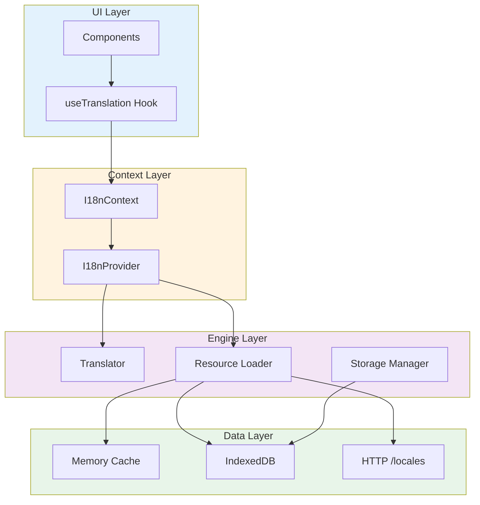
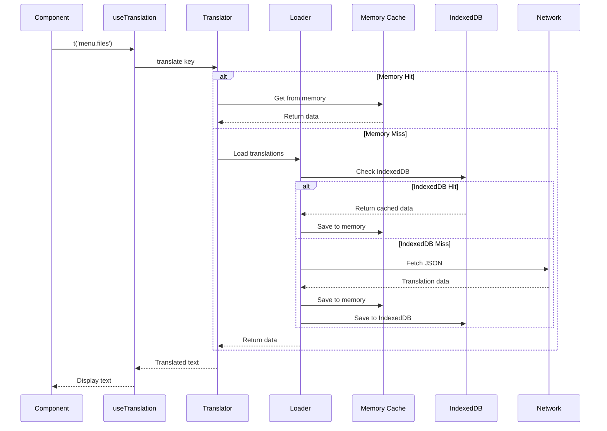
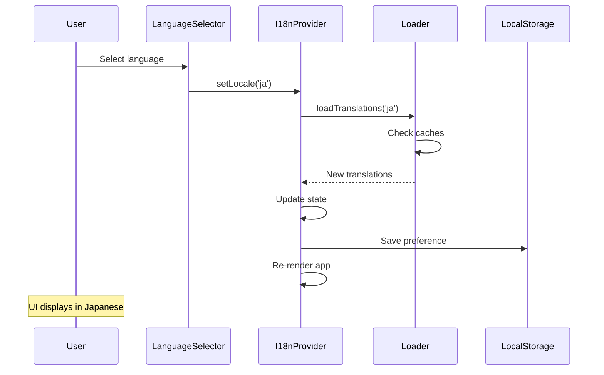

# i18n System - Internationalization Architecture

## 📋 概要

Pyxisの多言語対応システムは、型安全で高性能なi18n実装です。IndexedDBによる永続化キャッシュとメモリキャッシュの2層構造により、初回ロード後は即座に翻訳を提供します。

## 🏗️ アーキテクチャ

### システム構成



## 📂 ファイル構成

```
src/engine/i18n/
├── index.ts              # 公開API
├── types.ts              # 型定義
├── storage.ts            # IndexedDB管理
├── loader.ts             # リソースローダー
└── translator.ts         # 翻訳エンジン

src/context/
└── I18nContext.tsx       # Reactコンテキスト

public/locales/
├── en/
│   └── common.json       # 英語翻訳
└── ja/
    └── common.json       # 日本語翻訳
```

## 🔄 データフロー

### 翻訳取得フロー



### 言語切り替えフロー



## 🎯 主要機能

### 1. 型安全な翻訳キー

TypeScriptの型推論により、翻訳キーの補完とチェックが可能:

```typescript
// ✅ 正しい
t('menu.files')
t('auth.signIn')

// ❌ エラー: キーが存在しない
t('invalid.key')
```

### 2. 変数の補間

動的な値を埋め込み可能:

```typescript
// 翻訳ファイル: "Hello {name}!"
t('greeting', { params: { name: 'World' } })
// => "Hello World!"
```

### 3. フォールバック機構

```typescript
t('new.key', { 
  fallback: 'Default text',
  defaultValue: 'Alternative'
})
```

### 4. 2層キャッシュシステム

| Layer | Purpose | Speed | Persistence |
|-------|---------|-------|-------------|
| Memory | 高速アクセス | 🚀 最速 | セッション中 |
| IndexedDB | オフライン対応 | ⚡ 高速 | 永続的 |
| HTTP | 初回ロード | 🐢 普通 | - |

### 5. 自動言語検出

```typescript
// 優先順位:
// 1. localStorage (ユーザーの選択)
// 2. navigator.language (ブラウザ設定)
// 3. デフォルト (en)
```

## 📖 使用方法

### 基本的な使い方

```tsx
import { useTranslation } from '@/context/I18nContext';

function MyComponent() {
  const { t } = useTranslation();
  
  return (
    <div>
      <h1>{t('app.name')}</h1>
      <button>{t('action.save')}</button>
    </div>
  );
}
```

### 言語切り替え

```tsx
import { useI18n } from '@/context/I18nContext';

function Settings() {
  const { locale, setLocale } = useI18n();
  
  return (
    <button onClick={() => setLocale('ja')}>
      Switch to Japanese
    </button>
  );
}
```

### 変数の使用

```tsx
const count = 5;
t('items.count', { 
  params: { count } 
});
// => "5 items found"
```

## 🔧 翻訳の追加

### 新しいキーを追加

1. **英語翻訳を追加** (`public/locales/en/common.json`):

```json
{
  "myFeature": {
    "title": "My Feature",
    "description": "This is a new feature"
  }
}
```

2. **日本語翻訳を追加** (`public/locales/ja/common.json`):

```json
{
  "myFeature": {
    "title": "マイ機能",
    "description": "これは新しい機能です"
  }
}
```

3. **コンポーネントで使用**:

```tsx
const title = t('myFeature.title');
```

### 新しい言語を追加

1. `src/engine/i18n/types.ts`を更新:

```typescript
export type Locale = 'en' | 'ja' | 'es'; // 'es'を追加
```

2. `locales/es/common.json`を作成

3. `LanguageSelector`コンポーネントに追加

## ⚡ パフォーマンス最適化

### 1. プリロード

```typescript
import { preloadTranslations } from '@/engine/i18n';

// アプリ起動時に複数言語をプリロード
await preloadTranslations('en', ['common']);
await preloadTranslations('ja', ['common']);
```

### 2. キャッシュクリーンアップ

```typescript
import { cleanExpiredCache } from '@/engine/i18n';

// 古いキャッシュを削除（7日以上経過）
await cleanExpiredCache();
```

### 3. メモリキャッシュのクリア

```typescript
import { clearMemoryCache } from '@/engine/i18n';

// メモリキャッシュをクリア（開発時）
clearMemoryCache();
```

## 🎨 ベストプラクティス

### 1. キーの命名規則

```typescript
// ✅ 良い命名
'menu.files'
'auth.signIn'
'error.networkFailed'

// ❌ 悪い命名
'filesMenu'
'signin'
'err1'
```

### 2. 階層構造

```json
{
  "feature": {
    "section": {
      "action": "Text"
    }
  }
}
```

### 3. 共通アクションは`action`に集約

```json
{
  "action": {
    "save": "Save",
    "cancel": "Cancel",
    "delete": "Delete"
  }
}
```

### 4. 重要！
- gitなどターミナルに表示されるエラーメッセージは英語固定
- VSCodeのような方式

## 🐛 デバッグ

### ログの確認

```typescript
// コンソールに以下のようなログが出力される:
[i18n] Translation not found: invalid.key
[i18n-loader] Falling back to 'en' for namespace 'common'
[i18n-storage] Cleaned 3 expired entries
```

### 翻訳の確認

```tsx
const { locale, isLoading } = useI18n();
console.log('Current locale:', locale);
console.log('Loading:', isLoading);
```

## 📊 ストレージ情報

### IndexedDB構造

```
Database: pyxis-i18n
├── Store: translations
│   ├── Index: locale
│   ├── Index: timestamp
│   └── Records:
│       ├── id: "en-common"
│       │   ├── locale: "en"
│       │   ├── namespace: "common"
│       │   ├── data: {...}
│       │   └── timestamp: 1234567890
│       └── id: "ja-common"
│           └── ...
```

### キャッシュ有効期限

- **期間**: 7日間
- **自動クリーンアップ**: アプリ起動時
- **手動削除**: `clearAllTranslationCache()`

## 🔒 セキュリティ

- XSS対策: HTMLエスケープは自動
- CSP: 静的JSONのみ読み込み
- データ検証: 型チェックで不正データを防止

## 🚀 今後の拡張

### 実装予定

- [ ] 複数形対応の強化
- [ ] 日付・数値フォーマット
- [ ] RTL言語サポート
- [ ] 翻訳の遅延ロード（ネームスペース分割）
- [ ] 翻訳管理UI

---

**関連ドキュメント:**
- [SYSTEM-OVERVIEW.md](./SYSTEM-OVERVIEW.md) - システム全体の概要
- [UI-COMPONENTS.md](./UI-COMPONENTS.md) - UIコンポーネント設計
