# Node.js Runtime - Browser-Based JavaScript Execution Environment

Pyxis CodeCanvas の Node.js Runtime は、完全にブラウザ内で動作する Node.js 互換の実行環境です。IndexedDB をストレージとして使い、Babel standalone によるトランスパイル、Web Worker による非同期処理、そして 3 層のキャッシュシステムを備えています。

---

## System Overview

### Design Goals

1. **Complete Browser Execution**: サーバーを必要とせず、すべてクライアント側で実行されること
2. **Node.js Compatibility**: CommonJS の require、npm パッケージ、組み込みモジュールの互換性を保つこと
3. **High Performance**: Babel standalone による高速なトランスパイルと多層キャッシュで性能を確保すること
4. **Async Design**: IndexedDB の非同期性に合わせて、すべてのモジュール読み込みが非同期であること
5. **Extensibility**: プラグインで拡張可能なアーキテクチャであること

### Key Features

- **Babel Standalone Integration**: AST に基づく正確なトランスパイル
- **Full TypeScript/JSX Support**: 型情報の除去、React ランタイムへの自動変換を含むフルサポート
- **ES Module ⇔ CommonJS**: 双方向の変換と非同期 require の実装
- **npm Packages Support**: node_modules 内のパッケージを完全にサポート
- **Built-in Modules**: `fs`、`path`、`http`、`readline` などを提供

---

## Overall Architecture

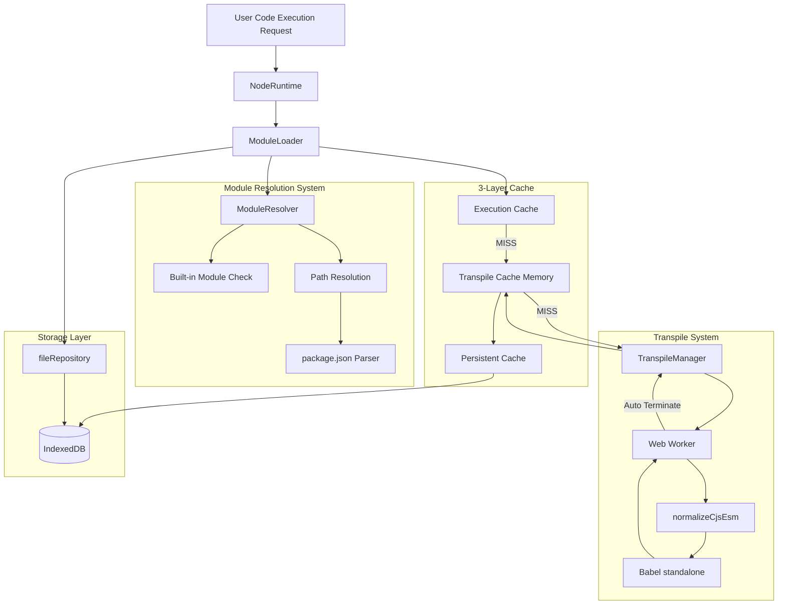

---

## Core Component Details

### 1. NodeRuntime

システムのエントリーポイント。ファイル実行の開始とサンドボックス環境の構築を管理します。

#### Primary Responsibilities

- ファイル実行の開始
- サンドボックス環境の構築
- グローバルオブジェクトの注入
- 組み込みモジュールの提供
- thenable な Proxy を持つ `__require__` 関数の作成

#### Processing Flow

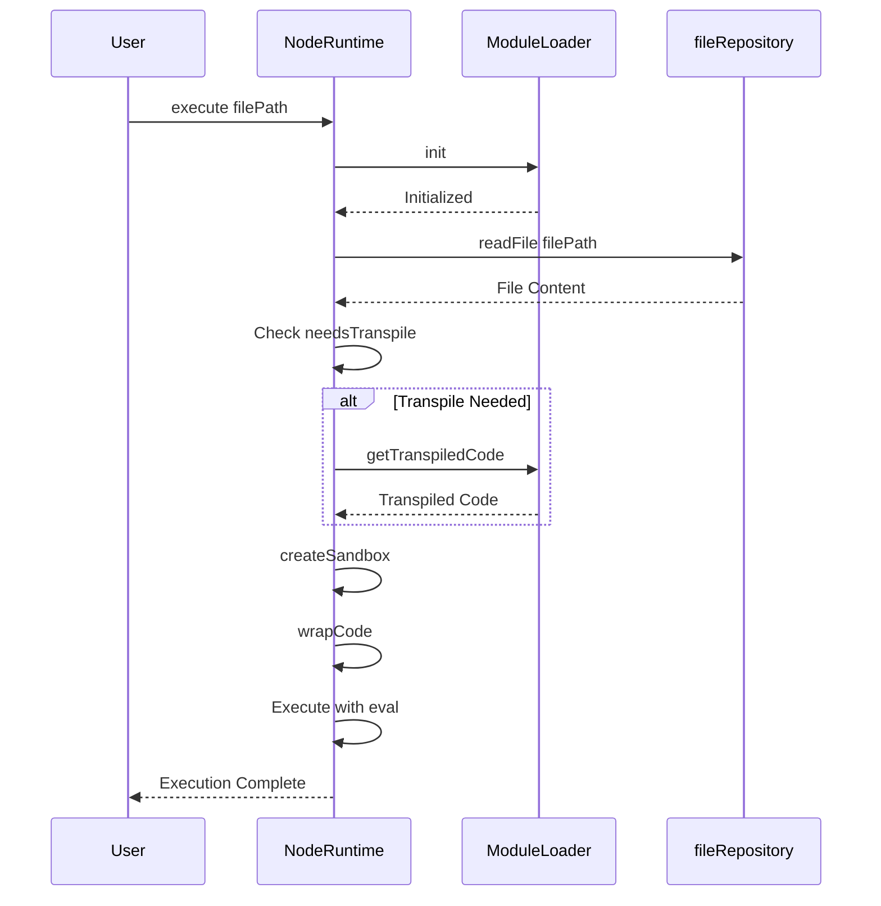

#### Sandbox Environment Components

| Element | Description |
|---------|-------------|
| `console` | デバッグコンソールまたはランタイムロガーへのプロキシ |
| `setTimeout` / `setInterval` | ブラウザのタイマー API |
| `Promise` / `Array` / `Object` | JavaScript の組み込みオブジェクト |
| `global` | グローバルオブジェクト参照 |
| `process` | Node.js の `process` オブジェクトのエミュレーション |
| `Buffer` | バイナリデータ操作用のクラス |
| `__require__` | 非同期モジュール読み込み用の thenable Proxy |

#### Async Require Implementation with Thenable Proxy

IndexedDB の非同期性に対応するため、従来の同期的な `require` を非同期に変換しています。

**主な特徴**: `__require__` は thenable な Proxy を返し、次の両方を可能にします。
- `await __require__('fs')` — 非同期で解決する
- `__require__('fs').promises` — await する前にプロパティへアクセスできる

この Proxy 実装は次の性質を持ちます。
1. 組み込みモジュールは同期的に解決され（`__syncValue` に格納）、
2. 組み込みでないモジュールは非同期に読み込まれ、
3. プロパティアクセスはチェーン可能な入れ子の thenable を返し、
4. 関数呼び出しもラップされ thenable を返します。

**サポートされる利用例**:
```javascript
const promises = await __require__('fs').promises;
// .promises が await 前に thenable を返すため動作する
```

---

### 2. ModuleLoader

Core component for module loading and lifecycle management.

#### Primary Responsibilities

- モジュール解決の調整
- トランスパイル処理の管理
- 実行キャッシュの管理
- 循環依存の検出とハンドリング

#### Cache Strategy

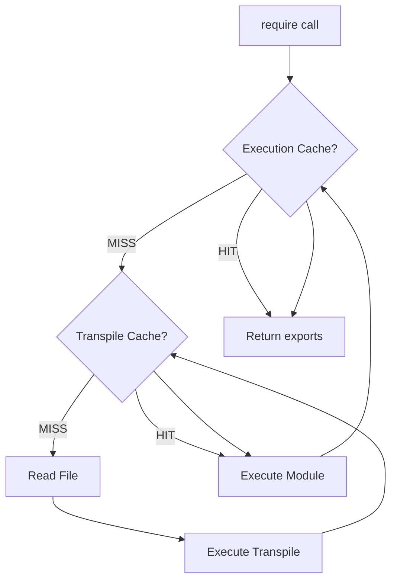

#### Execution Cache Structure

| Field | Type | Description |
|-------|------|-------------|
| `exports` | unknown | モジュールの exports オブジェクト |
| `loaded` | boolean | 読み込み完了フラグ |
| `loading` | boolean | 循環依存検出用の読み込み中フラグ |

#### Module Execution Details

各モジュールは独立した関数スコープ内で実行されます:

- `module.exports` オブジェクトを注入
- さらなるモジュール読み込みのために `__require__` を提供
- `__filename` と `__dirname` を提供
- `eval` で実行し、exports を返す

#### Transpile Decision Logic

トランスパイルは以下の場合に実行されます:

1. 拡張子が `.ts`, `.tsx`, `.mts`, `.cts` の場合
2. 拡張子が `.jsx`, `.tsx` の場合
3. `import` または `export` 構文を含む場合
4. `require()` 呼び出しを含み（非同期変換が必要な場合）

---

### 3. ModuleResolver

Node.js-compatible module path resolution system.

#### Primary Responsibilities

- 組み込みモジュールの検出
- 相対パスの解決
- `node_modules` の検索
- `package.json` の解析
- `exports` フィールドのサポート

#### Resolution Priority

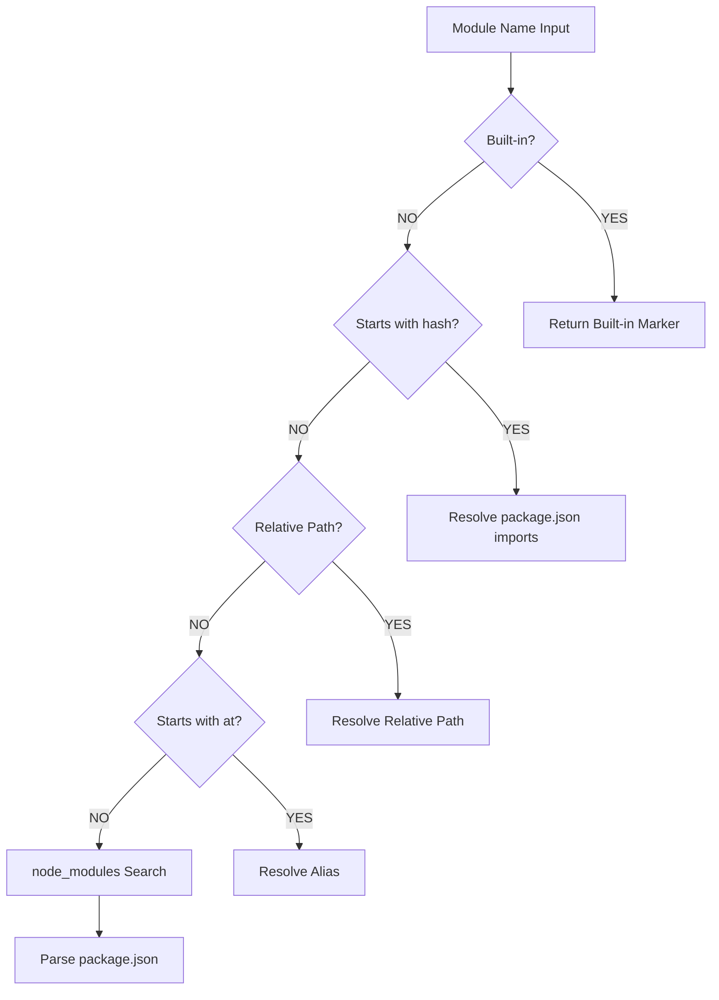

#### Built-in Modules List

`fs`, `fs/promises`, `path`, `os`, `util`, `http`, `https`, `buffer`, `readline`, `crypto`, `stream`, `events`, `url`, `querystring`, `assert` など

#### Path Resolution Examples

| Input | Resolution Result |
|-------|-------------------|
| `fs` | 組み込みマーカーが返される |
| `./utils` | `/projects/my-app/src/utils.js` |
| `../config` | `/projects/my-app/config.ts` |
| `@/components/Button` | `/projects/my-app/src/components/Button.tsx` |
| `lodash` | `/projects/my-app/node_modules/lodash/lodash.js` |
| `@vue/runtime-core` | `/projects/my-app/node_modules/@vue/runtime-core/dist/runtime-core.esm-bundler.js` |
| `#internal/utils` | `package.json` の `imports` フィールドから解決される |

#### package.json Parsing Logic

エントリポイント決定の優先順位:

1. `module` フィールド — ES モジュール版を優先
2. `main` フィールド — CommonJS 版
3. `exports` フィールド — 条件付きエクスポート対応
4. `index.js` — フォールバック

#### Scoped Package Support

スコープパッケージ（例: `@vue/runtime-core`）を正しく解決します:

- パッケージ名: `@vue/runtime-core`
- サブパス: なし
- `package.json` の場所: `/node_modules/@vue/runtime-core/package.json`

#### Extension Completion

ファイルパスに拡張子がない場合、次の順で試します:

1. `.js`, `.mjs`, `.ts`, `.mts`, `.tsx`, `.jsx`, `.json`
2. `/index.js`, `/index.mjs`, `/index.ts`, `/index.mts`, `/index.tsx`

---

### 4. TranspileManager & Web Worker

High-speed transpilation system using Babel standalone.


#### Primary Responsibilities

- Web Worker の作成と管理
- トランスパイルリクエストの処理
- タイムアウト管理（30 秒）
- 自動メモリ管理

#### Worker Processing Flow

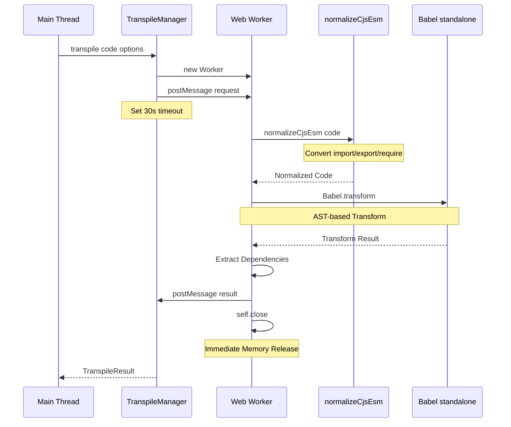


#### Babel Configuration Construction

| Config Item | Condition | Value |
|-------------|-----------|-------|
| presets: typescript | isTypeScript=true | TypeScript 構文の除去 |
| presets: react | isJSX=true | JSX を React.createElement に変換 |
| sourceType | Always | top-level await を想定して 'module' |

#### normalizeCjsEsm Transform

**Babel の前処理**: 正規表現ベースの軽量な変換を行います

**import 文の変換例**

- `import foo from 'bar'` → `const foo = (tmp => tmp && tmp.default !== undefined ? tmp.default : tmp)(await __require__('bar'))`
- `import { named } from 'bar'` → `const { named } = await __require__('bar')`
- `import * as ns from 'bar'` → `const ns = await __require__('bar')`

**export 文の変換例**

- `export default foo` → `module.exports.default = foo`
- `export const bar = 1` → `const bar = 1; module.exports.bar = bar;`
- `export { baz }` → `module.exports.baz = baz`

**require 呼び出しの変換**

- `require('foo')` → `await __require__('foo')`

#### Memory Management Strategy

- トランスパイル完了後に `self.close()` を呼んで Worker を終了させる
- Babel standalone のヒープは Worker 内に隔離される
- メインスレッドのメモリへ影響は与えない
- 各リクエストごとに新しい Worker を生成する

---

### 5. ModuleCache

Persistent cache system for transpiled code.


#### Primary Responsibilities

- トランスパイル結果の保存
- LRU 戦略によるキャッシュ管理
- IndexedDB への永続化
- 自動 GC（合計サイズが 100MB を超えたとき）

#### Cache Structure

IndexedDB のディレクトリ構成:

```
/cache/
    ├── modules/
    │     ├── abc123.js
    │     ├── def456.js
    │     └── ...
    └── meta/
                ├── abc123.json
                ├── def456.json
                └── ...
```

#### Cache Entry Format

| Field | Type | Description |
|-------|------|-------------|
| `originalPath` | string | 元のファイルパス |
| `hash` | string | パスから生成したハッシュキー |
| `code` | string | トランスパイル済みコード |
| `sourceMap` | string | ソースマップ（将来的な実装） |
| `deps` | string[] | 依存モジュール一覧 |
| `mtime` | number | トランスフォームのタイムスタンプ |
| `lastAccess` | number | 最終アクセスのタイムスタンプ |
| `size` | number | コードのバイトサイズ |

#### Hash Generation

パス文字列から数値ハッシュを計算し、base-36 の文字列に変換してキーとして使います。

#### GC Strategy

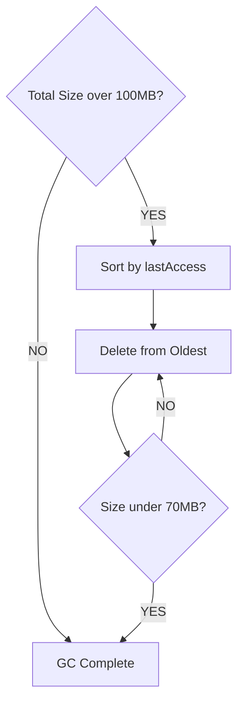

**GC 実行条件**: キャッシュ合計サイズが 100MB を超えたとき  
**削減目標**: 最終アクセスが古いものから削除して 70MB まで減らす

---

## Data Flow Details

### Complete Module Loading Flow

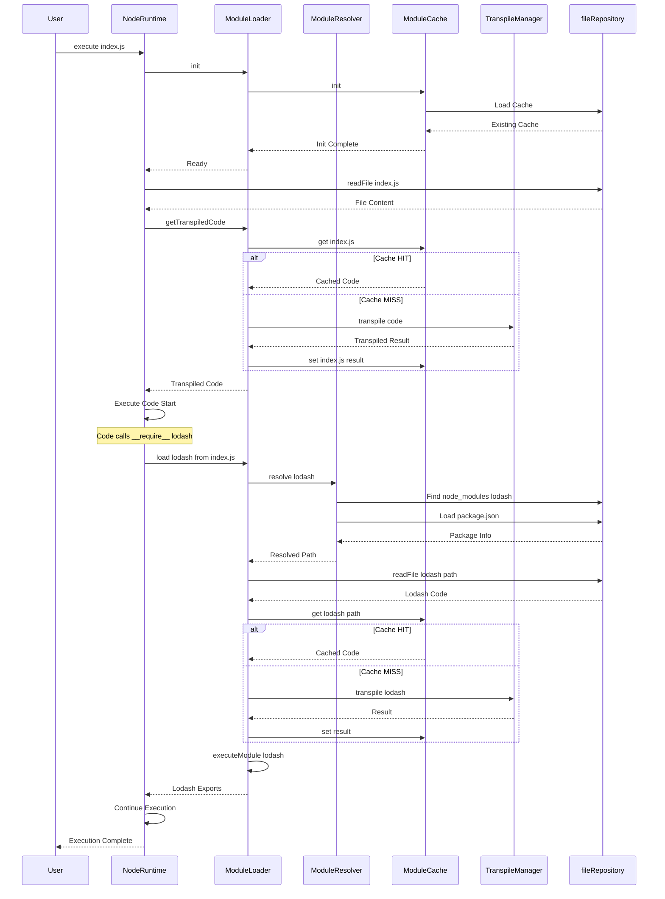

### Transpile Detail Flow

#### Step 1: Language Detection

入力: ファイルパスとコード内容

判定基準:

1. 拡張子が `.ts`, `.tsx`, `.mts`, `.cts` → TypeScript
2. 拡張子が `.jsx`, `.tsx` → JSX
3. コードに `import` / `export` を含む → ES Module
4. コードに `require()` を含む → CommonJS（非同期変換が必要）

#### Step 2: Babel Configuration Construction

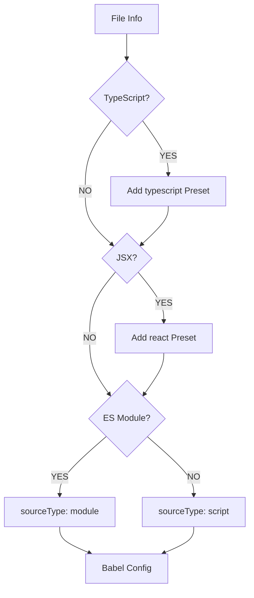

#### Step 3: AST Transformation

Babel standalone による処理:

1. コードを AST にパースする
2. TypeScript の型注釈を削除する
3. JSX を React の関数呼び出しに変換する
4. normalizeCjsEsm により import/export が既に CommonJS に変換されている
5. require 呼び出しを非同期に変換する（normalizeCjsEsm による）
6. 依存関係を抽出する
7. 最適化されたコードを生成する

#### Step 4: Cache Save

メモリとディスクの両方に保存:

- メモリ: 即時アクセス用の Map 構造
- ディスク: IndexedDB（次回起動時に有効）

---

## Performance Characteristics


### First Execution Timing

| Phase | Time | Description |
|-------|------|-------------|
| File Loading | ~5-10ms | IndexedDB からの取得 |
| Transpilation | ~50-150ms | Babel の変換と Worker 実行 |
| Cache Save | ~5ms | IndexedDB への非同期保存 |
| Module Execution | ~5-10ms | eval による実行 |
| **Total** | **~65-175ms** | 初回のみの目安 |

### Second and Later (Cache HIT)

| Phase | Time | Description |
|-------|------|-------------|
| Cache Load | ~1-5ms | メモリからの取得 |
| Module Execution | ~5-10ms | eval による実行 |
| **Total** | **~6-15ms** | **約 10-15 倍高速** |

### Memory Footprint


**メモリ使用量**: LRU GC により概ね 50-70MB に落ち着く

---

## Built-in Modules


### Support Status

| Module | Implementation | Description |
|--------|----------------|-------------|
| `fs` | ✅ | fileRepository を通したファイル操作 |
| `fs/promises` | ✅ | Promise ベースの FS API |
| `path` | ✅ | パス操作ユーティリティ |
| `os` | ✅ | OS 情報のエミュレーション |
| `util` | ✅ | ユーティリティ関数群 |
| `http` | ✅ | fetch をラップした HTTP 通信 |
| `https` | ✅ | HTTPS 通信 |
| `buffer` | ✅ | Buffer クラス |
| `readline` | ✅ | 対話入力のサポート |
| Others | 📝 | `stream`, `events`, `crypto` などは今後対応予定 |

### fs Module Implementation Features


**設計方針**: IndexedDB を単一の真実のソース（single source of truth）として利用する

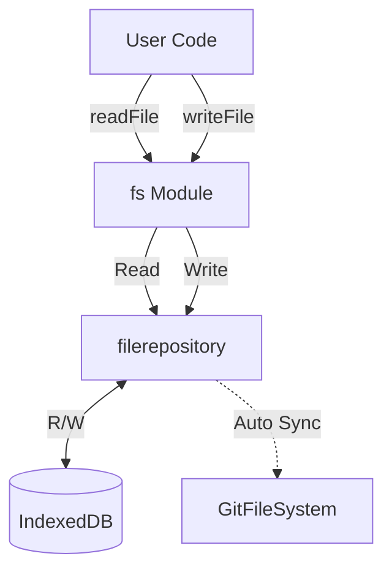

**主な API**:

| API | Behavior |
|-----|----------|
| `readFile` / `readFileSync` | fileRepository 経由で IndexedDB から読み取る |
| `writeFile` / `writeFileSync` | fileRepository に書き込み、GitFS に自動同期する |
| `readdir` / `readdirSync` | ディレクトリ一覧を取得する |
| `stat` / `statSync` | ファイル情報を取得する |
| `mkdir` / `mkdirSync` | ディレクトリを作成する |
| `unlink` / `unlinkSync` | ファイルを削除し、GitFS に自動同期する |

### path Module

Provides standard Node.js path API:

- `join()`, `resolve()`, `dirname()`, `basename()`, `extname()`
- Resolution based on project directory

### http Module

HTTP communication wrapping fetch API:

- `http.get()`, `http.request()`
- EventEmitter-based response stream

---

## npm Packages Support


### Prerequisites

`npm install` は別システムで実行済みで、`node_modules/` は IndexedDB 内に存在していることを前提としています。

### Resolution Flow

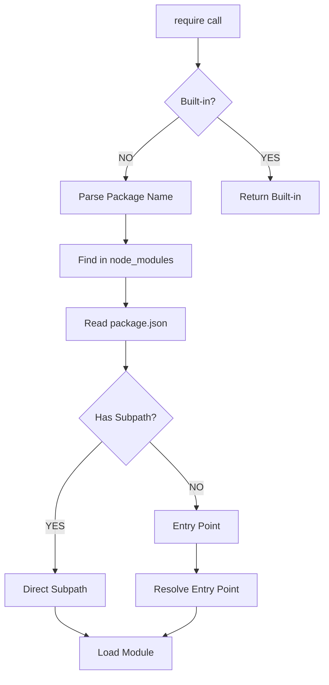

### package.json Parsing Example

**lodash パッケージ**:

```
/node_modules/lodash/package.json:
{
    "name": "lodash",
    "main": "lodash.js"
}

→ 解決結果: /node_modules/lodash/lodash.js
```

**@vue/runtime-core パッケージ**:

```
/node_modules/@vue/runtime-core/package.json:
{
    "name": "@vue/runtime-core",
    "module": "dist/runtime-core.esm-bundler.js",
    "main": "index.js"
}

→ 解決結果: /node_modules/@vue/runtime-core/dist/runtime-core.esm-bundler.js
```

### Subpath Resolution

| require Call | Resolution |
|--------------|------------|
| `lodash` | `/node_modules/lodash/lodash.js` |
| `lodash/merge` | `/node_modules/lodash/merge.js` |
| `@vue/runtime-core` | package.json の `module` フィールドに従う |
| `chalk` | `/node_modules/chalk/source/index.js` |

---

## Error Handling


### Error Types and Solutions

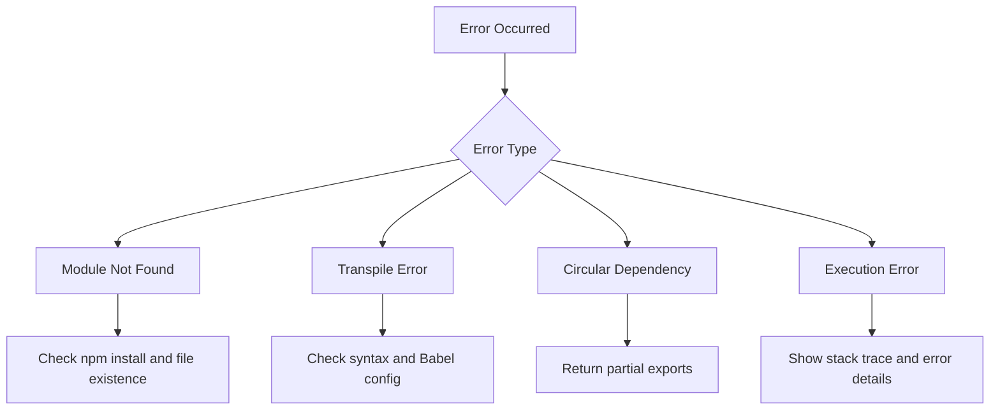

### Error Message Examples

**1. Module Not Found**:

```
❌ Module not found: lodash
Cannot find module 'lodash'

Solution:
- `npm install` が完了しているか確認する
- `node_modules` が IndexedDB 内に存在するか確認する
- パスが正しいか確認する
```

**2. Transpile Error**:

```
❌ Transpile failed: /src/app.tsx
SyntaxError: Unexpected token

Worker error: ...
```

**3. Circular Dependency Detected**:

```
⚠️ Circular dependency detected: /src/a.js
→ /src/b.js
→ /src/a.js

部分的にロードされた exports を返します
```

---

## Design Rationale

### Why Babel Standalone?

| Option | Pros | Cons | Decision |
|--------|------|------|----------|
| Regex | Lightweight, simple | Inaccurate, no complex syntax | ❌ |
| TypeScript Compiler | Official, accurate | Heavy, no browser support | ❌ |
| esbuild-wasm | Fast | Large size, limited features | ❌ |
| Babel standalone | Accurate, rich plugins | Medium bundle size | ✅ |

**Reason for Adoption**: AST ベースの高い正確性、プラグインによる柔軟な拡張性、ブラウザ上で動作する点。

### Why Web Worker?

**Main Thread Problems**:

- トランスパイルが 50–150ms 程度かかり、UI 処理をブロックする
- メモリ使用量が蓄積する

**Worker Benefits**:

- メインスレッドをブロックしない
- 完了後に即座にメモリを解放できる
- Babel のヒープが Worker 内に隔離される

### Why 3-Layer Cache?

**Role of Each Layer**:

1. **Execution Cache**: 循環依存への対処、同一モジュールの再実行を防ぐ
2. **Transpile Cache (Memory)**: 高速アクセスのためのトランスパイル結果保存
3. **Persistent Cache (IndexedDB)**: ブラウザ再起動後に有効な永続キャッシュ

**効果**:

- 初回: 約 100ms
- 2 回目以降: 約 10ms（約 10 倍高速）
- 再起動後: 約 15ms（ディスクキャッシュ）

### Why IndexedDB as Single Source of Truth?


**Design Principle**: 単一のストレージでデータ整合性を保証する

```
User Operation
    ↓
fileRepository (IndexedDB)
    ↓
Auto Sync (Background)
    ↓
GitFileSystem (lightning-fs)
```

**利点**: 書き込み先を一箇所に集約し、同期処理を自動化できること。

### Why Async require?

IndexedDB is async API, so file loading becomes async. Traditional synchronous require cannot handle this, so converted to `await __require__()`.

---

## Usage Examples


### Basic File Execution

TypeScript や JSX ファイルを実行する例:

```typescript
import { executeNodeFile } from '@/engine/runtime/nodeRuntime';

await executeNodeFile({
    projectId: 'proj_123',
    projectName: 'my-project',
    filePath: '/src/index.ts',
    debugConsole: console,
});
```

### Using npm Packages

npm パッケージを使用するユーザコードの例:

```javascript
// ユーザコード: index.js
const lodash = require('lodash');
const result = lodash.map([1, 2, 3], x => x * 2);
console.log(result); // [2, 4, 6]
```

自動的に変換・実行される例:

```javascript
const lodash = await __require__('lodash');
```

### Using ES Modules

ES Module 構文も自動変換されます:

```javascript
// ユーザコード: utils.ts
import { map } from 'lodash';
export const double = (arr) => map(arr, x => x * 2);
```

自動的に CommonJS に変換される例:

```javascript
const { map } = await __require__('lodash');
module.exports.double = (arr) => map(arr, x => x * 2);
```

---


### Troubleshooting

### Common Issues and Solutions

**Issue 1: Module not found**

症状: `Cannot find module 'xxx'`

原因と対処:

- `npm install` が完了していない → `npm install` を実行する
- パスが間違っている → 相対パスを確認する
- IndexedDB に存在しない → ファイルを作成するかアップロードする

**Issue 2: Transpilation is slow**

症状: 初回実行に数秒かかる

原因と対処:

- 初回は Babel の初期化とトランスパイルに時間がかかる（想定内）
- 2 回目以降はキャッシュにより高速化される

**Issue 3: Out of memory**

症状: ブラウザの動作が重くなる

原因と対処:

- キャッシュが 100MB を超える → 自動 GC が作動して 70MB まで削減する
- キャッシュをクリアして再起動する

---

## Future Enhancement Plans


### Short-term

- ソースマップ統合（デバッグ向上）
- より詳細なエラーメッセージ
- パフォーマンス計測とプロファイリング

### Mid-term

- さらに多くの組み込みモジュールを実装
- ワーカープール（並列トランスパイル）
- ホットモジュールリプレースメント

### Long-term

- WebContainer との統合検討
- ネイティブアプリサポート（Tauri）
- AI 支援デバッグ機能

---

## References

### Related Documents

- [CORE-ENGINE.md](./CORE-ENGINE.md) - Core engine design
- [DATA-FLOW.md](./DATA-FLOW.md) - Overall data flow
- [SYSTEM-OVERVIEW.md](./SYSTEM-OVERVIEW.md) - System overview

### External Links

- [Babel Documentation](https://babeljs.io/docs/)
- [Web Workers API](https://developer.mozilla.org/en-US/docs/Web/API/Web_Workers_API)
- [IndexedDB API](https://developer.mozilla.org/en-US/docs/Web/API/IndexedDB_API)
- [Node.js Built-in Modules](https://nodejs.org/api/)

---

**Last Updated**: 2025-01-06  
**Version**: 5.0  
**Status**: ✅ Accurate documentation based on implementation
