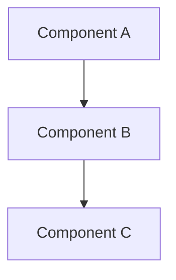
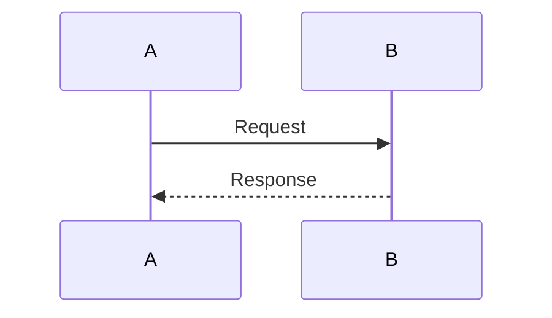
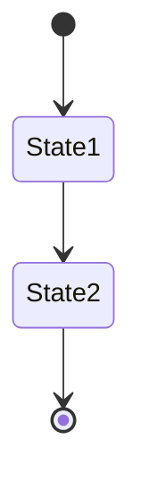
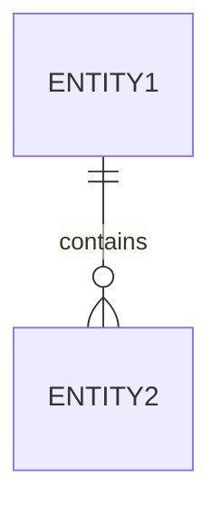

# Pyxis CodeCanvas - Technical Documentation

このディレクトリには、Pyxis CodeCanvasの技術的な詳細を説明する包括的なドキュメントが含まれています。

---

## 📚 Documentation Index

### 1. [SYSTEM-OVERVIEW.md](./SYSTEM-OVERVIEW.md)
**システム全体の概要とアーキテクチャ**

システム全体の構成、技術スタック、主要コンポーネント、データ戦略について説明します。

**主な内容:**
- システムアーキテクチャの概要
- レイヤー構造とコンポーネント
- データストレージ戦略
- 主要機能の概要
- パフォーマンス最適化
- エラーハンドリング
- セキュリティ考慮事項

**対象読者:** 全ての開発者、アーキテクト、新規参加者

---

### 2. [CORE-ENGINE.md](./CORE-ENGINE.md)
**コアエンジンの詳細設計**

`src/engine/core/` の各モジュールの役割、データフロー、実装詳細について説明します。

**主な内容:**
- FileRepository: IndexedDB管理
- GitFileSystem: lightning-fs管理
- SyncManager: 同期制御
- Project Hook: React統合
- データベーススキーマ
- 同期戦略とアルゴリズム
- イベントシステム
- エラーハンドリング

**対象読者:** コア機能を修正する開発者、データ層を理解したい人

---

### 3. [UI-COMPONENTS.md](./UI-COMPONENTS.md)
**UIコンポーネントの構成と設計**

UI層のコンポーネント階層、状態管理、レイアウトシステムについて説明します。

**主な内容:**
- コンポーネント階層
- page.tsx メインコントローラー
- エディタシステム（マルチペイン、タブ管理）
- サイドバーコンポーネント
- ボトムパネル（ターミナル、出力）
- コードエディタ（Monaco統合）
- モーダルコンポーネント
- レスポンシブリサイズ
- テーマシステム

**対象読者:** UI機能を追加・修正する開発者、デザイナー

---

### 4. [AI-SYSTEM.md](./AI-SYSTEM.md)
**AI統合システムの設計**

Gemini AI統合、コードレビュー、チャット機能の実装について説明します。

**主な内容:**
- AI機能の概要
- コアAIモジュール（fetchAI, contextBuilder, diffProcessor, prompts）
- コードレビューシステム
- コミットメッセージ生成
- AIチャットアシスタント
- コンテキスト管理
- レスポンス処理
- パフォーマンス最適化
- セキュリティとプライバシー

**対象読者:** AI機能を拡張する開発者、AI統合を理解したい人

---

### 5. [I18N-SYSTEM.md](./I18N-SYSTEM.md)
**多言語対応システム**

型安全でパフォーマンスに優れたi18n実装について説明します。

**主な内容:**
- アーキテクチャと設計思想
- 2層キャッシュシステム（Memory + IndexedDB）
- 翻訳リソースの管理
- 型安全な翻訳キー
- 自動言語検出とフォールバック
- 変数補間と複数形対応
- パフォーマンス最適化
- 翻訳の追加方法
- ベストプラクティス

**対象読者:** UI翻訳を追加する開発者、新しい言語を追加する人

---

### 6. [NODE-RUNTIME.md](./NODE-RUNTIME.md)
**ブラウザ内Node.js実行環境**

ブラウザでNode.jsコードを実行するための独自ランタイムの実装について説明します。

**主な内容:**
- ランタイムアーキテクチャ
- ES Module Transformer（ES6 → CommonJS変換）
- Built-in Modules（fs, path, os, process, etc.）
- モジュール解決戦略
- 実行コンテキスト
- コンソール統合
- ファイルシステム統合
- NPMパッケージサポート
- パフォーマンス最適化
- 制限事項と回避策

**対象読者:** ランタイム機能を拡張する開発者、実行環境を理解したい人

---

### 7. [SHELL-SYSTEM.md](./SHELL-SYSTEM.md)
**Shell実行システム**

ブラウザ上でPOSIX準拠のシェルスクリプトを実行するための仕組みについて説明します。

**主な内容:**
- Shellアーキテクチャ全体像
- Process抽象化（stdin/stdout/stderr）
- AST Parser（コマンドライン解析）
- パイプライン処理とストリーム接続
- リダイレクション（>, >>, <, 2>&1など）
- 制御構文（if/for/while）
- 変数展開とコマンド置換
- Builtinsアダプター
- スクリプト実行フロー
- エラーハンドリングとタイムアウト
- パフォーマンス最適化

**対象読者:** ターミナル機能を拡張する開発者、シェルコマンドの実装を理解したい人

---

### 8. [DATA-FLOW.md](./DATA-FLOW.md)
**データフローと状態管理**

システム全体のデータフロー、状態遷移、イベント伝播について詳細に説明します。

**主な内容:**
- システム全体のデータフロー
- ファイル操作フロー（作成、編集、削除、移動）
- プロジェクトライフサイクル
- Git操作フロー
- ターミナル操作フロー
- AI操作フロー
- UI更新フロー
- 状態永続化フロー
- エラー伝播フロー
- パフォーマンス最適化フロー
- 完全なユーザーシナリオ

**対象読者:** 全ての開発者、特にデータフローを追跡したい人

---

## 🎯 ドキュメントの使い方

### 初めての方

1. **SYSTEM-OVERVIEW.md** から読み始めてください
2. 興味のある機能に応じて該当するドキュメントに進む
3. 具体的な実装を確認する際は **DATA-FLOW.md** を参照

### 機能を追加する場合

1. 該当する層のドキュメントを読む（UI/Core/AI/Runtime）
2. **DATA-FLOW.md** で既存のフローを確認
3. 既存のパターンに従って実装
4. 必要に応じてドキュメントを更新

### バグを修正する場合

1. **DATA-FLOW.md** で該当する操作フローを確認
2. 関連するコンポーネントのドキュメントを読む
3. デバッグガイドを参照してトラブルシューティング

### アーキテクチャを理解する場合

全てのドキュメントを順番に読み、Mermaid図を活用して理解を深めてください。

---

## 📊 Mermaid図の見方

このドキュメント群では、以下の種類のMermaid図を使用しています:

### Graph (グラフ図)

依存関係、階層構造、システム構成を表現します。

### Sequence Diagram (シーケンス図)

時系列でのコンポーネント間のやり取りを表現します。

### State Diagram (状態遷移図)

状態の遷移を表現します。

### ER Diagram (ER図)

データベーススキーマやエンティティ関係を表現します。

---

## 🔄 ドキュメントの更新

### 更新が必要な場合

- 新機能の追加
- アーキテクチャの変更
- 重要なバグ修正
- APIの変更
- 新しいベストプラクティスの導入

### 更新手順

1. 該当するドキュメントファイルを開く
2. 変更内容を反映
3. Mermaid図が必要な場合は追加・更新
4. "Last Updated" の日付を更新
5. プルリクエストで変更を提出

---

## 🏗️ アーキテクチャの原則

### 設計原則（再掲）

1. **Client-Side Complete**: 全ての処理はクライアント側で完結
2. **IndexedDB as Source of Truth**: IndexedDBを唯一のデータソースとする
3. **Automatic Synchronization**: GitFileSystemへの同期は自動的にバックグラウンドで実行
4. **Event-Driven UI Updates**: イベントシステムによる自動的なUI更新
5. **Browser-Based Runtime**: ブラウザ内でNode.jsコードを実行

### コーディング規約

- **TypeScript**: 型安全性を最大限活用
- **関数型プログラミング**: イミュータブルなデータ構造を推奨
- **単一責任の原則**: 各モジュールは1つの明確な責任を持つ
- **イベント駆動**: 疎結合なコンポーネント設計
- **エラーハンドリング**: 適切なレベルでエラーを処理

---

## 📖 関連ドキュメント

### プロジェクトルートのドキュメント

- **README.md**: プロジェクトの概要と使い方
- **README_en.md**: English version of README
- **Development/NEW-ARCHITECTURE.md**: 新アーキテクチャガイド（開発者向け簡易版）
- **Development/TODO.md**: 今後の開発予定
- **Development/ai-agent-implementation-plan.md**: AI機能の実装計画

### コードドキュメント

コード内のJSDocコメントも参照してください。主要なクラスやメソッドには詳細な説明があります。

---

## 🤝 コントリビューション

### ドキュメントへの貢献

- 誤字脱字の修正
- 説明の改善
- 図の追加・改善
- 新しいセクションの追加
- 翻訳（英語版の作成）

### 質問やフィードバック

- GitHub Issues でドキュメントに関する質問や提案を歓迎します
- 不明瞭な箇所があれば遠慮なく報告してください

---

## 📈 ドキュメントのメンテナンス

### バージョン管理

各ドキュメントの末尾に以下の情報があります:

- **Last Updated**: 最終更新日
- **Version**: ドキュメントバージョン
- **Status**: ドキュメントのステータス（Draft/Complete/Deprecated）

### 定期レビュー

- 四半期ごとにドキュメントの正確性を確認
- 大きなアーキテクチャ変更後は全ドキュメントをレビュー
- 新機能追加時は関連ドキュメントを更新

---

## 🔍 クイックリファレンス

### 主要なデータフロー

| 操作 | 開始点 | 経由 | 終着点 | ドキュメント |
|------|--------|------|--------|--------------|
| ファイル作成 | UI | FileRepository → IndexedDB → SyncManager | GitFileSystem | DATA-FLOW.md §2.1 |
| ファイル編集 | Editor | Debounce → FileRepository | IndexedDB + GitFS | DATA-FLOW.md §2.2 |
| Git コミット | Git Panel | GitCommands → isomorphic-git | GitFileSystem | DATA-FLOW.md §4.1 |
| AI レビュー | Editor | Context Builder → AI Engine | AI Review Tab | DATA-FLOW.md §6.1 |
| コード実行 | Terminal | Node Runtime → Built-in Modules | Output Panel | DATA-FLOW.md §5.1 |
| Shell実行 | Terminal | StreamShell → Parser → Process | stdout/stderr | SHELL-SYSTEM.md §3 |

### 主要なコンポーネント

| コンポーネント | 場所 | 役割 | ドキュメント |
|----------------|------|------|--------------|
| FileRepository | src/engine/core/ | IndexedDB管理 | CORE-ENGINE.md §2 |
| GitFileSystem | src/engine/core/ | lightning-fs管理 | CORE-ENGINE.md §3 |
| page.tsx | src/app/ | メインコントローラー | UI-COMPONENTS.md §2 |
| Terminal | src/components/Bottom/ | ターミナルUI | UI-COMPONENTS.md §5.2 |
| fetchAI | src/engine/ai/ | AI APIクライアント | AI-SYSTEM.md §2.1 |
| esModuleTransformer | src/engine/node/ | ES6変換 | NODE-RUNTIME.md §2 |
| StreamShell | src/engine/cmd/shell/ | シェル実行エンジン | SHELL-SYSTEM.md §3.2 |
| AST Parser | src/engine/cmd/shell/ | コマンドライン解析 | SHELL-SYSTEM.md §3.4 |

---

## 🎓 学習パス

### 初級（1-2週間）

1. SYSTEM-OVERVIEW.md を読む
2. 簡単なUI変更を試す
3. ファイル操作の基本フローを理解

### 中級（1ヶ月）

1. CORE-ENGINE.md と UI-COMPONENTS.md を読む
2. 新しいコマンドやUI要素を追加
3. DATA-FLOW.md で詳細なフローを理解

### 上級（2-3ヶ月）

1. 全てのドキュメントを読む
2. AI-SYSTEM.md と NODE-RUNTIME.md を深く理解
3. アーキテクチャレベルの改善を提案・実装

---

## 📝 用語集

### 主要な用語

| 用語 | 説明 |
|------|------|
| **IndexedDB** | ブラウザ内のNoSQLデータベース。主データストア |
| **lightning-fs** | ブラウザ内で動作する仮想ファイルシステム |
| **isomorphic-git** | ブラウザで動作するGit実装 |
| **EditorPane** | エディタの分割されたペイン単位 |
| **Tab** | エディタ内で開いているファイルのタブ |
| **FileRepository** | IndexedDBを管理する統一API |
| **GitFileSystem** | lightning-fsを管理するAPI |
| **SyncManager** | 2つのストレージ間の同期を制御 |
| **Built-in Modules** | ブラウザでエミュレートされたNode.jsコアモジュール |
| **Context Builder** | AI用のコンテキストを収集・構築 |
| **StreamShell** | シェルスクリプトの実行エンジン |
| **Process** | シェル内の仮想プロセス抽象化 |
| **Segment** | パース後のコマンドセグメント（AST） |
| **Pipeline** | パイプでつながれた複数コマンド |

---

**最終更新**: 2025-10-02  
**バージョン**: 0.6  
**メンテナー**: Pyxis CodeCanvas Development Team

---

Happy Coding! 🚀
