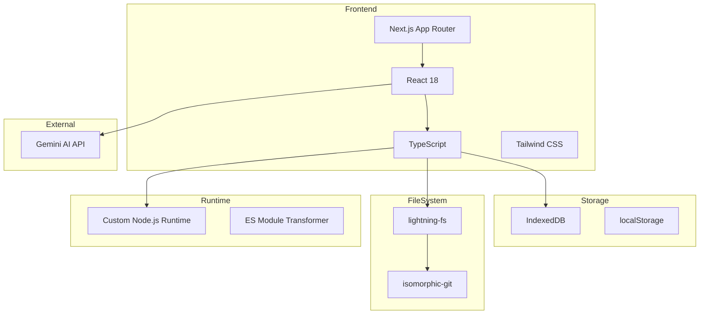
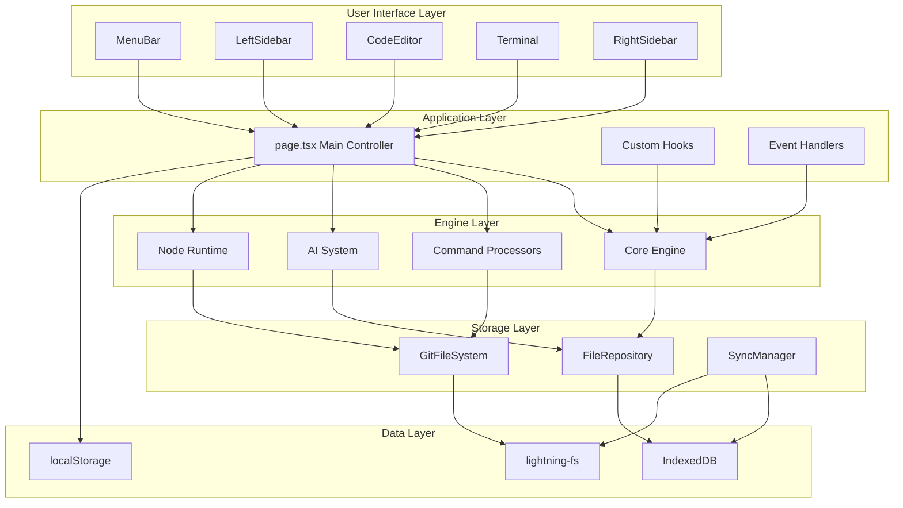
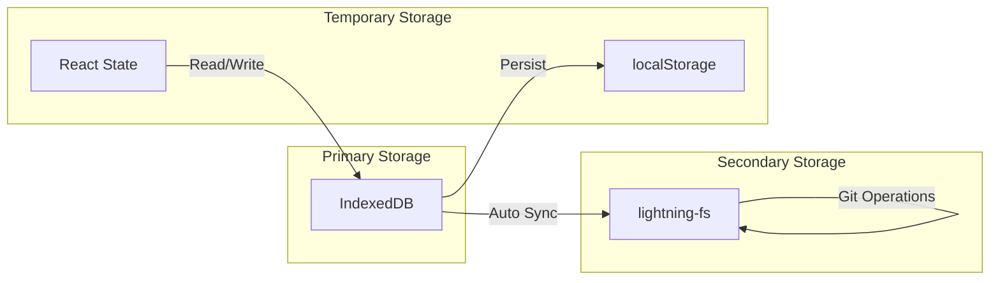
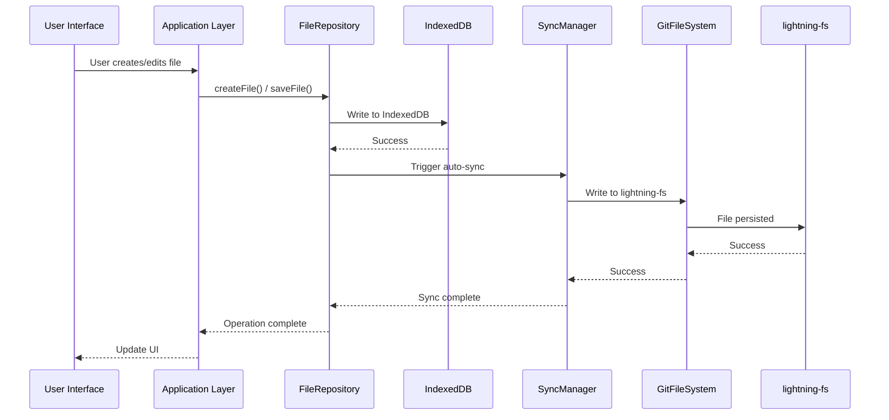
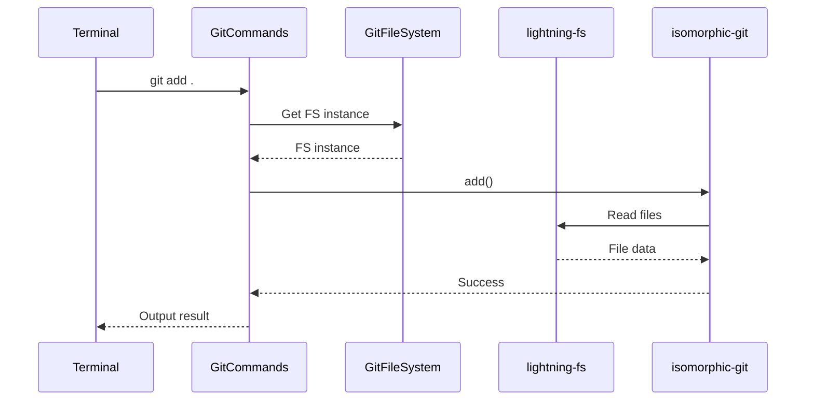
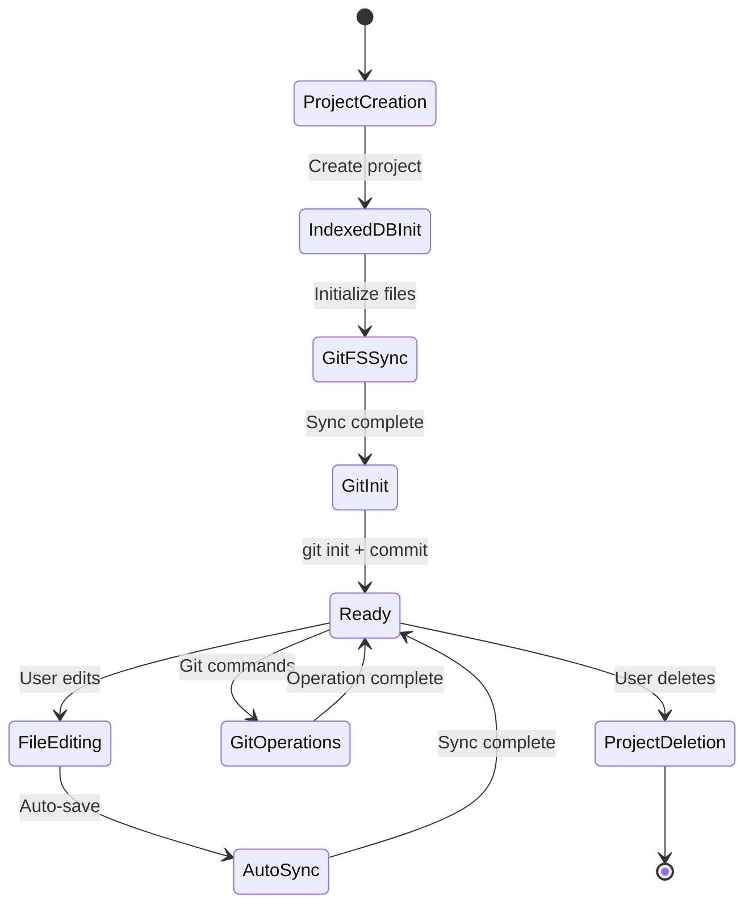
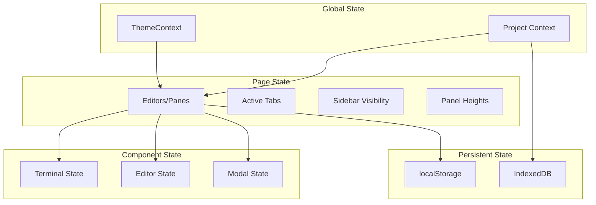
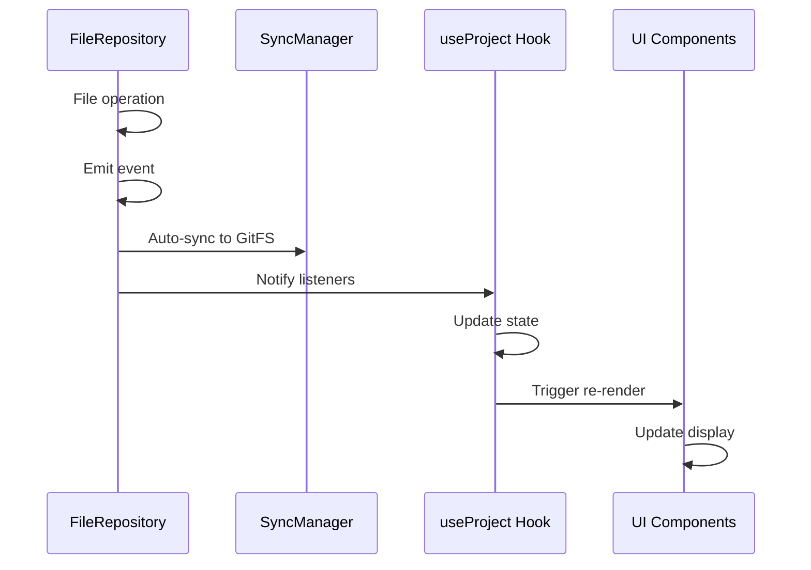
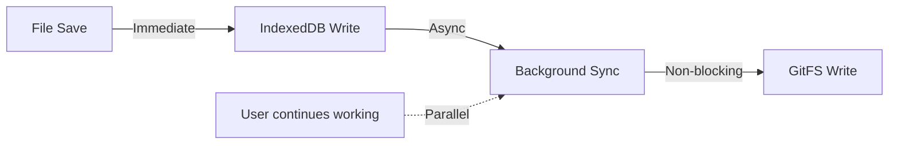
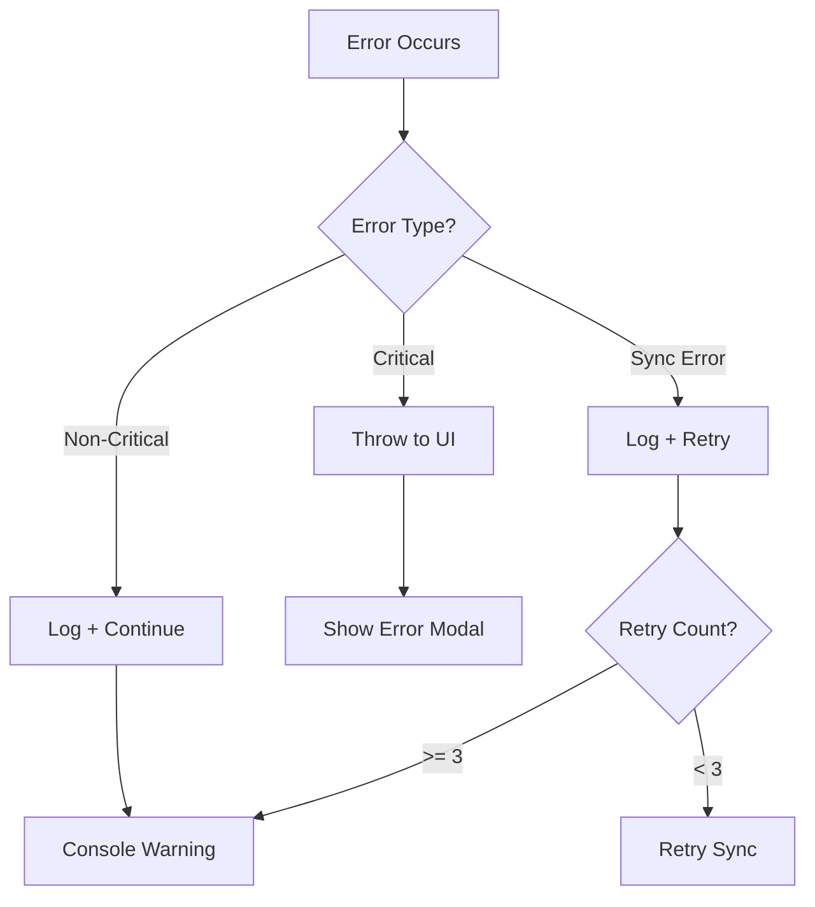

# Pyxis CodeCanvas - System Overview

## Document Structure

本ドキュメント群は、Pyxis CodeCanvasの全体的なシステム構成、データフロー、依存関係を理解するためのものです。

### ドキュメント一覧

- **SYSTEM-OVERVIEW.md** (本ファイル): システム全体概要とアーキテクチャ
- **CORE-ENGINE.md**: coreエンジンの詳細設計と動作フロー
- **UI-COMPONENTS.md**: UI層の構成とコンポーネント設計
- **AI-SYSTEM.md**: AI統合システムの設計
- **NODE-RUNTIME.md**: ブラウザ内Node.js実行環境の詳細
- **DATA-FLOW.md**: データフローと状態管理の全体像

---

## 1. System Architecture

Pyxis CodeCanvasは、ブラウザ上で完全に動作するWebベースの統合開発環境（IDE）です。

### 1.1 Core Principles

1. **Client-Side Complete**: 全ての処理はクライアント側で完結
2. **IndexedDB as Source of Truth**: IndexedDBを唯一のデータソースとする
3. **Automatic Synchronization**: GitFileSystemへの同期は自動的にバックグラウンドで実行
4. **Event-Driven UI Updates**: イベントシステムによる自動的なUI更新
5. **Browser-Based Runtime**: ブラウザ内でNode.jsコードを実行

### 1.2 Technology Stack

### 1.3 High-Level Architecture

---

## 2. System Components

### 2.1 Core Layers

| Layer | Purpose | Key Components |
|-------|---------|----------------|
| **UI Layer** | ユーザーインターフェース | MenuBar, Sidebar, Editor, Terminal |
| **Application Layer** | アプリケーションロジック | page.tsx, Custom Hooks |
| **Engine Layer** | ビジネスロジック | Core, Commands, AI, Runtime |
| **Storage Layer** | データ永続化 | FileRepository, GitFileSystem |
| **Data Layer** | 物理ストレージ | IndexedDB, lightning-fs, localStorage |

### 2.2 Data Storage Strategy

**Storage Roles:**

- **IndexedDB**: 全てのプロジェクトデータ、ファイル、メタデータの主要ストレージ
- **lightning-fs**: Git操作専用のファイルシステム（IndexedDBから自動同期）
- **localStorage**: UI状態、エディタレイアウト、設定の保存
- **React State**: 一時的なUI状態とユーザーインタラクション

---

## 3. Key Features

### 3.1 Multi-Pane Editor System

VSCode風の分割エディタシステムを実装しています。

**Features:**
- Vertical/Horizontal split support
- Nested pane structure
- Independent tab management per pane
- Preview mode and pinned tabs
- Drag-and-drop tab reordering

### 3.2 Integrated Terminal

XTermベースのフルフィーチャーターミナル。

**Supported Commands:**
- **Unix Commands**: ls, cd, cat, touch, mkdir, rm, mv, cp, pwd, echo, grep
- **Git Commands**: init, add, commit, status, log, diff, branch, checkout, merge, push, pull
- **NPM Commands**: install, run, test, build, init

### 3.3 Built-in Git Support

isomorphic-gitを使用した完全なGit機能。

**Features:**
- Repository initialization
- Commit management
- Branch operations
- Diff visualization
- Change tracking
- History browsing

### 3.4 AI Integration

Gemini AIを統合したコード支援機能。

**Features:**
- Code review and suggestions
- Commit message generation
- Contextual code assistance
- Multi-file analysis
- Diff-aware suggestions

### 3.5 Browser-Based Node.js Runtime

ブラウザ内でNode.jsコードを実行できる独自ランタイム。

**Features:**
- ES Module support
- Built-in modules emulation (fs, path, os, etc.)
- Dynamic module loading
- Console output capture
- Error handling

---

## 4. Data Flow Overview

### 4.1 File Operation Flow

### 4.2 Git Operation Flow

### 4.3 Project Lifecycle

---

## 5. State Management

### 5.1 State Hierarchy

### 5.2 State Persistence Strategy

| State Type | Storage | Restoration Timing |
|------------|---------|-------------------|
| Editor Layout | localStorage | On mount |
| Active Tabs | localStorage | On mount |
| Current Project | localStorage | On mount |
| Project Files | IndexedDB | On project load |
| Terminal History | Session only | Not persisted |
| Theme Settings | localStorage | On mount |

---

## 6. Event System

### 6.1 File Change Events

FileRepositoryはイベントシステムを実装しており、ファイル変更を自動的に通知します。

**Event Types:**
- `create`: New file created
- `update`: File content updated
- `delete`: File deleted

**Listeners:**
- UI components (automatic refresh)
- Git monitor (change detection)
- Tab synchronization (content update)

### 6.2 Event Flow

---

## 7. Performance Optimization

### 7.1 Optimization Strategies

| Strategy | Implementation | Benefit |
|----------|----------------|---------|
| Lazy Loading | Dynamic imports for heavy modules | Reduced initial load time |
| Batch Operations | Batch file sync operations | Reduced IndexedDB transactions |
| Background Sync | Non-blocking GitFS sync | Smooth user experience |
| Event Debouncing | Debounce file change events | Reduced re-renders |
| Virtual Scrolling | Large file list rendering | Improved rendering performance |
| Code Splitting | Split chunks by route/feature | Faster page transitions |

### 7.2 Sync Performance

**Key Points:**
- IndexedDB writes are immediate and blocking
- GitFS sync is asynchronous and non-blocking
- Users can continue working during sync
- Sync errors are logged but don't block operations

---

## 8. Error Handling

### 8.1 Error Propagation Strategy

**Error Categories:**

1. **Critical Errors**: Database failures, initialization errors
   - Action: Show user-facing error, prevent operation
   
2. **Non-Critical Errors**: File read failures, command errors
   - Action: Show in-app message, allow continuation
   
3. **Sync Errors**: GitFS sync failures
   - Action: Log warning, continue (IndexedDB is still correct)

4. **AI Errors**: API failures, timeout
   - Action: Show error message, allow retry

---

## 9. Security Considerations

### 9.1 Data Security

- All data stored client-side only
- No server-side persistence
- API keys stored in localStorage (user responsibility)
- No automatic network transmission of code

### 9.2 Code Execution Safety

- Sandboxed Node.js runtime
- No access to real Node.js APIs
- File system access limited to virtual FS
- No network access from runtime (except explicit fetch)

---

## 10. Browser Compatibility

### 10.1 Required Features

- **IndexedDB**: Full support required
- **localStorage**: Full support required
- **ES6+ JavaScript**: Native or transpiled
- **Web Workers**: For background processing

### 10.2 Tested Browsers

- Chrome/Edge 90+
- Firefox 88+
- Safari 14+

---

## 11. Development Guidelines

### 12.1 Adding New Features

1. Determine appropriate layer (UI, Application, Engine)
2. Use FileRepository for all file operations
3. Emit events for state changes
4. Use TypeScript for type safety
5. Follow existing patterns and conventions
6. Add error handling at appropriate levels

### 12.2 Modifying Core Systems

1. Review NEW-ARCHITECTURE.md first
2. Understand data flow and dependencies
3. Maintain backward compatibility where possible
4. Test with multiple projects and file types
5. Verify IndexedDB and GitFS stay in sync
6. Update relevant documentation

### 12.3 Code Organization Principles

- **Single Responsibility**: Each module has one clear purpose
- **Dependency Injection**: Pass dependencies explicitly
- **Event-Driven**: Use events for loose coupling
- **Type Safety**: Leverage TypeScript fully
- **Testability**: Design for unit testing

---

## 13. Debugging Guide

### 13.1 Common Debug Points

| Issue | Check Points | Tools |
|-------|--------------|-------|
| File not syncing | Check FileRepository events | Console logs, IndexedDB inspector |
| Git operation failed | Check GitFileSystem state | Terminal output, FS inspector |
| UI not updating | Check event listeners | React DevTools |
| Performance issues | Check sync batching | Chrome DevTools Performance tab |
| Data loss | Check IndexedDB state | Application tab in DevTools |

### 13.2 Debug Flags

Enable detailed logging by setting flags in localStorage:

- `DEBUG_FILE_REPO`: FileRepository operations
- `DEBUG_SYNC`: Sync operations
- `DEBUG_GIT`: Git command execution
- `DEBUG_TERMINAL`: Terminal operations

---

## Related Documents

- [CORE-ENGINE.md](./CORE-ENGINE.md) - Core engine detailed design
- [UI-COMPONENTS.md](./UI-COMPONENTS.md) - UI layer architecture
- [AI-SYSTEM.md](./AI-SYSTEM.md) - AI integration details
- [NODE-RUNTIME.md](./NODE-RUNTIME.md) - Browser runtime implementation
- [DATA-FLOW.md](./DATA-FLOW.md) - Complete data flow diagrams

---

**Last Updated**: 2025-01-02  
**Version**: 0.7  
**Status**: Verified - Future Considerations削除
