# UI Components - Architecture and Design

このドキュメントでは、Pyxis CodeCanvasのUI層の構成、コンポーネント設計、状態管理について詳細に説明します。

---

## 1. UI Layer Overview

UI層は、ユーザーインターフェースを構成するReactコンポーネント群で構成されています。

### 1.1 Component Hierarchy

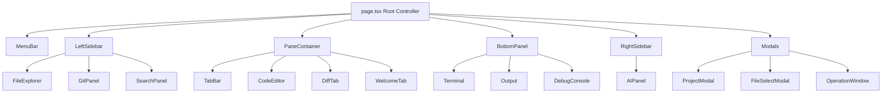
```mermaid
graph TB
    A[page.tsx Root Controller] --> B[MenuBar]
    A --> C[LeftSidebar]
    A --> D[PaneContainer]
    A --> E[BottomPanel]
    A --> F[RightSidebar]
    A --> G[Modals]
    
    C --> C1[FileExplorer]
    C --> C2[GitPanel]
    C --> C3[SearchPanel]
    
    D --> D1[TabBar]
    D --> D2[CodeEditor]
    D --> D3[DiffTab]
    D --> D4[WelcomeTab]
    
    E --> E1[Terminal]
    E --> E2[Output]
    E --> E3[DebugConsole]
    
    F --> F1[AIPanel]
    
    G --> G1[ProjectModal]
    G --> G2[FileSelectModal]
    G --> G3[OperationWindow]
```

### 1.2 Layout Structure

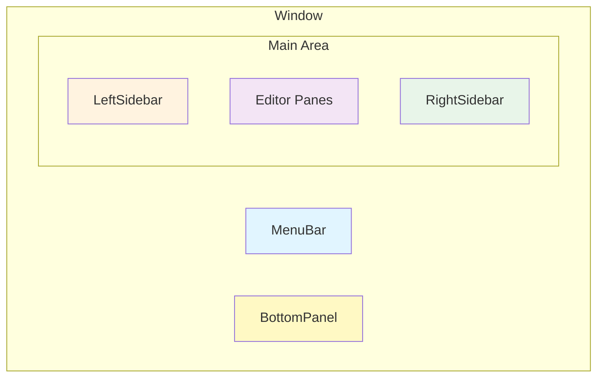
```mermaid
graph TB
    subgraph Window
        A[MenuBar]
        
        subgraph Main Area
            B[LeftSidebar]
            C[Editor Panes]
            D[RightSidebar]
        end
        
        E[BottomPanel]
    end
    
    style A fill:#e1f5ff
    style B fill:#fff3e0
    style C fill:#f3e5f5
    style D fill:#e8f5e9
    style E fill:#fff9c4
```

**Layout Dimensions:**
- MenuBar: Fixed height (40px)
- LeftSidebar: Resizable width (default 240px)
- RightSidebar: Resizable width (default 240px)
- BottomPanel: Resizable height (default 200px)
- Editor Panes: Flexible, fills remaining space

---

## 2. page.tsx: Main Controller

page.tsxは、アプリケーション全体の状態とレイアウトを管理するメインコントローラーです。

### 2.1 State Management

**主要なState変数:**

| Category | State | Type | Persistence |
|----------|-------|------|-------------|
| Layout | `leftSidebarWidth` | number | localStorage |
| Layout | `rightSidebarWidth` | number | localStorage |
| Layout | `bottomPanelHeight` | number | localStorage |
| Layout | `isLeftSidebarVisible` | boolean | localStorage |
| Layout | `isRightSidebarVisible` | boolean | localStorage |
| Layout | `isBottomPanelVisible` | boolean | localStorage |
| Editor | `editors` | EditorPane[] | localStorage |
| Project | `currentProject` | Project or null | useProject hook |
| Project | `projectFiles` | FileItem[] | useProject hook |
| UI | `activeMenuTab` | MenuTab | Session |
| UI | `isProjectModalOpen` | boolean | Session |
| UI | `gitChangesCount` | number | Session |
| UI | `nodeRuntimeOperationInProgress` | boolean | Session |

### 2.2 Initialization Flow

1. localStorageからレイアウト復元
2. useProjectでFileRepository初期化
3. 前回のプロジェクトがあれば読み込み
4. イベントリスナー設定
5. UI レンダリング

### 2.3 主要なuseEffect

- localStorage復元 (マウント時)
- localStorage自動保存 (editors変更時)
- プロジェクトファイル同期 (projectFiles, currentProject変更時)
- タブコンテンツ復元 (editors, isRestoredFromLocalStorage)
- Git監視 (currentProject, gitRefreshTrigger)

### 2.4 Event Handlers

**File Operations:**

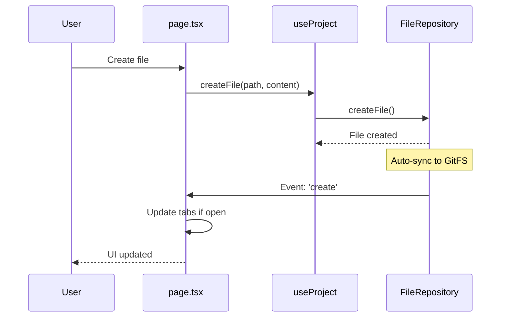
```mermaid
sequenceDiagram
    participant USER as User
    participant PAGE as page.tsx
    participant HOOK as useProject
    participant REPO as FileRepository

    USER->>PAGE: Create file
    PAGE->>HOOK: createFile(path, content)
    HOOK->>REPO: createFile()
    REPO-->>HOOK: File created
    Note over REPO: Auto-sync to GitFS
    REPO->>PAGE: Event: 'create'
    PAGE->>PAGE: Update tabs if open
    PAGE-->>USER: UI updated
```

**Tab Operations:**

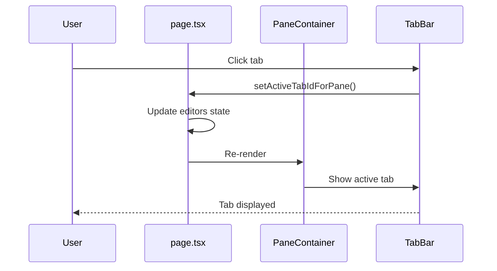
```mermaid
sequenceDiagram
    participant USER as User
    participant PAGE as page.tsx
    participant PANE as PaneContainer
    participant TAB as TabBar

    USER->>TAB: Click tab
    TAB->>PAGE: setActiveTabIdForPane()
    PAGE->>PAGE: Update editors state
    PAGE->>PANE: Re-render
    PANE->>TAB: Show active tab
    TAB-->>USER: Tab displayed
```

**Git Operations:**

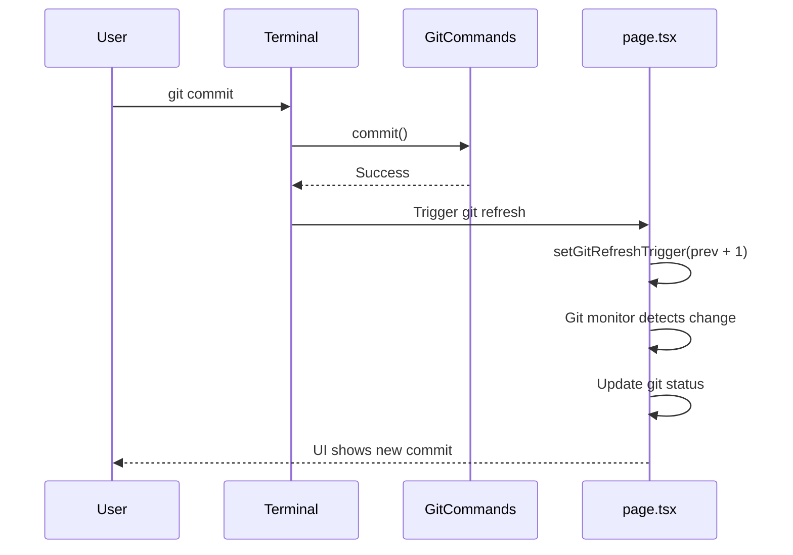
```mermaid
sequenceDiagram
    participant USER as User
    participant TERM as Terminal
    participant GIT as GitCommands
    participant PAGE as page.tsx

    USER->>TERM: git commit
    TERM->>GIT: commit()
    GIT-->>TERM: Success
    TERM->>PAGE: Trigger git refresh
    PAGE->>PAGE: setGitRefreshTrigger(prev + 1)
    PAGE->>PAGE: Git monitor detects change
    PAGE->>PAGE: Update git status
    PAGE-->>USER: UI shows new commit
```

---

## 3. Editor System

### 3.1 Multi-Pane Architecture

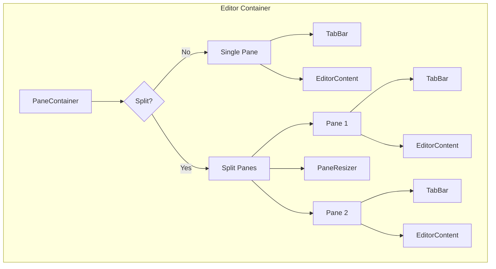
```mermaid
graph TB
    subgraph Editor Container
        A[PaneContainer] --> B{Split?}
        B -->|No| C[Single Pane]
        B -->|Yes| D[Split Panes]
        
        C --> C1[TabBar]
        C --> C2[EditorContent]
        
        D --> D1[Pane 1]
        D --> D2[PaneResizer]
        D --> D3[Pane 2]
        
        D1 --> D1A[TabBar]
        D1 --> D1B[EditorContent]
        
        D3 --> D3A[TabBar]
        D3 --> D3B[EditorContent]
    end
```

**Pane Structure:**

```typescript
interface EditorPane {
  id: string
  tabs: Tab[]
  activeTabId: string
  layout?: 'vertical' | 'horizontal'
  size?: number
  children?: EditorPane[]
  parentId?: string
}
```

**Pane Operations:**

| Operation | Function | Description |
|-----------|----------|-------------|
| Add Pane | `addEditorPane()` | Add new pane to array |
| Remove Pane | `removeEditorPane()` | Remove pane by ID |
| Split Pane | `splitPane()` | Split pane into two |
| Flatten | `flattenPanes()` | Get flat list of all panes |

### 3.2 Tab Management

**Tab Lifecycle:**

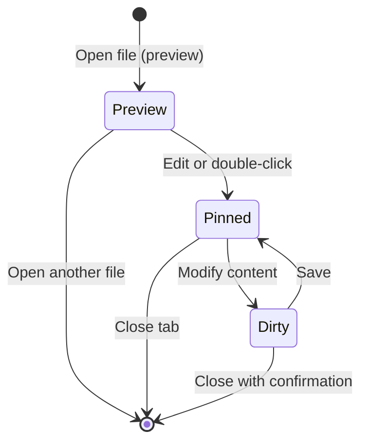
```mermaid
stateDiagram-v2
    [*] --> Preview: Open file (preview)
    Preview --> Pinned: Edit or double-click
    Preview --> [*]: Open another file
    Pinned --> Dirty: Modify content
    Dirty --> Pinned: Save
    Pinned --> [*]: Close tab
    Dirty --> [*]: Close with confirmation
```

**Tab Types:**

| Type | Purpose | Identifier Pattern |
|------|---------|-------------------|
| Welcome | Initial tab | `welcome` |
| File | Regular file | `paneId:path` |
| Preview | Preview file | `paneId:path-preview` |
| Diff | Git diff view | `paneId:path-diff` |
| AI Review | AI suggestion | `paneId:path-ai` |
| Web Preview | HTML preview | `paneId:path-web` |

**Tab State Management:**

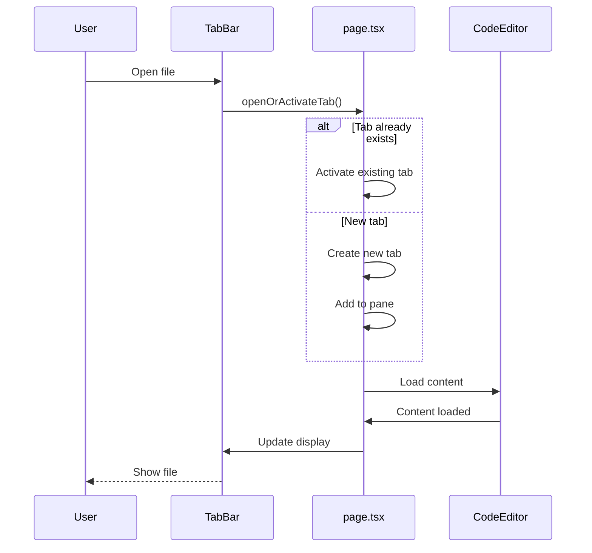
```mermaid
sequenceDiagram
    participant USER as User
    participant TAB as TabBar
    participant PAGE as page.tsx
    participant EDITOR as CodeEditor

    USER->>TAB: Open file
    TAB->>PAGE: openOrActivateTab()
    
    alt Tab already exists
        PAGE->>PAGE: Activate existing tab
    else New tab
        PAGE->>PAGE: Create new tab
        PAGE->>PAGE: Add to pane
    end
    
    PAGE->>EDITOR: Load content
    EDITOR->>PAGE: Content loaded
    PAGE->>TAB: Update display
    TAB-->>USER: Show file
```

### 3.3 Tab Synchronization

**File Change Sync:**

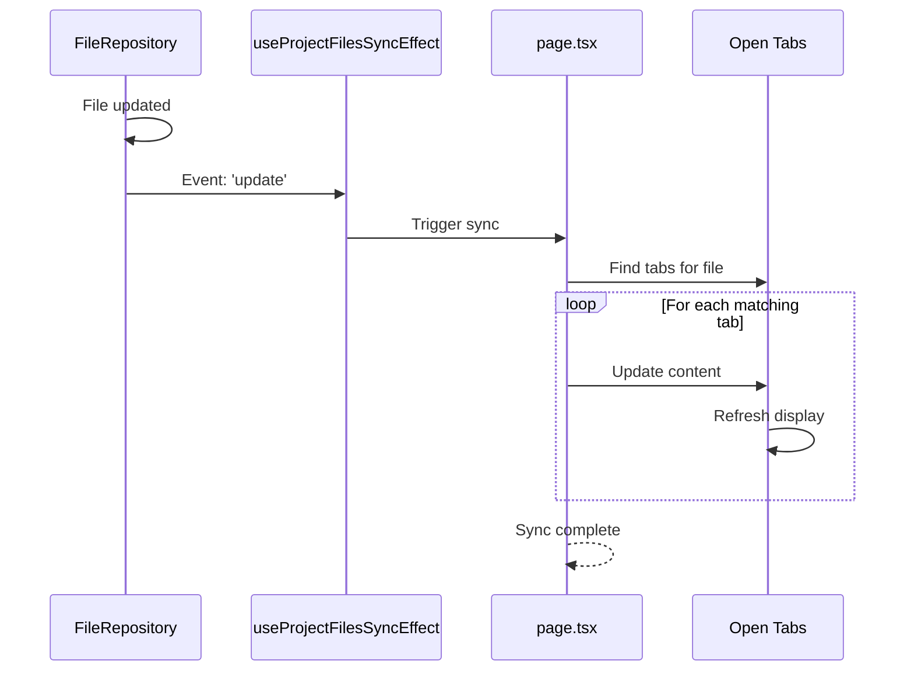
```mermaid
sequenceDiagram
    participant REPO as FileRepository
    participant HOOK as useProjectFilesSyncEffect
    participant PAGE as page.tsx
    participant TAB as Open Tabs

    REPO->>REPO: File updated
    REPO->>HOOK: Event: 'update'
    HOOK->>PAGE: Trigger sync
    PAGE->>TAB: Find tabs for file
    
    loop For each matching tab
        PAGE->>TAB: Update content
        TAB->>TAB: Refresh display
    end
    
    PAGE-->>PAGE: Sync complete
```

**NodeRuntime Sync:**

When Node runtime writes files, tabs are synchronized differently:

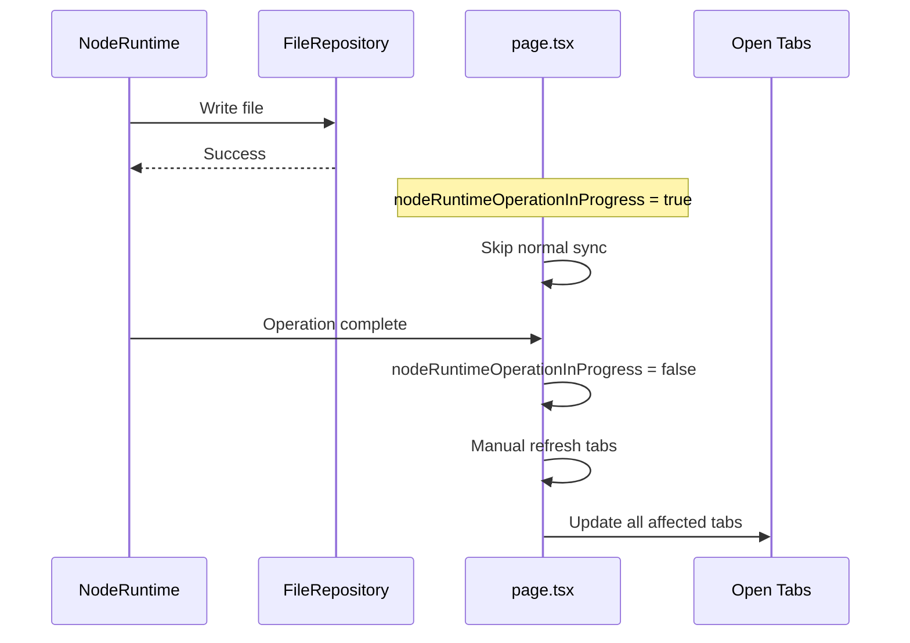
```mermaid
sequenceDiagram
    participant RUNTIME as NodeRuntime
    participant REPO as FileRepository
    participant PAGE as page.tsx
    participant TAB as Open Tabs

    RUNTIME->>REPO: Write file
    REPO-->>RUNTIME: Success
    Note over PAGE: nodeRuntimeOperationInProgress = true
    PAGE->>PAGE: Skip normal sync
    RUNTIME->>PAGE: Operation complete
    PAGE->>PAGE: nodeRuntimeOperationInProgress = false
    PAGE->>PAGE: Manual refresh tabs
    PAGE->>TAB: Update all affected tabs
```

---

## 4. Sidebar Components

### 4.1 LeftSidebar

**Active Tabs:**

| Tab | Component | Purpose |
|-----|-----------|---------|
| `files` | FileTree | ファイルエクスプローラー |
| `search` | SearchPanel | ファイル検索 |
| `git` | GitPanel | Git操作とステータス |
| `run` | RunPanel | スクリプト実行 |
| `settings` | SettingsPanel | 設定管理 |

**各パネルの機能:**

- **FileTree**: 階層ファイルツリー、ドラッグ&ドロップ、コンテキストメニュー、ファイル/フォルダ作成・削除・リネーム
- **SearchPanel**: ファイル内容検索
- **GitPanel**: 変更ファイル表示、ステージング、コミット、ブランチ管理、履歴表示
- **RunPanel**: スクリプト実行
- **SettingsPanel**: 設定管理(APIキー、エディター設定など)

### 4.2 RightSidebar

RightSidebarはAIPanel専用のコンテナです。

**役割:**
- AIPanelをレンダリング
- リサイズハンドル提供
- 幅の管理(デフォルト240px)

**内容:**
- `children` prop経由で任意のコンテンツを表示可能
- デフォルトでは`AIPanel`を表示
- AIPanelが利用不可の場合はエラーメッセージ表示

---

## 5. Bottom Panel

### 5.1 Panel Structure

```mermaid
graph TB
**BottomPanel Tabs:**

| Tab | Component | Purpose |
|-----|-----------|---------|
| `terminal` | Terminal | コマンド実行 |
| `output` | OutputPanel | システム出力表示 |
| `debug` | DebugConsole | Python/JS実行結果 |

### 5.2 Terminal Component

**Terminal Architecture:**

```mermaid
graph TB
    subgraph Terminal Component
        A[XTerm Instance]
        B[Command Parser]
        C[Command Handlers]
        D[Output Formatter]
    end
    
    subgraph Command Processors
        E[UnixCommands]
        F[GitCommands]
        G[NPMCommands]
    end
    
    A --> B
    B --> C
    C --> E
    C --> F
    C --> G
    E --> D
    F --> D
    G --> D
    D --> A
```

**Terminal Initialization:**

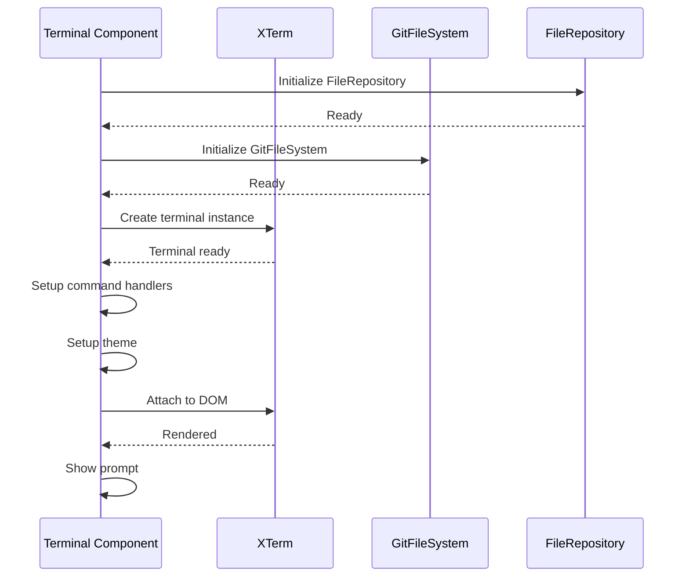
```mermaid
sequenceDiagram
    participant COMP as Terminal Component
    participant XTERM as XTerm
    participant FS as GitFileSystem
    participant REPO as FileRepository

    COMP->>REPO: Initialize FileRepository
    REPO-->>COMP: Ready
    COMP->>FS: Initialize GitFileSystem
    FS-->>COMP: Ready
    
    COMP->>XTERM: Create terminal instance
    XTERM-->>COMP: Terminal ready
    COMP->>COMP: Setup command handlers
    COMP->>COMP: Setup theme
    COMP->>XTERM: Attach to DOM
    XTERM-->>COMP: Rendered
    COMP->>COMP: Show prompt
```

**Command Execution Flow:**

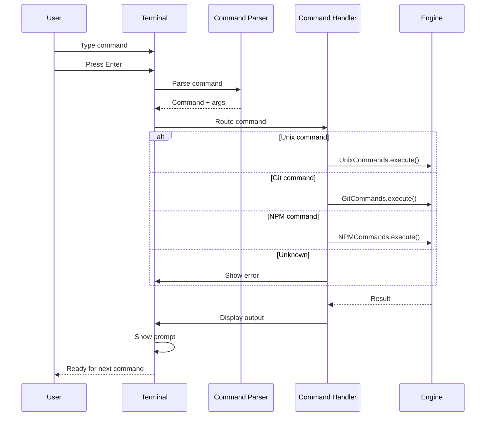
```mermaid
sequenceDiagram
    participant USER as User
    participant TERM as Terminal
    participant PARSER as Command Parser
    participant HANDLER as Command Handler
    participant ENGINE as Engine

    USER->>TERM: Type command
    USER->>TERM: Press Enter
    TERM->>PARSER: Parse command
    PARSER-->>TERM: Command + args
    
    TERM->>HANDLER: Route command
    
    alt Unix command
        HANDLER->>ENGINE: UnixCommands.execute()
    else Git command
        HANDLER->>ENGINE: GitCommands.execute()
    else NPM command
        HANDLER->>ENGINE: NPMCommands.execute()
    else Unknown
        HANDLER->>TERM: Show error
    end
    
    ENGINE-->>HANDLER: Result
    HANDLER->>TERM: Display output
    TERM->>TERM: Show prompt
    TERM-->>USER: Ready for next command
```

### 5.3 Output Panel

**Output Sources:**

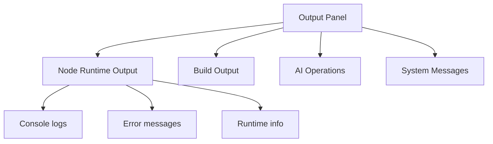
```mermaid
graph TB
    A[Output Panel] --> B[Node Runtime Output]
    A --> C[Build Output]
    A --> D[AI Operations]
    A --> E[System Messages]
    
    B --> B1[Console logs]
    B --> B2[Error messages]
    B --> B3[Runtime info]
```

**Output Message Structure:**

| Field | Type | Description |
|-------|------|-------------|
| `type` | string | Message category |
| `message` | string | Message content |
| `timestamp` | Date | When message was logged |
| `source` | string | Source of message |

---

## 6. Code Editor

### 6.1 Editor Types

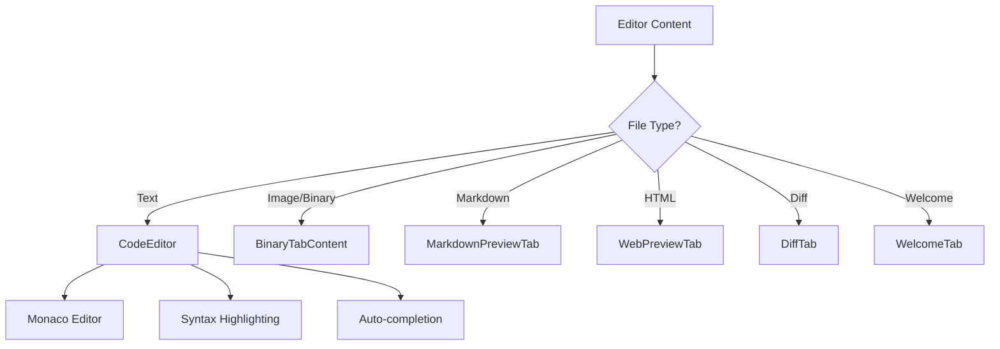
```mermaid
graph TB
    A[Editor Content] --> B{File Type?}
    
    B -->|Text| C[CodeEditor]
    B -->|Image/Binary| D[BinaryTabContent]
    B -->|Markdown| E[MarkdownPreviewTab]
    B -->|HTML| F[WebPreviewTab]
    B -->|Diff| G[DiffTab]
    B -->|Welcome| H[WelcomeTab]
    
    C --> C1[Monaco Editor]
    C --> C2[Syntax Highlighting]
    C --> C3[Auto-completion]
```

### 6.2 CodeEditor Component

**エディター実装:**

CodeEditorは2つのエディターをサポート:
- **MonacoEditor**: デフォルト、フル機能
- **CodeMirrorEditor**: `isCodeMirror` プロップで切り替え可能

**共通機能:**
- シンタックスハイライト
- 行ジャンプ (jumpToLine/jumpToColumn)
- ブレークポイント管理
- 文字数カウント
- デバウンス保存
- Undo/Redo履歴

**コンテンツ同期:**
- ユーザー編集 → onChange イベント → ローカル状態更新
- タブをdirtyとしてマーク
- デバウンス保存で自動保存

### 6.3 DiffTab Component

**Diff View Layout:**

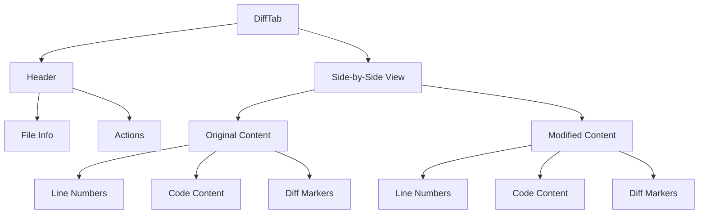
```mermaid
graph TB
    A[DiffTab] --> B[Header]
    A --> C[Side-by-Side View]
    
    B --> B1[File Info]
    B --> B2[Actions]
    
    C --> C1[Original Content]
    C --> C2[Modified Content]
    
    C1 --> C1A[Line Numbers]
    C1 --> C1B[Code Content]
    C1 --> C1C[Diff Markers]
    
    C2 --> C2A[Line Numbers]
    C2 --> C2B[Code Content]
    C2 --> C2C[Diff Markers]
```

**Diff Calculation:**

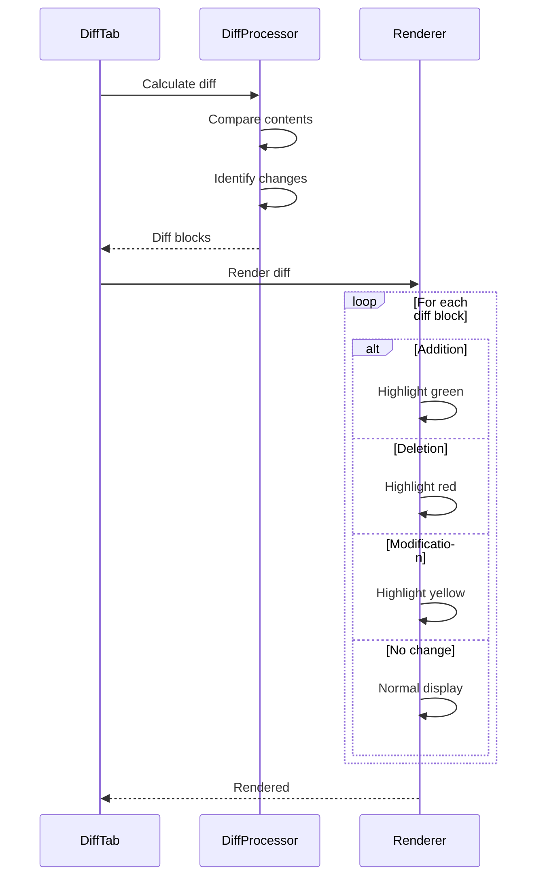
```mermaid
sequenceDiagram
    participant COMP as DiffTab
    participant PROC as DiffProcessor
    participant RENDER as Renderer

    COMP->>PROC: Calculate diff
    PROC->>PROC: Compare contents
    PROC->>PROC: Identify changes
    PROC-->>COMP: Diff blocks
    
    COMP->>RENDER: Render diff
    
    loop For each diff block
        alt Addition
            RENDER->>RENDER: Highlight green
        else Deletion
            RENDER->>RENDER: Highlight red
        else Modification
            RENDER->>RENDER: Highlight yellow
        else No change
            RENDER->>RENDER: Normal display
        end
    end
    
    RENDER-->>COMP: Rendered
```

---

## 7. Modal Components

### 7.1 ProjectModal

**Project Creation Flow:**

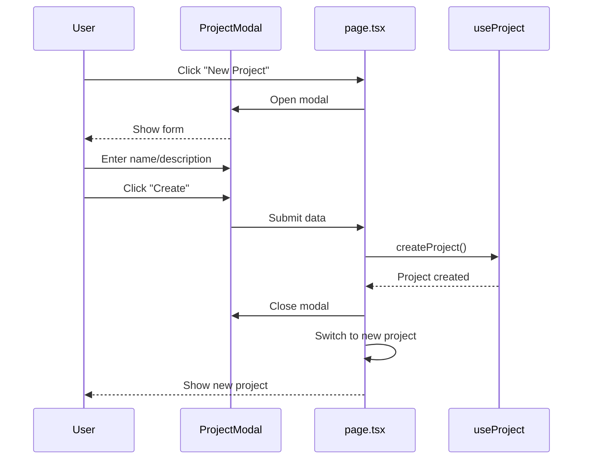
```mermaid
sequenceDiagram
    participant USER as User
    participant MODAL as ProjectModal
    participant PAGE as page.tsx
    participant HOOK as useProject

    USER->>PAGE: Click "New Project"
    PAGE->>MODAL: Open modal
    MODAL-->>USER: Show form
    
    USER->>MODAL: Enter name/description
    USER->>MODAL: Click "Create"
    
    MODAL->>PAGE: Submit data
    PAGE->>HOOK: createProject()
    HOOK-->>PAGE: Project created
    PAGE->>MODAL: Close modal
    PAGE->>PAGE: Switch to new project
    PAGE-->>USER: Show new project
```

### 7.2 FileSelectModal

**File Selection Flow:**

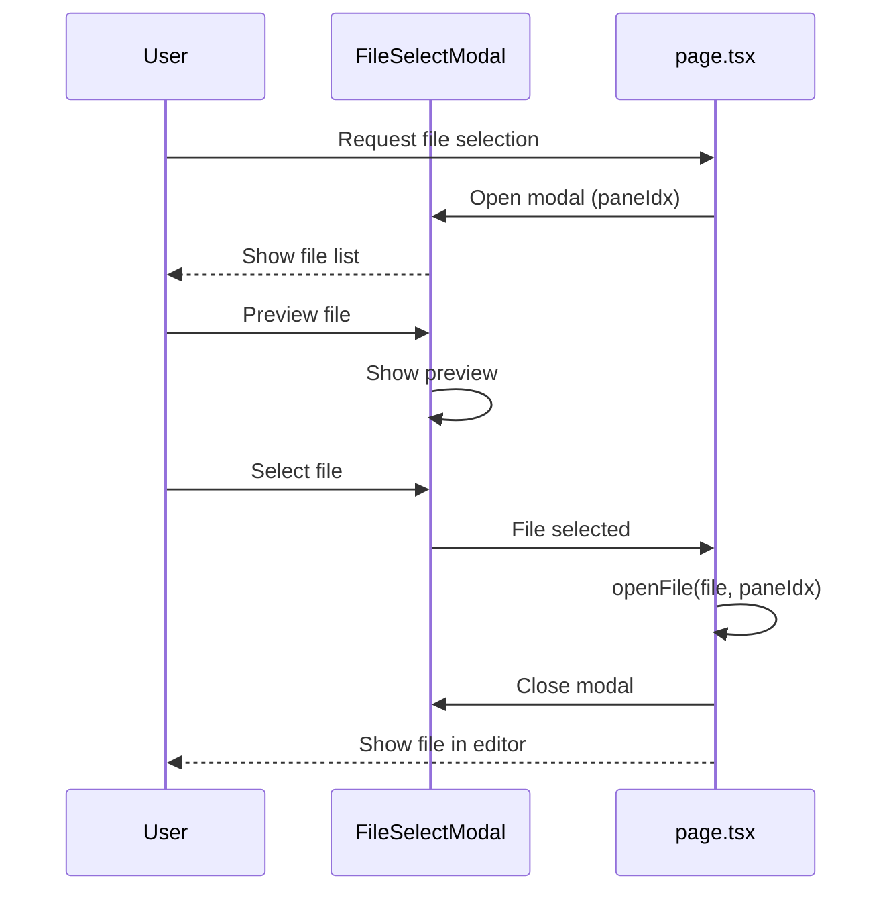
```mermaid
sequenceDiagram
    participant USER as User
    participant MODAL as FileSelectModal
    participant PAGE as page.tsx

    USER->>PAGE: Request file selection
    PAGE->>MODAL: Open modal (paneIdx)
    MODAL-->>USER: Show file list
    
    USER->>MODAL: Preview file
    MODAL->>MODAL: Show preview
    
    USER->>MODAL: Select file
    MODAL->>PAGE: File selected
    PAGE->>PAGE: openFile(file, paneIdx)
    PAGE->>MODAL: Close modal
    PAGE-->>USER: Show file in editor
```

### 7.3 OperationWindow

**Operation Monitoring:**

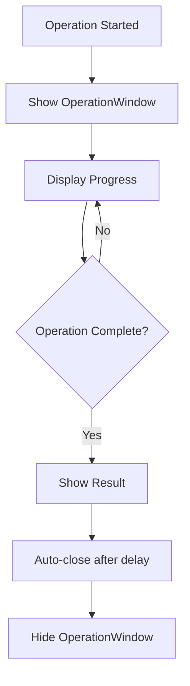
```mermaid
graph TB
    A[Operation Started] --> B[Show OperationWindow]
    B --> C[Display Progress]
    C --> D{Operation Complete?}
    D -->|No| C
    D -->|Yes| E[Show Result]
    E --> F[Auto-close after delay]
    F --> G[Hide OperationWindow]
```

---

## 8. Responsive Resizing

### 8.1 Resize Handlers

```mermaid
graph TB
    A[Resize Handle] --> B[Mouse Down]
    B --> C[Track Mouse Move]
    C --> D[Calculate Delta]
    D --> E[Update Width/Height]
    E --> F{Still Dragging?}
    F -->|Yes| C
    F -->|No| G[Mouse Up]
    G --> H[Save to localStorage]
```

**Resize Constraints:**

| Panel | Min | Max | Default |
|-------|-----|-----|---------|
| LeftSidebar | 200px | 600px | 240px |
| RightSidebar | 200px | 600px | 240px |
| BottomPanel | 100px | 80vh | 200px |

### 8.2 Layout Persistence

**Save Flow:**

```mermaid
sequenceDiagram
    participant USER as User
    participant HANDLE as Resize Handle
    participant PAGE as page.tsx
    participant LS as localStorage

    USER->>HANDLE: Drag handle
    HANDLE->>PAGE: Update state
    PAGE->>PAGE: Re-render
    
    USER->>HANDLE: Release mouse
    HANDLE->>PAGE: Resize complete
    PAGE->>LS: Save layout
    LS-->>PAGE: Saved
```

**Restore Flow:**

```mermaid
sequenceDiagram
    participant BROWSER as Browser
    participant PAGE as page.tsx
    participant LS as localStorage

    BROWSER->>PAGE: Mount component
    PAGE->>LS: Load layout
    LS-->>PAGE: Layout data
    PAGE->>PAGE: Apply dimensions
    PAGE->>PAGE: Set visibility flags
    PAGE-->>BROWSER: Render with saved layout
```

---

## 9. Theme System

### 9.1 Theme Context

```mermaid
graph TB
    A[ThemeContext] --> B[Color Palette]
    A --> C[Component Styles]
    A --> D[Editor Theme]
    
    B --> B1[Background Colors]
    B --> B2[Foreground Colors]
    B --> B3[Accent Colors]
    
    C --> C1[Sidebar Styles]
    C --> C2[Editor Styles]
    C --> C3[Terminal Styles]
    
    D --> D1[Monaco Theme]
    D --> D2[Syntax Colors]
```

**Theme Application:**

```mermaid
sequenceDiagram
    participant USER as User
    participant COMP as Component
    participant THEME as ThemeContext
    participant LS as localStorage

    COMP->>THEME: useTheme()
    THEME-->>COMP: colors object
    COMP->>COMP: Apply to styles
    
    USER->>COMP: Toggle theme
    COMP->>THEME: setTheme('dark'/'light')
    THEME->>LS: Save preference
    THEME->>THEME: Update context
    THEME->>COMP: Trigger re-render
    COMP->>COMP: Apply new colors
```

### 9.2 Color System

**Color Categories:**

| Category | Dark Theme | Light Theme | Usage |
|----------|-----------|-------------|-------|
| Background | #1e1e1e | #ffffff | Main background |
| Foreground | #d4d4d4 | #333333 | Text color |
| Primary | #007acc | #0066cc | Accent color |
| Border | #3e3e3e | #e5e5e5 | Border color |
| Hover | #2a2a2a | #f0f0f0 | Hover background |
| Active | #37373d | #e8e8e8 | Active state |

---

## 10. Performance Optimization

### 10.1 Rendering Optimization

**Techniques:**

| Technique | Application | Benefit |
|-----------|-------------|---------|
| React.memo | Static components | Prevent unnecessary re-renders |
| useMemo | Expensive calculations | Cache computed values |
| useCallback | Event handlers | Stable function references |
| Lazy loading | Heavy components | Faster initial load |
| Virtual scrolling | Large lists | Render only visible items |
| Debouncing | Frequent updates | Reduce update frequency |

### 10.2 Editor Performance

```mermaid
graph TB
    A[Large File] --> B{File Size?}
    B -->|< 1MB| C[Monaco Editor]
    B -->|>= 1MB| D[Read-only View]
    
    C --> C1[Full features]
    D --> D1[Syntax highlight only]
    D --> D2[No IntelliSense]
```

**Large File Handling:**
- Files > 1MB: Read-only mode
- Files > 5MB: Plain text view
- Files > 10MB: Show warning, lazy load content

---

## 11. Accessibility

### 11.1 Keyboard Navigation

**Shortcuts:**

| Action | Shortcut | Scope |
|--------|----------|-------|
| Open file | Ctrl+P | Global |
| Save file | Ctrl+S | Editor |
| Close tab | Ctrl+W | Tab |
| New file | Ctrl+N | Global |
| Toggle terminal | Ctrl+` | Global |
| Find | Ctrl+F | Editor |
| Command palette | Ctrl+Shift+P | Global |

### 11.2 ARIA Labels

**Accessibility Features:**
- Semantic HTML elements
- ARIA labels for icon buttons
- Role attributes for custom components
- Focus management for modals
- Keyboard-accessible context menus

---

## 12. Error Boundaries

### 12.1 Error Boundary Structure

```mermaid
graph TB
    A[App Root] --> B[Error Boundary]
    B --> C[page.tsx]
    C --> D[Component Error Boundary]
    D --> E[Editor]
    D --> F[Terminal]
    D --> G[Sidebar]
```

**Error Recovery:**
- Component-level errors: Show error message, preserve app state
- Critical errors: Show reload prompt
- Network errors: Retry with exponential backoff

---

## Related Documents

- [SYSTEM-OVERVIEW.md](./SYSTEM-OVERVIEW.md) - System architecture
- [CORE-ENGINE.md](./CORE-ENGINE.md) - Core engine details
- [DATA-FLOW.md](./DATA-FLOW.md) - Data flow diagrams

---

**Last Updated**: 2025-01-02  
**Version**: 0.7  
**Status**: Verified - 未実装機能(Problems)削除、不要な図簡略化
